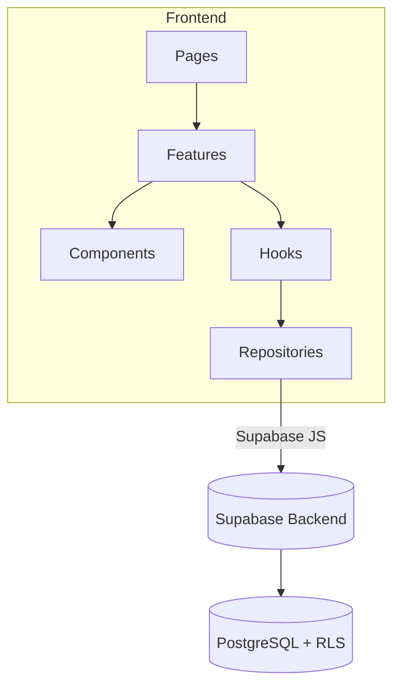

# PromptForge 🚀

[](https://github.com/Fr3doo/promptforge/releases)
[](https://github.com/Fr3doo/promptforge/actions/workflows/tests.yml)
[](https://codecov.io/gh/Fr3doo/promptforge)
[](https://github.com/Fr3doo/promptforge/blob/main/eslint.config.js)
[](./LICENSE)

**Gestionnaire de prompts IA avancé avec versioning sémantique, variables dynamiques et collaboration sécurisée.**

---

## 🧭 Sommaire
- [🚀 Objectif du projet](#-objectif-du-projet)
- [🧰 Stack technologique](#-stack-technologique)
- [⚡ Démarrage rapide](#-démarrage-rapide)
- [🔧 Installation](#-installation)
- [🌱 Variables d'environnement](#-variables-denvironnement)
- [▶️ Lancement](#-lancement)
- [📦 Utilisation](#-utilisation)
- [⚙️ Utilisation avancée](#-utilisation-avancée)
- [🔌 Injection de dépendances](#-injection-de-dépendances)
- [📈 Collecte de métriques](#-collecte-de-métriques)
- [❗ Gestion des erreurs](#-gestion-des-erreurs)
- [📝 Formats d'entrée](#-formats-dentrée)
- [📊 Contraintes de performance](#-contraintes-de-performance)
- [🧠 Architecture](#-architecture)
- [📁 Structure du projet](#-structure-du-projet)
- [🖥️ Compatibilité Windows](#-compatibilité-windows)
- [🛠️ Fichiers de configuration](#-fichiers-de-configuration)
- [🔄 Workflows CI/CD](#-workflows-cicd)
- [🧪 Tests](#-tests)
- [🔍 Qualité du code](#-qualité-du-code)
- [✅ Quality Gates](#-quality-gates)
- [🤝 Contribuer](#-contribuer)
- [📚 Documentation liée](#-documentation-liée)
- [🚀 Publication d’une release](#-publication-dune-release)
- [🛡️ Licence](#-licence)

---

## 🚀 Objectif du projet
PromptForge fournit une interface web moderne pour industrialiser la gestion des prompts IA : création assistée, détection automatique des variables, historisation SemVer, partage sécurisé et analyse d’usage pour les équipes produit et data science. Pour une vue d’ensemble détaillée, consultez [ARCHITECTURE.md](./ARCHITECTURE.md) et [docs/SHARING_GUIDE.md](./docs/SHARING_GUIDE.md).

## 🧰 Stack technologique
| Couche | Outils principaux |
| --- | --- |
| Framework UI | React 18, Vite, TypeScript, Tailwind CSS, Framer Motion |
| State & Data | TanStack Query, Supabase JS, Repository Pattern custom |
| Validation & Formulaires | Zod, React Hook Form, Radix UI, CMDK command palette |
| Qualité | Vitest, Testing Library, ESLint, Prettier, Husky, Commitlint, Codecov |
| Distribution | Vite build, Supabase backend (Lovable Cloud) |

> 💡 **Mini-tâche recommandée :** configurer `pnpm` via Corepack pour accélérer l’installation multi-plateforme.

## ⚡ Démarrage rapide
1. Cloner le dépôt : `git clone https://github.com/Fr3doo/promptforge && cd promptforge`
2. Copier les variables d’environnement : `cp .env.example .env`
3. Renseigner les clés publiques Supabase documentées dans [.env.example](./.env.example)
4. Installer les dépendances : `npm install`
5. Lancer le serveur de dev : `npm run dev`
6. Ouvrir [http://localhost:5173](http://localhost:5173) et se connecter avec un compte Supabase configuré.

## 🔧 Installation
### Pré-requis système (Linux)
- Node.js ≥ 20 (compatible Vite 5 et Supabase JS)
- npm 10+ (ou Corepack pour pnpm/bun)
- Accès à une instance Supabase (Lovable Cloud ou auto-hébergée)

### Depuis npm (par défaut)
```bash
npm install
```

### Depuis pnpm
```bash
corepack enable
pnpm install
```

### Depuis Bun
```bash
bun install
```

### Depuis les sources
```bash
git clone https://github.com/Fr3doo/promptforge
cd promptforge
npm install
```

### Mode développement
- Lancer le hot-reload : `npm run dev`
- Prévisualiser un build de production : `npm run preview`
- Réinitialiser la base Supabase (optionnel) via les scripts SQL dans `supabase/`

### Utilisation d’un environnement virtuel Node
```bash
nvm use 20
npm install
```
> 💡 **Mini-tâche recommandée :** ajouter un fichier `.nvmrc` pour verrouiller la version Node.

## 🌱 Variables d'environnement
| Variable | Description | Obligatoire | Exemple |
| --- | --- | --- | --- |
| `VITE_SUPABASE_URL` | URL du projet Supabase utilisé par le frontend | ✅ | `https://xyzcompany.supabase.co` |
| `VITE_SUPABASE_ANON_KEY` | Clé publique pour les appels client | ✅ | `eyJhbGciOiJIUzI1NiIsInR5cCI6IkpXVCJ9...` |
| `VITE_SUPABASE_SERVICE_ROLE` | Clé service (usage Edge Functions) | ⚠️ | À stocker côté serveur uniquement |
| `VITE_OPENAI_API_KEY` | Clé OpenAI pour les suggestions IA | ⚠️ | `sk-...` |
| `VITE_POSTHOG_KEY` | Tracking produit & métriques | Optionnel | `phc_xxxxxxxxxx` |

> ℹ️ Les clés sensibles (`SERVICE_ROLE`, `OPENAI_API_KEY`) doivent être renseignées dans les secrets Supabase Edge Functions ou GitHub Actions, jamais commitées.

## ▶️ Lancement
### Après installation
```bash
npm run dev           # serveur local avec HMR
npm run build         # build production
npm run preview       # preview production
```
Pour une exécution CI non interactive, privilégier `npm run build` suivi des tests headless (`npm run test`).

## 📦 Utilisation
### Exemple minimal
1. Créer un prompt depuis le tableau de bord (page `Prompts`).
2. Ajouter des variables via l’éditeur (`{{variable}}`) : le hook `useVariableDetection` les détecte et les ajoute au gestionnaire de variables.
3. Sauvegarder pour générer automatiquement une première version SemVer et activer l’historique dans la timeline.

## ⚙️ Utilisation avancée
- Définir des filtres persistants via `usePromptFilters` (recherche, favoris, visibilité).
- Activer la duplication de prompt avec variables partagées grâce au `PromptRepository`.
- Gérer les conflits d’édition simultanée avec le hook de détection de conflits décrit dans [TESTING.md](./TESTING.md).

## 🔌 Injection de dépendances
```typescript
import { SupabasePromptRepository } from "@/repositories/PromptRepository";
import { SupabaseVariableRepository } from "@/repositories/VariableRepository";

const promptRepository = new SupabasePromptRepository();
const variableRepository = new SupabaseVariableRepository();

await promptRepository.duplicate(userId, promptId, variableRepository);
```
Le pattern repository cloisonne les appels Supabase et facilite le remplacement par des mocks ou implémentations in-memory dans les tests. Voir [docs/REPOSITORY_GUIDE.md](./docs/REPOSITORY_GUIDE.md) pour les conventions.

## 📈 Collecte de métriques
```typescript
import { getCLS, getFCP, getLCP, getTTFB } from "web-vitals";

getCLS(console.log);
getFCP(console.log);
getLCP(console.log);
getTTFB(console.log);
```
L’instrumentation Web Vitals décrite dans [ARCHITECTURE.md](./ARCHITECTURE.md#-métriques-de-performance) permet de tracer TTI, FCP, LCP et CLS pour suivre les objectifs (<3s TTI, <300KB bundle).

> 💡 **Mini-tâche recommandée :** brancher un collecteur (PostHog, Datadog RUM) pour historiser ces métriques.

## ❗ Gestion des erreurs
```typescript
import { handleSupabaseError, getSafeErrorMessage } from "@/lib/errorHandler";

const result = await supabase.from("prompts").select("*");
handleSupabaseError(result);
return getSafeErrorMessage(result.error);
```
Les erreurs Supabase sont centralisées pour fournir des messages sûrs et tracer les codes PostgreSQL via `logError`. Compléter avec l’Error Boundary documenté dans [docs/ERROR_BOUNDARY.md](./docs/ERROR_BOUNDARY.md).

## 📝 Formats d’entrée
- **PromptFormData** : titre, description, contenu, visibilité (`PRIVATE|SHARED`), tags, et variables via `PromptEditorState` (voir `src/features/prompts/types.ts`).
- **Variables** : gérées par `VariableRepository` avec typage Supabase (`Tables<"variables">`).

## 📊 Contraintes de performance
- TTI < 3s, FCP < 1.5s, LCP < 2.5s, CLS < 0.1
- Bundle gzip < 300KB
- Invalidations React Query optimisées pour réduire les allers-retours Supabase

> ✅ Respecter ces seuils avant chaque release (CI + observabilité).

## 🧠 Architecture

La structure est feature-based avec séparation stricte UI / logique / data et un accès unique à Supabase via la couche repository. Voir [ARCHITECTURE.md](./ARCHITECTURE.md) et [docs/CIRCULAR_DEPENDENCIES.md](./docs/CIRCULAR_DEPENDENCIES.md) pour les règles détaillées.

## 📁 Structure du projet
```
.
├── src
│   ├── components         # Design system shadcn-ui
│   ├── constants/messages # Architecture modulaire des messages UI (9 modules)
│   ├── features           # Domaines fonctionnels (prompts, variables, versions)
│   ├── hooks              # Hooks transverses (sauvegarde, conflits, filtres)
│   ├── integrations       # Client Supabase & types générés
│   ├── repositories       # Accès données + règles RLS
│   └── test               # Setup Vitest & utils
├── docs                   # Guides architecture, qualité, sécurité
├── public                 # Assets statiques et manifest
└── supabase               # Migrations, policies et seed
```
> 💡 **Mini-tâche recommandée :** générer un `components/README.md` automatisé depuis `components.json`.

## 🖥️ Compatibilité Windows
- Utiliser WSL2 + Node 20 pour éviter les problèmes de dépendances natives.
- Scripts Husky/ESLint fonctionnent via `corepack` et `npm run lint` (voir [HUSKY.md](./HUSKY.md)).
- Les utilisateurs PowerShell peuvent lancer `npm run dev` via `pnpm` ou `bun` sans adaptation majeure.

## 🛠️ Fichiers de configuration
- `vite.config.ts` : build et alias TypeScript
- `tailwind.config.ts` + `postcss.config.js` : pipeline CSS
- `eslint.config.js`, scripts Prettier, `commitlint.config.js`, [HUSKY.md](./HUSKY.md) : qualité et hooks
- `codecov.yml` : upload de la couverture depuis GitHub Actions
- `supabase/` : policies SQL, seed, migrations

## 🔄 Workflows CI/CD
- `tests.yml` : installe les dépendances, exécute `npm run lint`, `npm run test` puis publie la couverture sur Codecov.
- `security-scan.yml` : déclenche `npm audit` et bloque les vulnérabilités critiques avant merge.
- `preview.yml` (optionnel) : construit une prévisualisation Vite pour les branches de feature.

> 📦 Les badges en tête de README reflètent l’état de ces workflows. La matrice complète est documentée dans [docs/CODE_QUALITY_SYSTEM.md](./docs/CODE_QUALITY_SYSTEM.md).

## 🧪 Tests
### Installation des dépendances de développement
```bash
npm install
```

### Exécution de la suite complète
```bash
npm run test
```

### Couverture & rapport HTML
```bash
npm run test:coverage
```

### Sélections ciblées
```bash
npm run test -- usePromptPermission    # tests de permissions
npm run test -- SharePromptDialog      # UI partage
npm run test -- useConflictDetection   # détection de conflits
```
La stratégie complète (objectifs de couverture, mocks Supabase, bonnes pratiques) est documentée dans [TESTING.md](./TESTING.md) et [docs/TESTING_GUIDELINES.md](./docs/TESTING_GUIDELINES.md).

## 🔍 Qualité du code
### Formatage & tri des imports
```bash
npm run format
npm run format:check
```
S’appuyer sur [PRETTIER_SETUP.md](./PRETTIER_SETUP.md) et [docs/ESLINT_SUPABASE_RULE.md](./docs/ESLINT_SUPABASE_RULE.md) pour garantir la cohérence.

### Typage statique
- TypeScript strict (`tsconfig.json`) + types Supabase générés
- Validation Zod sur les formulaires et API internes

### Linting & hooks
```bash
npm run lint
```
Husky exécute lint + tests pré-commit, Commitlint garantit des messages conformes Conventional Commits. Voir [HUSKY.md](./HUSKY.md) et [CONTRIBUTING.md](./CONTRIBUTING.md).

## ✅ Quality Gates
- **Lint & Format** : aucun avertissement eslint/prettier (`npm run lint`, `npm run format:check`).
- **Tests unitaires** : 100 % des suites `npm run test` doivent réussir avant merge.
- **Couverture** : seuil global ≥ 80 % (branches & statements) validé par Codecov.
- **Accessibilité** : revue manuelle (WCAG 2.1 AA) menée sur les écrans critiques avant chaque release.
- **Sécurité** : `npm audit` critique = blocage + vérification des politiques RLS Supabase.

## 🤝 Contribuer
- Lire [CONTRIBUTING.md](./CONTRIBUTING.md) pour l’onboarding, la convention de branches et les revues de code
- Vérifier [docs/CODE_QUALITY_SYSTEM.md](./docs/CODE_QUALITY_SYSTEM.md) et [HUSKY.md](./HUSKY.md) pour automatiser les checks
- Soumettre un ticket avec description du besoin, capture d’écran et checklist QA

## 📚 Documentation liée
- [ARCHITECTURE.md](./ARCHITECTURE.md)
- [TESTING.md](./TESTING.md)
- [MESSAGES_MIGRATION_GUIDE.md](./MESSAGES_MIGRATION_GUIDE.md) - Migration architecture modulaire des messages
- [docs/DEVELOPER_QUICK_START_MESSAGES.md](./docs/DEVELOPER_QUICK_START_MESSAGES.md) - Guide rapide hooks de messages
- [docs/SHARING_GUIDE.md](./docs/SHARING_GUIDE.md)
- [docs/ERROR_BOUNDARY.md](./docs/ERROR_BOUNDARY.md)
- [docs/ERROR_HANDLING_ARCHITECTURE.md](./docs/ERROR_HANDLING_ARCHITECTURE.md) - Architecture unifiée de gestion des erreurs (classifyError, SaveErrorType)
- [docs/CIRCULAR_DEPENDENCIES.md](./docs/CIRCULAR_DEPENDENCIES.md)
- [docs/CODECOV_SETUP.md](./docs/CODECOV_SETUP.md)
- [docs/REPOSITORY_GUIDE.md](./docs/REPOSITORY_GUIDE.md)

## 🚀 Publication d’une release
1. Mettre à jour [CHANGELOG.md](./CHANGELOG.md) avec la nouvelle version
2. Bumper la version dans `package.json` & tags Git (`npm version <major|minor|patch>`)
3. Lancer `npm run build && npm run test:coverage`
4. Publier un tag et une release GitHub (workflows `tests.yml` + `security-scan.yml`)
5. Vérifier l’upload Codecov (badge vert) et préparer les assets Supabase si nécessaire

> 💡 **Mini-tâche recommandée :** automatiser le draft de release via GitHub Actions.

## 🛡️ Licence
Ce projet ne contient pas encore de fichier de licence. Ajoutez un `LICENSE` (ex. MIT) avant toute diffusion publique pour clarifier les droits d’usage.

---
**Développé avec ❤️ pour les équipes qui orchestrent leurs prompts IA.**
