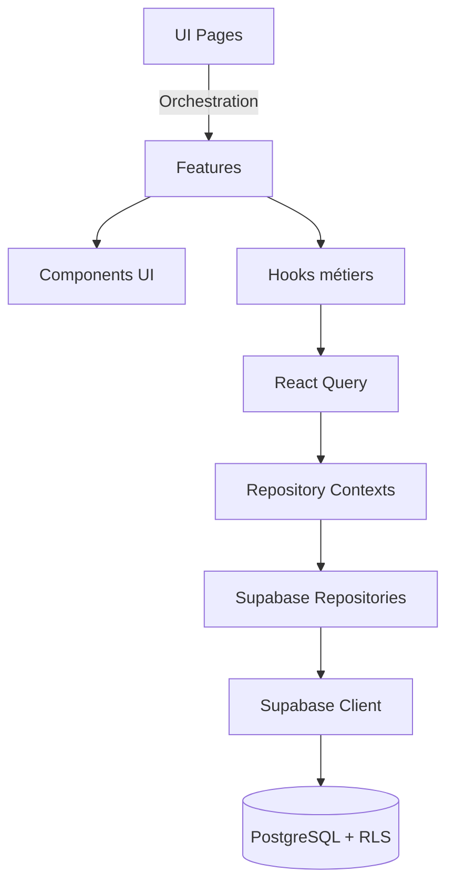

# PromptForge

[](https://github.com/Fr3doo/promptforge/blob/main/LICENSE)
[](https://github.com/Fr3doo/promptforge/releases)
[](https://github.com/Fr3doo/promptforge/actions/workflows/tests.yml)
[](https://github.com/Fr3doo/promptforge/actions/workflows/security-scan.yml)
[](https://app.codecov.io/gh/Fr3doo/promptforge)
[](./eslint.config.js)

## 🚀 Objectif du projet
PromptForge est un atelier de conception de prompts IA centré sur la collaboration : création assistée, versioning sémantique, variables typées et partage sécurisé via Supabase. L'application vise une expérience front-end premium (React + shadcn/ui) avec une gouvernance de qualité professionnelle, prête pour l'automatisation CI/CD et l'observabilité.

## 🧰 Stack technologique
| Catégorie | Outils principaux |
|-----------|-------------------|
| Framework UI | React 18, Vite, TypeScript |
| Design system | tailwindcss, shadcn/ui (Radix UI + class-variance-authority) |
| State & data | TanStack Query, React Hook Form, Zod |
| Backend & Auth | Supabase (PostgreSQL + RLS, Realtime, Auth) |
| Qualité | Vitest, Testing Library, ESLint 9, Prettier 3, Husky |
| Automatisation | GitHub Actions (tests, security scan), Codecov |

Dépendances issues de [`package.json`](./package.json) et des guides dédiés (voir [Documentation liée](#-documentation-li%C3%A9e)).

## ⚡ Démarrage rapide
1. Cloner le dépôt :
   ```bash
   git clone https://github.com/Fr3doo/promptforge.git
   cd promptforge
   ```
2. Préparer l'environnement :
   ```bash
   cp .env.example .env
   # Renseigner VITE_SUPABASE_URL et VITE_SUPABASE_PUBLISHABLE_KEY
   ```
3. Installer les dépendances et lancer le mode dev :
   ```bash
   npm install
   npm run dev
   ```
4. Ouvrir `http://localhost:5173` et connecter votre compte Supabase (voir [SHARING_GUIDE](./docs/SHARING_GUIDE.md)).

## 🔧 Installation
### Pré-requis système (Linux)
- Node.js ≥ 18.17 (recommandé : 20 LTS pour la compatibilité Vite).
- npm ≥ 9 ou gestionnaire alternatif (pnpm/bun supportés via lockfiles).
- Accès à un projet Supabase avec authentification e-mail activée.

### Depuis npm (mode application)
Le paquet n'est pas publié sur npm pour le moment. **TODO :** publier un bundle statique sur npm ou GitHub Releases pour faciliter le déploiement.

### Depuis les sources
```bash
npm install
npm run build
npm run preview # serveur statique sur http://localhost:4173
```

### Mode développement
```bash
npm run dev
```
Le serveur Vite recharge à chaud les pages, y compris les composants shadcn/ui et les hooks React Query.

### Utilisation d'un environnement virtuel Node
Pour isoler les dépendances, utilisez `corepack` et `pnpm` ou un gestionnaire de version (`nvm`, `volta`) :
```bash
corepack enable
nvm install 20
nvm use 20
pnpm install
```
**TODO :** documenter un Dockerfile de développement pour uniformiser les contributions.

## ▶️ Lancement
Après installation :
- **Développement** : `npm run dev`
- **Prévisualisation de build** : `npm run preview`
- **Build production** : `npm run build` (génère les artefacts dans `dist/`)
- **Analyse locale** : activer les features Supabase en renseignant les variables d'environnement (voir [`supabase/`](./supabase)).

## 📦 Utilisation
PromptForge est une SPA. Une fois le serveur lancé :
1. Authentifiez-vous via Supabase (email/password).
2. Créez un prompt via l'éditeur riche (variables `{{variable}}` détectées automatiquement).
3. Générez des versions SemVer et comparez les diff visuels.

Exemple minimal pour injecter des variables dans un prompt dans le navigateur :
```tsx
import { PromptPreview } from "@/features/prompts/components/PromptPreview";

<PromptPreview
  content="Bonjour {{prenom}}, voici la version {{version}}"
  variables={{ prenom: "Lina", version: "2.0.0" }}
/>
```
Les fonctionnalités collaboratives (partage public/privé, verrou optimiste) sont détaillées dans [`docs/SHARING_GUIDE.md`](./docs/SHARING_GUIDE.md).

## ⚙️ Utilisation avancée
- **Analyse automatique des prompts** : modules `src/components/analyzer` et docs [`ANALYZER_SAVE_FLOW`](./docs/ANALYZER_SAVE_FLOW.md).
- **Historisation SemVer** : consultez [`INITIAL_VERSION_SEQUENCE.md`](./docs/INITIAL_VERSION_SEQUENCE.md) pour comprendre la chronologie.
- **Sécurité Supabase** : règles RLS et limites décrites dans [`VARIABLE_UPSERT_SECURITY.md`](./docs/VARIABLE_UPSERT_SECURITY.md).
- **TODO :** exposer une API REST pour automatiser la génération de prompts côté CI.

## 🔌 Injection de dépendances
Les repositories sont injectés via des Context Providers pour respecter le DIP (Dependency Inversion Principle). Exemple :
```tsx
import { PromptRepositoryProvider, usePromptRepository } from "@/contexts/PromptRepositoryContext";

function PromptList() {
  const repository = usePromptRepository();
  // repository est une instance de SupabasePromptRepository
  return <PromptTable prompts={repository.fetchAll()} />;
}

createRoot(document.getElementById("root")!).render(
  <PromptRepositoryProvider>
    <App />
  </PromptRepositoryProvider>
);
```
Pour concevoir un nouveau repository, suivez le [Guide Repository](./docs/REPOSITORY_GUIDE.md).

## 📈 Collecte de métriques
La collecte applicative (Sentry, OpenTelemetry) n'est pas encore branchée. Points de terminaison à instrumenter :
- Actions critiques (`SupabasePromptRepository.create`, `usePromptSave` hook) pour suivre les taux de succès.
- Events UI (Toast notifications) pour mesurer la satisfaction utilisateur.

**TODO :** intégrer un service de télémétrie (ex. LogRocket, PostHog) et documenter la configuration.

## ❗ Gestion des erreurs
Une Error Boundary globale capture les erreurs runtime et affiche un fallback ergonomique.
```tsx
import { ErrorBoundary } from "@/components/ErrorBoundary";

<ErrorBoundary>
  <PromptRepositoryProvider>
    <App />
  </PromptRepositoryProvider>
</ErrorBoundary>
```
- Logs détaillés en dev (`console.group`).
- Hooks pour brancher Sentry/observabilité en production.

Consultez [`docs/ERROR_BOUNDARY.md`](./docs/ERROR_BOUNDARY.md) pour la stratégie complète (actions utilisateur, logging, TODO monitoring).

## 📝 Formats d'entrée
Les limites et schémas de validation sont centralisés dans [`src/constants/validation-limits.ts`](./src/constants/validation-limits.ts) :
- Titre de prompt : 1–200 caractères.
- Variables : max 50 occurrences, noms 1–100 caractères.
- Contenu AI metadata : voir `AI_METADATA_LIMITS`.

Utilisez les helpers Zod présents dans `src/lib` pour garantir la conformité lors des appels Supabase.

## 📊 Contraintes de performance
- React Query assure un cache intelligent avec invalidation ciblée (voir `src/hooks/usePrompts.ts`).
- Le bundle est optimisé via Vite + SWC (`vite.config.ts`).
- TODO : ajouter un budget de performance Lighthouse dans CI et documenter les résultats.

## 🧠 Architecture

Les principes complets (séparation des responsabilités, flux de données, DIP) sont décrits dans [`ARCHITECTURE.md`](./ARCHITECTURE.md).

## 📁 Structure du projet
```
src/
  components/        # UI shadcn, ErrorBoundary, toast
  features/          # Domaines (prompts, variables)
  hooks/             # Logique métier réutilisable
  repositories/      # Interfaces + impl. Supabase
  contexts/          # Providers d'injection
  integrations/      # Client Supabase généré
  pages/             # Routage et vues
```
Compléments dans [`ARCHITECTURE.md`](./ARCHITECTURE.md) et [`docs/`](./docs).

## 🖥️ Compatibilité Windows
Le projet fonctionne sous Windows (PowerShell) avec `npm` ou `pnpm`. Exemple :
```powershell
npm install
npm run dev
```
Pour la compatibilité WSL2/Docker, assurez-vous que les variables `VITE_SUPABASE_*` sont définies côté hôte.

**TODO :** ajouter une CI Windows pour valider les scripts Husky et Vitest.

## 🛠️ Fichiers de configuration
| Fichier | Rôle |
|---------|------|
| [`vite.config.ts`](./vite.config.ts) | Build Vite + plugins React SWC |
| [`tsconfig.json`](./tsconfig.json) | Base TypeScript pour l'app |
| [`eslint.config.js`](./eslint.config.js) | Configuration ESLint Flat |
| [`tailwind.config.ts`](./tailwind.config.ts) | Design system Tailwind |
| [`codecov.yml`](./codecov.yml) | Seuils de couverture et commentaires PR |
| [`postcss.config.js`](./postcss.config.js) | Pipeline CSS |
| [`commitlint.config.js`](./commitlint.config.js) | Convention de commits |
| [`supabase/`](./supabase) | Configuration du backend Supabase |

## 🧪 Tests
### Installer les dépendances de développement
```
npm install
```

### Exécuter toute la suite
```
npm run test
```

### Couverture & rapport HTML
```
npm run test:coverage
# Ouvrir coverage/index.html
```

### Scénarios ciblés
- **Test unique** : `npx vitest src/features/prompts/components/__tests__/PromptCard.test.tsx`
- **Exclure les tests lents** : `npx vitest --run --max-workers=4`
- **Tests d'intégration** : filtrer via `vitest --run --dir src/features`.

Documentation complète : [`TESTING.md`](./TESTING.md) & [`docs/TESTING_GUIDELINES.md`](./docs/TESTING_GUIDELINES.md).

## 🔍 Qualité du code
### Formatage & tri des imports
- `npm run format` / `npm run format:check` (Prettier).
- ESLint applique le tri via `eslint-plugin-import-x`.
- Référence : [`PRETTIER_SETUP.md`](./PRETTIER_SETUP.md).

### Typage statique
- TypeScript strict via `tsconfig.json`.
- Types Supabase générés dans `src/integrations/supabase/types.ts`.
- TODO : activer `tsc --noEmit` en CI pour les PR.

### Linting & hooks
- `npm run lint` (ESLint flat config + règles Supabase custom). Exemple de règle : interdiction d'importer Supabase hors repositories (`docs/ESLINT_SUPABASE_RULE.md`).
- Husky déclenche lint + tests avant commit (voir [`HUSKY.md`](./HUSKY.md)).

## 🤝 Contribuer
1. Lire [`CONTRIBUTING.md`](./CONTRIBUTING.md) pour la checklist (issues, style de commit, PR template).
2. Installer Husky : `npm install && npm run lint` (postinstall configure les hooks).
3. Exécuter tests + lint avant PR.

**TODO :** ajouter un guide "First good issue" dans `docs/` pour onboarding rapide.

## 📚 Documentation liée
- [`ARCHITECTURE.md`](./ARCHITECTURE.md)
- [`CHANGELOG.md`](./CHANGELOG.md)
- [`docs/`](./docs) : qualité code, sécurité, repository pattern, Codecov
- [`TESTING.md`](./TESTING.md)
- [`PRETTIER_SETUP.md`](./PRETTIER_SETUP.md)
- [`HUSKY.md`](./HUSKY.md)

## 🚀 Publication d'une release
1. Mettre à jour [`CHANGELOG.md`](./CHANGELOG.md) et incrémenter la version dans `package.json` (SemVer).
2. Créer un tag : `git tag -a vX.Y.Z -m "Release vX.Y.Z"` puis `git push origin vX.Y.Z`.
3. Lancer la build (`npm run build`) et attacher les artefacts à la release GitHub.
4. **TODO :** ajouter un workflow GitHub Actions pour publier automatiquement le bundle et notifier Codecov.

## 🛡️ Licence
Aucun fichier `LICENSE` n'est publié dans le dépôt. Le badge ci-dessus reflète l'état GitHub (non défini). **TODO :** ajouter un fichier de licence (ex. MIT) et mettre à jour le badge pour clarifier les droits d'usage.
