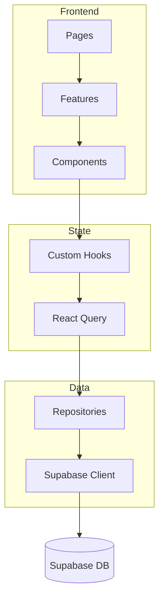

# PromptForge

[](https://github.com/Fr3doo/promptforge)
[](#-licence)
[](https://github.com/Fr3doo/promptforge/actions/workflows/tests.yml)
[](https://codecov.io/gh/Fr3doo/promptforge)
[](eslint.config.js)

## 🚀 Objectif du projet

PromptForge est un atelier web pour concevoir, versionner et partager des prompts IA. L'application met l'accent sur la séparation des responsabilités entre pages, fonctionnalités et composants, tout en s'appuyant sur Supabase pour l'authentification, le stockage et la collaboration en temps réel.【F:ARCHITECTURE.md†L1-L64】【F:src/repositories/PromptRepository.ts†L1-L110】

## 🧰 Stack technologique

| Catégorie | Technologies |
| --- | --- |
| Framework & langage | React 18, TypeScript, Vite |
| UI & animation | Tailwind CSS, Radix UI, Framer Motion |
| Etat & données | TanStack Query, Supabase, Repository Pattern |
| Qualité | Vitest, Testing Library, ESLint, Prettier, Husky |

> Source : [`package.json`](./package.json) et guides d'architecture.【F:package.json†L1-L83】【F:ARCHITECTURE.md†L66-L130】

## ⚡ Démarrage rapide

```bash
# Cloner et installer
git clone https://github.com/Fr3doo/promptforge.git
cd promptforge
npm install

# Lancer l'environnement local
npm run dev
```

> ✅ Pensez à activer Husky après l'installation (`npx husky install`) pour bénéficier des contrôles qualité automatiques.【F:HUSKY.md†L1-L37】

## 🔧 Installation

### Pré-requis système
- Node.js 20+ recommandé pour profiter du support Vite et Vitest.
- npm (installé avec Node) ou pnpm.
- Accès à un projet Supabase configuré.

### Depuis npm (mode utilisateur)
```bash
npm install
```

### Depuis les sources
```bash
git clone https://github.com/Fr3doo/promptforge.git
cd promptforge
npm install
```

### Mode développement
```bash
npm run dev
```

### Environnement virtuel Node
Utilisez [`corepack`](https://nodejs.org/api/corepack.html) pour verrouiller la version de npm/pnpm si nécessaire :
```bash
corepack enable
corepack prepare pnpm@latest --activate
```

### TODO
- [ ] Ajouter une distribution publiée (npm/pnpm) une fois la licence définie.

## ▶️ Lancement

Après installation :
```bash
# Mode développement avec Vite
npm run dev

# Build production
npm run build

# Prévisualisation du build
npm run preview
```

Les scripts sont définis dans `package.json` et exécutent Vite en mode approprié.【F:package.json†L6-L20】

## 📦 Utilisation

### Interface web
1. Authentifiez-vous via Supabase.
2. Créez un prompt : titre, description, contenu et variables associées.
3. Gérez les versions, la visibilité (privée/partagée) et les favoris.

### Exemple minimal (duplication d'un prompt)
```typescript
const repository = new SupabasePromptRepository();
const duplicate = await repository.duplicate(userId, promptId, variableRepository);
```
Ce flux duplique les variables, conserve les métadonnées et bascule le prompt en mode privé pour édition.【F:src/repositories/PromptRepository.ts†L1-L171】

## ⚙️ Utilisation avancée

- **Gestion des conflits** : la logique de partage et de verrouillage optimiste est centralisée dans les repositories pour éviter les éditions concurrentes.【F:src/repositories/PromptRepository.ts†L112-L251】
- **Stratégies de cache** : combinez `useQuery` de TanStack Query avec les repositories pour invalider ou actualiser les prompts selon l'action utilisateur.【F:docs/REPOSITORY_GUIDE.md†L240-L330】

## 🔌 Injection de dépendances

Les repositories sont injectés via contextes React, facilitant les tests.

```typescript
export function PromptRepositoryProvider({
  children,
  repository = new SupabasePromptRepository(),
}: PromptRepositoryProviderProps) {
  return (
    <PromptRepositoryContext.Provider value={repository}>
      {children}
    </PromptRepositoryContext.Provider>
  );
}
```
Référencez les hooks (`usePromptRepository`) pour remplacer l'implémentation par un mock en test.【F:docs/REPOSITORY_GUIDE.md†L268-L330】

📚 Plus de détails : [`docs/REPOSITORY_GUIDE.md`](./docs/REPOSITORY_GUIDE.md).

## 📈 Collecte de métriques

La couverture de tests est mesurée par Vitest et publiée dans Codecov.

```bash
npm run test:coverage          # Génère coverage/lcov.info
```
Le workflow `tests.yml` envoie automatiquement les rapports à Codecov et expose un badge pour suivre la qualité.【F:docs/CODECOV_SETUP.md†L1-L101】【F:package.json†L13-L16】

📚 Documentation : [`docs/CODECOV_SETUP.md`](./docs/CODECOV_SETUP.md).

## ❗ Gestion des erreurs

Centralisez les erreurs Supabase via `handleSupabaseError` et exposez un message utilisateur sécurisé avec `getSafeErrorMessage`.

```typescript
const result = await supabase.from("prompts").select("*");
handleSupabaseError(result);
```
La fonction déclenche l'exception Supabase si nécessaire et transforme les erreurs courantes (duplicate key, RLS, JWT expiré) en messages localisés.【F:src/lib/errorHandler.ts†L8-L66】

📚 Documentation : [`docs/REPOSITORY_GUIDE.md`](./docs/REPOSITORY_GUIDE.md).

## 📝 Formats d'entrée

Les prompts suivent le schéma Supabase `prompts` (titre, contenu, description, tags, statut, version). Les variables associées reprennent `name`, `type`, `required`, `default_value`, `pattern` et `options`. Ces champs sont validés côté repository avant insertion.【F:src/repositories/PromptRepository.ts†L118-L171】

## 📊 Contraintes de performance

- Les requêtes critiques utilisent des vues (`prompts_with_share_count`) pour optimiser l'affichage de la liste principale.【F:src/repositories/PromptRepository.ts†L21-L78】
- Vitest impose un seuil de 70 % de couverture pour prévenir les régressions.【F:docs/CODECOV_SETUP.md†L54-L85】

## 🧠 Architecture



Cette architecture respecte le pattern repository pour limiter les imports directs du client Supabase.【F:ARCHITECTURE.md†L1-L130】【F:eslint.config.js†L1-L47】

📚 Documentation complémentaire :
- [`ARCHITECTURE.md`](./ARCHITECTURE.md)
- [`docs/REPOSITORY_GUIDE.md`](./docs/REPOSITORY_GUIDE.md)
- [`docs/ESLINT_SUPABASE_RULE.md`](./docs/ESLINT_SUPABASE_RULE.md)

## 📁 Structure du projet

```text
src/
  components/      # UI réutilisable
  features/        # Modules métiers (prompts, variables, analytics)
  repositories/    # Accès Supabase + DIP
  hooks/           # Logique partagée (auth, prompts, variables)
  test/            # Utilitaires Vitest/RTL
supabase/          # Scripts et fonctions edge
.github/workflows/ # Pipelines CI (tests, sécurité)
```

> Consultez `ARCHITECTURE.md` pour des détails et conventions avancées.【F:ARCHITECTURE.md†L66-L130】

## 🖥️ Compatibilité Windows

Les hooks Husky gèrent automatiquement les permissions sous PowerShell. Pour lancer la couverture localement, utilisez `start coverage/index.html` afin d'ouvrir le rapport dans votre navigateur Windows.【F:HUSKY.md†L18-L37】【F:docs/CODECOV_SETUP.md†L258-L275】

📚 Documentation : [`HUSKY.md`](./HUSKY.md).

## 🛠️ Fichiers de configuration

| Fichier | Rôle |
| --- | --- |
| `package.json` | Scripts npm, dépendances frontend et tooling |
| `vite.config.ts` | Configuration Vite (React, alias, env) |
| `tailwind.config.ts` | Design system Tailwind + animations |
| `vitest.config.ts` | Collecte de couverture et environnement de test |
| `eslint.config.js` | Règles TypeScript, Prettier, import Supabase restreint |
| `codecov.yml` | Seuils de couverture et rapports PR |
| `.github/workflows/*.yml` | Pipelines Tests & Security |

## 🧪 Tests

### Installation des dépendances de développement
```bash
npm install
```

### Suite complète
```bash
npm run test
```

### Couverture & rapport HTML
```bash
npm run test:coverage
start coverage/index.html   # Windows
open coverage/index.html    # macOS
xdg-open coverage/index.html # Linux
```

### Sélections utiles
```bash
npm run test -- usePromptPermission    # Cibler un test
npm run test -- --exclude slow         # Exclure tests lents (flag Vitest)
npm run test --mode run --filter integration # Tests d'intégration seulement
```

Les workflows GitHub exécutent la couverture et publient les rapports sur Codecov pour chaque PR.【F:TESTING.md†L1-L120】【F:docs/CODECOV_SETUP.md†L1-L101】

📚 Ressources : [`TESTING.md`](./TESTING.md).

## 🔍 Qualité du code

### Formatage & tri des imports
```bash
npm run format
npm run format:check
```
Prettier est intégré à ESLint pour garantir un style cohérent sur tout le projet.【F:package.json†L16-L20】【F:eslint.config.js†L1-L47】

### Typage statique
TypeScript strict est activé via `tsconfig.json`. Utilisez `npm run build` pour valider le typage en CI.【F:CONTRIBUTING.md†L31-L54】

### Linting & hooks
```bash
npm run lint      # ESLint (règles Supabase, import/no-cycle)
npx husky install # Active les hooks pre-commit & pre-push
```
Les hooks Husky exécutent formatage, lint et tests avant chaque commit/push.【F:package.json†L11-L15】【F:HUSKY.md†L1-L83】

## 🤝 Contribuer

1. Forkez et clonez le dépôt.
2. Créez une branche (`git checkout -b feat/ma-feature`).
3. Ajoutez des tests, mettez à jour la documentation.
4. Ouvrez une Pull Request après avoir vérifié la checklist qualité.

La checklist impose formatage, lint, tests et couverture ≥ 70 %.【F:CONTRIBUTING.md†L1-L87】

## 📚 Documentation liée

- [`ARCHITECTURE.md`](./ARCHITECTURE.md)
- [`TESTING.md`](./TESTING.md)
- [`CONTRIBUTING.md`](./CONTRIBUTING.md)
- [`docs/REPOSITORY_GUIDE.md`](./docs/REPOSITORY_GUIDE.md)
- [`docs/CODECOV_SETUP.md`](./docs/CODECOV_SETUP.md)
- [`docs/ESLINT_SUPABASE_RULE.md`](./docs/ESLINT_SUPABASE_RULE.md)
- [`PRETTIER_SETUP.md`](./PRETTIER_SETUP.md)

## 🚀 Publication d'une release

1. Mettre à jour `CHANGELOG.md` et la version dans `package.json`.
2. Créer un tag Git (`git tag -a vX.Y.Z -m "Release"`).
3. Pousser le tag (`git push origin vX.Y.Z`).
4. Publier la release GitHub et (optionnel) le paquet npm.

> TODO : automatiser la génération de release via GitHub Actions.

## 🛡️ Licence

La licence n'est pas définie dans le dépôt. Ajoutez un fichier `LICENSE` (ex. MIT, Apache-2.0) puis mettez à jour le badge ci-dessus.

