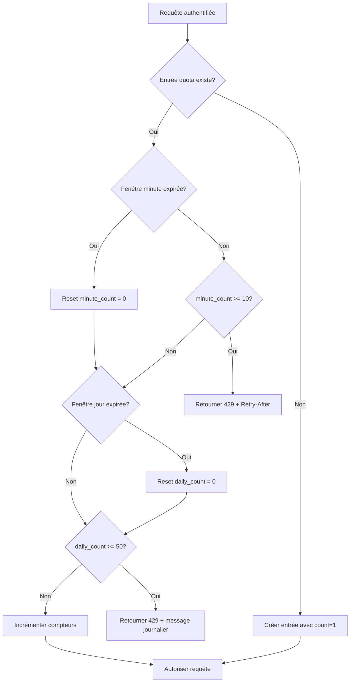

# Système de Quotas d'Analyse AI

## Vue d'ensemble

Le système de quotas remplace le rate limiting in-memory par une solution persistante en base de données, garantissant que les limites sont respectées même après redémarrage des Edge Functions.

## Problématique résolue

### Avant (In-Memory Rate Limiting)

```
┌─────────────────────────────────────────────────────────────────┐
│  Edge Function Instance 1     Edge Function Instance 2          │
│  ├─ Map<userId, count>        ├─ Map<userId, count>             │
│  └─ Non-synchronisé           └─ Non-synchronisé                │
│                                                                 │
│  Problèmes :                                                    │
│  - Données perdues au redémarrage                               │
│  - Instances non synchronisées (chaque instance a son compteur) │
│  - Contournement facile en répartissant sur plusieurs instances │
└─────────────────────────────────────────────────────────────────┘
```

### Après (Database-Based Quotas)

```
┌─────────────────────────────────────────────────────────────────┐
│  Edge Function Instance 1     Edge Function Instance 2          │
│  └─ checkAndIncrementQuota()  └─ checkAndIncrementQuota()       │
│              │                            │                     │
│              ▼                            ▼                     │
│  ┌─────────────────────────────────────────────────┐           │
│  │           Table: analysis_quotas                 │           │
│  │  - user_id (unique, clé primaire)                │           │
│  │  - minute_count / minute_reset_at                │           │
│  │  - daily_count / daily_reset_at                  │           │
│  └─────────────────────────────────────────────────┘           │
│                                                                 │
│  Avantages :                                                    │
│  - Données persistantes                                         │
│  - Synchronisation automatique entre instances                  │
│  - Quotas utilisateur cohérents                                 │
└─────────────────────────────────────────────────────────────────┘
```

## Limites configurées

| Type | Limite | Fenêtre | Description |
|------|--------|---------|-------------|
| Par minute | 10 requêtes | Glissante (60s) | Protection contre les rafales |
| Par jour | 50 requêtes | Fixe (minuit UTC) | Protection des crédits AI |

Ces limites sont définies dans `supabase/functions/analyze-prompt/index.ts` :

```typescript
const QUOTA_LIMITS = {
  MAX_PER_MINUTE: 10,
  MAX_PER_DAY: 50,
} as const;
```

## Comportement "Fail-Open"

En cas d'erreur de base de données, le système **autorise** la requête pour éviter de bloquer les utilisateurs :

```typescript
if (fetchError) {
  console.error('[QUOTA] Fetch error:', fetchError);
  return { allowed: true }; // Fail-open
}
```

### Justification

| Approche | Avantages | Inconvénients |
|----------|-----------|---------------|
| **Fail-Open** (choisi) | UX préservée, résilience | Risque de dépassement temporaire |
| Fail-Closed | Respect strict des quotas | Blocage utilisateurs sur erreur DB |

Le choix de fail-open privilégie l'expérience utilisateur. Les erreurs DB sont rares et transitoires.

## Table `analysis_quotas`

### Structure

| Colonne | Type | Description |
|---------|------|-------------|
| `id` | uuid | Clé primaire (auto-générée) |
| `user_id` | uuid | Référence vers `auth.users` (UNIQUE) |
| `minute_count` | integer | Compteur minute actuel |
| `minute_reset_at` | timestamptz | Heure de reset minute |
| `daily_count` | integer | Compteur jour actuel |
| `daily_reset_at` | timestamptz | Heure de reset jour (minuit UTC) |
| `created_at` | timestamptz | Date de création |
| `updated_at` | timestamptz | Date de dernière modification |

### Index de performance

```sql
CREATE INDEX idx_analysis_quotas_user_id ON public.analysis_quotas(user_id);
CREATE INDEX idx_analysis_quotas_daily_reset ON public.analysis_quotas(daily_reset_at);
```

## RLS Policies

| Policy | Action | Condition |
|--------|--------|-----------|
| `Deny anonymous access` | ALL | Bloque les accès anonymes |
| `Users can manage their own quotas` | ALL | `auth.uid() = user_id` |

Ces policies garantissent que :
1. Aucun accès anonyme n'est possible
2. Chaque utilisateur ne peut voir/modifier que ses propres quotas

## Flux de vérification des quotas



## Messages d'erreur

| Situation | Message | HTTP Status |
|-----------|---------|-------------|
| Limite minute atteinte | "Trop de requêtes. Veuillez patienter avant de réessayer." | 429 |
| Limite journalière atteinte | "Limite journalière atteinte (50 analyses/jour). Réessayez demain." | 429 |

Les réponses 429 incluent un header `Retry-After` indiquant le délai en secondes.

## Maintenance

### Nettoyage des entrées expirées

Les entrées ne sont pas automatiquement supprimées. Pour un nettoyage périodique (optionnel), vous pouvez exécuter :

```sql
-- Supprimer les entrées non utilisées depuis plus de 30 jours
DELETE FROM public.analysis_quotas 
WHERE daily_reset_at < NOW() - INTERVAL '30 days';
```

### Réinitialisation manuelle d'un utilisateur

```sql
-- Reset complet des quotas d'un utilisateur
UPDATE public.analysis_quotas 
SET 
  minute_count = 0,
  minute_reset_at = NOW() + INTERVAL '1 minute',
  daily_count = 0,
  daily_reset_at = DATE_TRUNC('day', NOW() AT TIME ZONE 'UTC') + INTERVAL '1 day'
WHERE user_id = 'USER_UUID_HERE';
```

## Références

- Edge Function: `supabase/functions/analyze-prompt/index.ts`
- Migration: `supabase/migrations/*_create_analysis_quotas.sql`
- Tests: `supabase/functions/analyze-prompt/auth.integration.test.ts`
- Documentation tests: `docs/EDGE_FUNCTION_TESTS.md`
