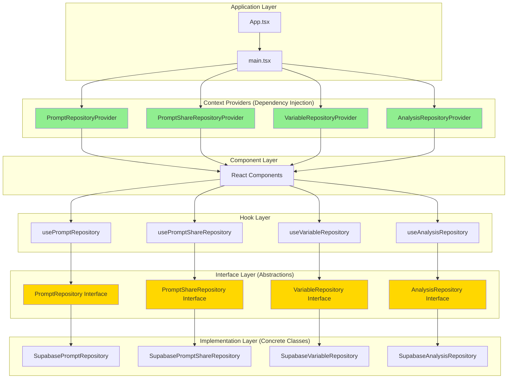

# Guide des Patterns de Contextes et Injection de Dépendances

## Table des Matières

1. [Introduction](#introduction)
2. [Types de Contextes](#types-de-contextes)
3. [Pattern #1 : Repository Contexts](#pattern-1-repository-contexts)
4. [Pattern #2 : Feature Contexts](#pattern-2-feature-contexts)
5. [Pattern #3 : Service Contexts](#pattern-3-service-contexts)
6. [Anti-Patterns à Éviter](#anti-patterns-à-éviter)
7. [Tests avec Injection de Dépendances](#tests-avec-injection-de-dépendances)
8. [Migration de Contextes Existants](#migration-de-contextes-existants)
9. [Checklist de Création](#checklist-de-création)
10. [FAQ](#faq)

---

## Introduction

### Pourquoi l'Injection de Dépendances dans les Contextes ?

Les contextes React sans injection de dépendances créent plusieurs problèmes :

**Problèmes sans Injection de Dépendances :**
- ❌ **Tests difficiles** : Impossible de mocker les dépendances (Supabase, services externes)
- ❌ **Couplage fort** : Dépendance directe aux implémentations concrètes
- ❌ **Inflexibilité** : Impossible de changer l'implémentation (admin, migration, tests)
- ❌ **Violation du DIP** : Dépendance aux détails d'implémentation plutôt qu'aux abstractions

**Bénéfices de l'Injection de Dépendances :**
- ✅ **Testabilité maximale** : Injection de mocks sans configuration complexe
- ✅ **Flexibilité** : Changement d'implémentation sans modifier le code consommateur
- ✅ **Respect du DIP** : Dépendance aux abstractions (interfaces)
- ✅ **Séparation des responsabilités** : Chaque contexte a une responsabilité unique
- ✅ **Maintenabilité** : Code prévisible et cohérent

### Architecture Actuelle



**Légende :**
- 🟢 **Vert** : Contextes avec injection de dépendances (best practice)
- 🟡 **Jaune** : Interfaces/abstractions (contrats)
- ⚪ **Blanc** : Implémentations concrètes et composants

---

## Types de Contextes

L'application utilise différents types de contextes, chacun ayant des besoins et des patterns d'injection spécifiques.

### Taxonomie des Contextes

| Type | Responsabilité | Exemples | Injection DI ? | Complexité | Cas d'usage |
|------|----------------|----------|----------------|------------|-------------|
| **Repository** | Accès aux données (CRUD) | `PromptRepositoryContext` | ✅ **Obligatoire** | Faible | Données Supabase, APIs |
| **Feature** | Logique métier complexe | `PromptEditorContext` | ⚠️ **Recommandé** | Moyenne | Workflows, orchestration |
| **Service** | Services globaux | `AuthContext` | ✅ **Obligatoire** | Faible | Auth, cache, analytics |
| **UI** | État UI local/partagé | `SidebarContext` | ❌ Non nécessaire | Variable | Collapse, thème, modales |

### Quand Utiliser Quel Type ?

#### Repository Context
**Utiliser quand :**
- Vous avez besoin d'accéder à une source de données (base de données, API)
- Vous voulez isoler la logique d'accès aux données
- Vous avez besoin de mocker les données en tests

**Exemple :** `PromptRepositoryContext`, `VariableRepositoryContext`

#### Feature Context
**Utiliser quand :**
- Vous orchestrez plusieurs hooks/services
- Vous gérez un workflow métier complexe
- Vous avez besoin de tester des scénarios E2E

**Exemple :** `PromptEditorContext` (agrège prompts, variables, versions, permissions)

#### Service Context
**Utiliser quand :**
- Vous avez un service global (auth, cache, logging)
- Vous voulez abstraire une dépendance externe
- Vous avez besoin de différentes implémentations (prod, dev, test)

**Exemple :** `AuthContext`, `CacheContext`, `AnalyticsContext`

#### UI Context
**Utiliser quand :**
- Vous gérez un état UI partagé simple
- Vous n'avez PAS besoin de testabilité avancée
- L'état ne dépend pas de services externes

**Exemple :** `SidebarContext`, `ThemeContext` (librairies tierces)

---

## Pattern #1 : Repository Contexts

### Principe

Un **Repository Context** encapsule l'accès à une source de données (Supabase, API REST, etc.) et fournit une abstraction testable via une interface.

### Architecture

```
Repository Interface (abstraction)
         ↓
Concrete Implementation (Supabase)
         ↓
Context Provider (injection)
         ↓
Custom Hook (consommation)
         ↓
React Components
```

### Structure Complète

#### 1. Définir l'Interface Repository

```typescript
// src/repositories/{Entity}Repository.ts

import { supabase } from "@/integrations/supabase/client";
import { handleSupabaseError } from "@/lib/errorHandler";

/**
 * Interface définissant le contrat pour l'accès aux données {Entity}
 * 
 * Suit le principe DIP (Dependency Inversion Principle) :
 * - Les composants dépendent de cette abstraction
 * - Les implémentations concrètes implémentent cette interface
 */
export interface {Entity}Repository {
  /**
   * Récupère toutes les entités pour un utilisateur
   * @param userId - ID de l'utilisateur
   * @returns Liste des entités
   * @throws Error si userId est vide ou si la requête échoue
   */
  fetchAll(userId: string): Promise<{Entity}[]>;
  
  /**
   * Récupère une entité par son ID
   * @param id - ID de l'entité
   * @returns L'entité ou null si non trouvée
   */
  fetchById(id: string): Promise<{Entity} | null>;
  
  /**
   * Crée une nouvelle entité
   * @param userId - ID de l'utilisateur propriétaire
   * @param data - Données de l'entité à créer
   * @returns L'entité créée
   */
  create(userId: string, data: {Entity}Insert): Promise<{Entity}>;
  
  /**
   * Met à jour une entité existante
   * @param id - ID de l'entité
   * @param updates - Champs à mettre à jour
   * @returns L'entité mise à jour
   */
  update(id: string, updates: Partial<{Entity}>): Promise<{Entity}>;
  
  /**
   * Supprime une entité
   * @param id - ID de l'entité
   */
  delete(id: string): Promise<void>;
}

/**
 * Implémentation Supabase du {Entity}Repository
 * 
 * Gère UNIQUEMENT l'accès aux données.
 * NE DOIT PAS :
 * - Appeler supabase.auth.getUser() (violation SRP)
 * - Gérer la logique métier (responsabilité des hooks/composants)
 * - Gérer l'UI (toasts, etc.)
 */
export class Supabase{Entity}Repository implements {Entity}Repository {
  /**
   * Récupère toutes les entités pour un utilisateur
   */
  async fetchAll(userId: string): Promise<{Entity}[]> {
    // ✅ Validation explicite
    if (!userId) {
      throw new Error("ID utilisateur requis pour récupérer les entités");
    }
    
    const result = await supabase
      .from("{entities}")
      .select("*")
      .eq("owner_id", userId)
      .order("created_at", { ascending: false });
    
    handleSupabaseError(result);
    return result.data as {Entity}[];
  }
  
  /**
   * Récupère une entité par son ID
   */
  async fetchById(id: string): Promise<{Entity} | null> {
    if (!id) {
      throw new Error("ID de l'entité requis");
    }
    
    const result = await supabase
      .from("{entities}")
      .select("*")
      .eq("id", id)
      .single();
    
    if (result.error) {
      if (result.error.code === "PGRST116") {
        // Not found
        return null;
      }
      handleSupabaseError(result);
    }
    
    return result.data as {Entity};
  }
  
  /**
   * Crée une nouvelle entité
   */
  async create(userId: string, data: {Entity}Insert): Promise<{Entity}> {
    if (!userId) {
      throw new Error("ID utilisateur requis pour créer une entité");
    }
    
    const result = await supabase
      .from("{entities}")
      .insert({
        ...data,
        owner_id: userId,
      })
      .select()
      .single();
    
    handleSupabaseError(result);
    return result.data as {Entity};
  }
  
  /**
   * Met à jour une entité existante
   */
  async update(id: string, updates: Partial<{Entity}>): Promise<{Entity}> {
    if (!id) {
      throw new Error("ID de l'entité requis pour la mise à jour");
    }
    
    const result = await supabase
      .from("{entities}")
      .update(updates)
      .eq("id", id)
      .select()
      .single();
    
    handleSupabaseError(result);
    return result.data as {Entity};
  }
  
  /**
   * Supprime une entité
   */
  async delete(id: string): Promise<void> {
    if (!id) {
      throw new Error("ID de l'entité requis pour la suppression");
    }
    
    const result = await supabase
      .from("{entities}")
      .delete()
      .eq("id", id);
    
    handleSupabaseError(result);
  }
}
```

#### 2. Créer le Context avec Injection

```typescript
// src/contexts/{Entity}RepositoryContext.tsx

import { createContext, useContext, type ReactNode } from "react";
import { 
  type {Entity}Repository, 
  Supabase{Entity}Repository 
} from "@/repositories/{Entity}Repository";

/**
 * Context pour injecter le {Entity}Repository
 */
const {Entity}RepositoryContext = createContext<{Entity}Repository | null>(null);

/**
 * Props du provider avec support d'injection de dépendances
 */
interface {Entity}RepositoryProviderProps {
  children: ReactNode;
  /**
   * Repository à injecter (optionnel)
   * 
   * En production : utilise la valeur par défaut (Supabase{Entity}Repository)
   * En test : injectez un mock repository
   * 
   * @example
   * // Production
   * <{Entity}RepositoryProvider>
   *   <App />
   * </{Entity}RepositoryProvider>
   * 
   * @example
   * // Tests avec mock
   * const mockRepository: {Entity}Repository = {
   *   fetchAll: vi.fn().mockResolvedValue([]),
   *   create: vi.fn(),
   *   // ... autres méthodes
   * };
   * 
   * <{Entity}RepositoryProvider repository={mockRepository}>
   *   <Component />
   * </{Entity}RepositoryProvider>
   */
  repository?: {Entity}Repository;
}

/**
 * Provider pour {Entity}Repository avec support d'injection de dépendances
 * 
 * Pattern : Dependency Injection via Context
 * - Permet l'injection de mocks en tests
 * - Fournit une implémentation par défaut pour la production
 * - Respecte le principe DIP (Dependency Inversion Principle)
 */
export function {Entity}RepositoryProvider({ 
  children, 
  repository = new Supabase{Entity}Repository() // ✅ Valeur par défaut
}: {Entity}RepositoryProviderProps) {
  return (
    <{Entity}RepositoryContext.Provider value={repository}>
      {children}
    </{Entity}RepositoryContext.Provider>
  );
}

/**
 * Hook pour accéder au {Entity}Repository depuis le contexte
 * 
 * @throws Error si utilisé en dehors du {Entity}RepositoryProvider
 * 
 * @example
 * function MyComponent() {
 *   const repository = use{Entity}Repository();
 *   
 *   const { data } = useQuery({
 *     queryKey: ["entities", userId],
 *     queryFn: () => repository.fetchAll(userId),
 *   });
 *   
 *   return <div>{data?.length} entités</div>;
 * }
 */
export function use{Entity}Repository(): {Entity}Repository {
  const context = useContext({Entity}RepositoryContext);
  
  if (!context) {
    throw new Error(
      "use{Entity}Repository must be used within {Entity}RepositoryProvider"
    );
  }
  
  return context;
}
```

#### 3. Enregistrer le Provider dans main.tsx

```typescript
// src/main.tsx

import { createRoot } from "react-dom/client";
import App from "./App.tsx";
import "./index.css";
import { {Entity}RepositoryProvider } from "./contexts/{Entity}RepositoryContext.tsx";
import { ErrorBoundary } from "./components/ErrorBoundary.tsx";

createRoot(document.getElementById("root")!).render(
  <ErrorBoundary>
    <{Entity}RepositoryProvider>
      {/* ... autres providers */}
      <App />
    </{Entity}RepositoryProvider>
  </ErrorBoundary>
);
```

#### 4. Utiliser dans les Hooks

```typescript
// src/hooks/use{Entity}.ts

import { useQuery, useMutation, useQueryClient } from "@tanstack/react-query";
import { use{Entity}Repository } from "@/contexts/{Entity}RepositoryContext";
import { useAuth } from "@/hooks/useAuth";
import { toast } from "sonner";

/**
 * Hook pour récupérer toutes les entités de l'utilisateur
 */
export function use{Entity}s() {
  const repository = use{Entity}Repository();
  const { user } = useAuth();
  
  return useQuery({
    queryKey: ["{entities}", user?.id],
    queryFn: () => {
      if (!user) throw new Error("Non authentifié");
      return repository.fetchAll(user.id);
    },
    enabled: !!user, // ✅ Ne lance pas la requête sans utilisateur
  });
}

/**
 * Hook pour créer une nouvelle entité
 */
export function useCreate{Entity}() {
  const repository = use{Entity}Repository();
  const { user } = useAuth();
  const queryClient = useQueryClient();
  
  return useMutation({
    mutationFn: (data: {Entity}Insert) => {
      if (!user) throw new Error("Non authentifié");
      return repository.create(user.id, data);
    },
    onSuccess: () => {
      queryClient.invalidateQueries({ queryKey: ["{entities}"] });
      toast.success("Entité créée avec succès");
    },
    onError: (error) => {
      toast.error(`Erreur : ${error.message}`);
    },
  });
}
```

### Tests du Repository Context

```typescript
// src/contexts/__tests__/{Entity}RepositoryContext.test.tsx

import { describe, it, expect, vi } from "vitest";
import { render, screen } from "@testing-library/react";
import { 
  {Entity}RepositoryProvider, 
  use{Entity}Repository 
} from "../{Entity}RepositoryContext";
import type { {Entity}Repository } from "@/repositories/{Entity}Repository";

describe("{Entity}RepositoryContext", () => {
  it("fournit le repository par défaut en production", () => {
    const TestComponent = () => {
      const repository = use{Entity}Repository();
      return <div>Repository: {repository ? "Loaded" : "Missing"}</div>;
    };
    
    render(
      <{Entity}RepositoryProvider>
        <TestComponent />
      </{Entity}RepositoryProvider>
    );
    
    expect(screen.getByText("Repository: Loaded")).toBeInTheDocument();
  });
  
  it("permet l'injection d'un mock repository", () => {
    const mockRepository: {Entity}Repository = {
      fetchAll: vi.fn().mockResolvedValue([]),
      fetchById: vi.fn().mockResolvedValue(null),
      create: vi.fn().mockResolvedValue({ id: "1", title: "Test" }),
      update: vi.fn().mockResolvedValue({ id: "1", title: "Updated" }),
      delete: vi.fn().mockResolvedValue(undefined),
    };
    
    const TestComponent = () => {
      const repository = use{Entity}Repository();
      repository.fetchAll("test-user-id");
      return <div>Mock injected</div>;
    };
    
    render(
      <{Entity}RepositoryProvider repository={mockRepository}>
        <TestComponent />
      </{Entity}RepositoryProvider>
    );
    
    expect(mockRepository.fetchAll).toHaveBeenCalledWith("test-user-id");
    expect(screen.getByText("Mock injected")).toBeInTheDocument();
  });
  
  it("lance une erreur si utilisé hors du provider", () => {
    const TestComponent = () => {
      use{Entity}Repository();
      return <div>Should fail</div>;
    };
    
    // Supprime les erreurs console pour ce test
    const consoleSpy = vi.spyOn(console, "error").mockImplementation(() => {});
    
    expect(() => render(<TestComponent />)).toThrow(
      "use{Entity}Repository must be used within {Entity}RepositoryProvider"
    );
    
    consoleSpy.mockRestore();
  });
  
  it("permet de tester les méthodes du repository avec un mock", async () => {
    const mockData = [
      { id: "1", title: "Entity 1" },
      { id: "2", title: "Entity 2" },
    ];
    
    const mockRepository: {Entity}Repository = {
      fetchAll: vi.fn().mockResolvedValue(mockData),
      fetchById: vi.fn(),
      create: vi.fn(),
      update: vi.fn(),
      delete: vi.fn(),
    };
    
    const TestComponent = () => {
      const repository = use{Entity}Repository();
      const [data, setData] = React.useState<any[]>([]);
      
      React.useEffect(() => {
        repository.fetchAll("user-123").then(setData);
      }, [repository]);
      
      return <div>Count: {data.length}</div>;
    };
    
    render(
      <{Entity}RepositoryProvider repository={mockRepository}>
        <TestComponent />
      </{Entity}RepositoryProvider>
    );
    
    await screen.findByText("Count: 2");
    expect(mockRepository.fetchAll).toHaveBeenCalledWith("user-123");
  });
});
```

### Exemples Réels dans le Projet

#### PromptRepositoryContext (Référence)

```typescript
// src/contexts/PromptRepositoryContext.tsx

import { createContext, useContext, ReactNode } from "react";
import { PromptRepository, SupabasePromptRepository } from "@/repositories/PromptRepository";

const PromptRepositoryContext = createContext<PromptRepository | null>(null);

interface PromptRepositoryProviderProps {
  children: ReactNode;
  repository?: PromptRepository;
}

export function PromptRepositoryProvider({ 
  children, 
  repository = new SupabasePromptRepository() 
}: PromptRepositoryProviderProps) {
  return (
    <PromptRepositoryContext.Provider value={repository}>
      {children}
    </PromptRepositoryContext.Provider>
  );
}

export function usePromptRepository(): PromptRepository {
  const context = useContext(PromptRepositoryContext);
  if (!context) {
    throw new Error("usePromptRepository must be used within PromptRepositoryProvider");
  }
  return context;
}
```

---

## Pattern #2 : Feature Contexts

### Principe

Un **Feature Context** orchestre plusieurs hooks et services pour gérer une fonctionnalité métier complexe. Il agrège l'état et la logique de plusieurs sources.

### Quand Utiliser ?

Utilisez un Feature Context quand :
- Vous orchestrez **plusieurs hooks** (queries, mutations, état local)
- Vous gérez un **workflow complexe** (ex: éditeur avec versions, conflits, permissions)
- Vous avez besoin de **tests E2E** sans dépendances réseau
- Vous voulez **partager l'état** entre plusieurs composants profondément imbriqués

### Cas d'Usage : PromptEditorContext

Le `PromptEditorContext` est un excellent exemple de Feature Context. Il agrège :
- ✅ Données du prompt (`usePrompt`)
- ✅ Variables associées (`useVariables`)
- ✅ Historique des versions (`useVersions`)
- ✅ Permissions de l'utilisateur (`usePromptPermission`)
- ✅ Détection de conflits (`useConflictDetection`)
- ✅ Gestion du formulaire (`usePromptForm`)

### Architecture Actuelle (Sans Injection)

**Problème :**

```typescript
// ❌ ACTUEL - Pas d'injection possible
export function PromptEditorProvider({ children, promptId }: PromptEditorProviderProps) {
  // Hooks appelés directement → impossible à mocker en tests
  const { data: prompt, isLoading: isLoadingPrompt } = usePrompt(promptId);
  const { data: variables = [] } = useVariables(promptId);
  const { data: versions = [] } = useVersions(promptId);
  const { canEdit } = usePromptPermission(promptId);
  const { hasConflict } = useConflictDetection(promptId, prompt?.updated_at);
  
  // ... reste du code
}
```

**Limitations :**
- ❌ Impossible de tester sans appels réseau réels
- ❌ Impossible de simuler différents états (conflit, permissions, etc.)
- ❌ Tests E2E lents et fragiles

### Architecture Proposée (Avec Injection)

**Solution :**

```typescript
// ✅ PROPOSÉ - Injection de dépendances

/**
 * Dépendances injectables pour PromptEditorProvider
 * 
 * Permet de mocker tous les hooks utilisés par le contexte
 */
interface PromptEditorDependencies {
  /** Hook pour récupérer le prompt */
  promptHook?: typeof usePrompt;
  
  /** Hook pour récupérer les variables */
  variablesHook?: typeof useVariables;
  
  /** Hook pour récupérer les versions */
  versionsHook?: typeof useVersions;
  
  /** Hook pour vérifier les permissions */
  permissionHook?: typeof usePromptPermission;
  
  /** Hook pour détecter les conflits */
  conflictHook?: typeof useConflictDetection;
  
  /** Hook pour gérer le formulaire */
  formHook?: typeof usePromptForm;
}

interface PromptEditorProviderProps {
  children: ReactNode;
  promptId?: string;
  
  /**
   * Dépendances à injecter (optionnel)
   * 
   * En production : utilise les vrais hooks
   * En test : injectez des mocks
   * 
   * @example
   * // Tests
   * <PromptEditorProvider 
   *   promptId="test-id"
   *   dependencies={{
   *     promptHook: mockUsePrompt,
   *     variablesHook: mockUseVariables,
   *   }}
   * >
   *   <Component />
   * </PromptEditorProvider>
   */
  dependencies?: PromptEditorDependencies;
}

/**
 * Provider pour le contexte de l'éditeur de prompt
 * 
 * Orchestre plusieurs hooks et gère l'état complexe de l'éditeur
 */
export function PromptEditorProvider({ 
  children, 
  promptId,
  dependencies = {} // ✅ Valeur par défaut vide
}: PromptEditorProviderProps) {
  const isEditMode = !!promptId;
  
  // ✅ Utiliser les hooks injectés OU les vrais hooks
  const hookPrompt = dependencies.promptHook || usePrompt;
  const hookVariables = dependencies.variablesHook || useVariables;
  const hookVersions = dependencies.versionsHook || useVersions;
  const hookPermission = dependencies.permissionHook || usePromptPermission;
  const hookConflict = dependencies.conflictHook || useConflictDetection;
  const hookForm = dependencies.formHook || usePromptForm;
  
  // Queries avec hooks injectables
  const { 
    data: prompt, 
    isLoading: isLoadingPrompt, 
    refetch: refetchPrompt 
  } = hookPrompt(promptId);
  
  const { 
    data: existingVariables = [], 
    isLoading: isLoadingVariables, 
    refetch: refetchVariables 
  } = hookVariables(promptId);
  
  const { data: versions = [] } = hookVersions(promptId);
  
  const { canEdit } = hookPermission(promptId, prompt);
  
  const { hasConflict, checkConflict } = hookConflict(
    promptId,
    prompt?.updated_at
  );
  
  const form = hookForm({
    prompt,
    existingVariables,
    isEditMode,
    canEdit,
  });
  
  // Fonction de rafraîchissement
  const handleRefreshPrompt = async () => {
    if (promptId) {
      await Promise.all([
        refetchPrompt(),
        refetchVariables(),
      ]);
      await checkConflict();
    }
  };
  
  const value: PromptEditorContextValue = {
    // État du prompt
    prompt,
    isLoadingPrompt,
    
    // Variables
    variables: existingVariables,
    isLoadingVariables,
    
    // Versions
    versions,
    
    // Permissions
    canEdit,
    
    // Conflits
    hasConflict,
    
    // Formulaire
    form,
    
    // Actions
    handleRefreshPrompt,
  };
  
  return (
    <PromptEditorContext.Provider value={value}>
      {children}
    </PromptEditorContext.Provider>
  );
}
```

### Tests du Feature Context

```typescript
// src/features/prompts/contexts/__tests__/PromptEditorContext.test.tsx

import { describe, it, expect, vi } from "vitest";
import { render, screen, waitFor } from "@testing-library/react";
import { PromptEditorProvider, usePromptEditorContext } from "../PromptEditorContext";

describe("PromptEditorContext avec injection", () => {
  it("utilise les vrais hooks par défaut (production)", () => {
    const TestComponent = () => {
      const { prompt, isLoadingPrompt } = usePromptEditorContext();
      return <div>Loading: {isLoadingPrompt ? "Yes" : "No"}</div>;
    };
    
    render(
      <PromptEditorProvider promptId="real-prompt-id">
        <TestComponent />
      </PromptEditorProvider>
    );
    
    // Les vrais hooks sont appelés
    expect(screen.getByText(/Loading:/)).toBeInTheDocument();
  });
  
  it("permet de mocker tous les hooks en tests", () => {
    // ✅ Créer des mocks pour chaque hook
    const mockPromptHook = vi.fn(() => ({
      data: { id: "1", title: "Test Prompt", content: "Content" },
      isLoading: false,
      refetch: vi.fn(),
    }));
    
    const mockVariablesHook = vi.fn(() => ({
      data: [{ id: "v1", name: "var1", type: "STRING" }],
      isLoading: false,
      refetch: vi.fn(),
    }));
    
    const mockVersionsHook = vi.fn(() => ({
      data: [],
    }));
    
    const mockPermissionHook = vi.fn(() => ({
      canEdit: true,
    }));
    
    const mockConflictHook = vi.fn(() => ({
      hasConflict: false,
      checkConflict: vi.fn(),
    }));
    
    const mockFormHook = vi.fn(() => ({
      values: { title: "Test" },
      handleSubmit: vi.fn(),
    }));
    
    const TestComponent = () => {
      const { prompt, variables, canEdit } = usePromptEditorContext();
      return (
        <div>
          <div>Prompt: {prompt?.title}</div>
          <div>Variables: {variables.length}</div>
          <div>CanEdit: {canEdit ? "Yes" : "No"}</div>
        </div>
      );
    };
    
    render(
      <PromptEditorProvider 
        promptId="test-id"
        dependencies={{
          promptHook: mockPromptHook,
          variablesHook: mockVariablesHook,
          versionsHook: mockVersionsHook,
          permissionHook: mockPermissionHook,
          conflictHook: mockConflictHook,
          formHook: mockFormHook,
        }}
      >
        <TestComponent />
      </PromptEditorProvider>
    );
    
    // ✅ Vérifier que les mocks ont été appelés
    expect(mockPromptHook).toHaveBeenCalledWith("test-id");
    expect(mockVariablesHook).toHaveBeenCalledWith("test-id");
    
    // ✅ Vérifier que les données mockées sont affichées
    expect(screen.getByText("Prompt: Test Prompt")).toBeInTheDocument();
    expect(screen.getByText("Variables: 1")).toBeInTheDocument();
    expect(screen.getByText("CanEdit: Yes")).toBeInTheDocument();
  });
  
  it("permet de simuler un état de conflit", () => {
    const mockConflictHook = vi.fn(() => ({
      hasConflict: true, // ✅ Simuler un conflit
      checkConflict: vi.fn(),
    }));
    
    const TestComponent = () => {
      const { hasConflict } = usePromptEditorContext();
      return <div>Conflict: {hasConflict ? "Yes" : "No"}</div>;
    };
    
    render(
      <PromptEditorProvider 
        promptId="test-id"
        dependencies={{
          conflictHook: mockConflictHook,
        }}
      >
        <TestComponent />
      </PromptEditorProvider>
    );
    
    expect(screen.getByText("Conflict: Yes")).toBeInTheDocument();
  });
  
  it("permet de simuler des permissions en lecture seule", () => {
    const mockPermissionHook = vi.fn(() => ({
      canEdit: false, // ✅ Simuler lecture seule
    }));
    
    const TestComponent = () => {
      const { canEdit } = usePromptEditorContext();
      return <div>CanEdit: {canEdit ? "Yes" : "No"}</div>;
    };
    
    render(
      <PromptEditorProvider 
        promptId="test-id"
        dependencies={{
          permissionHook: mockPermissionHook,
        }}
      >
        <TestComponent />
      </PromptEditorProvider>
    );
    
    expect(screen.getByText("CanEdit: No")).toBeInTheDocument();
  });
});
```

### Bénéfices du Pattern Feature Context

✅ **Tests E2E rapides** : Pas de réseau, uniquement des mocks  
✅ **Scénarios complexes** : Simuler conflits, permissions, états de chargement  
✅ **Isolation** : Tester chaque workflow indépendamment  
✅ **Maintenabilité** : Changement d'implémentation d'un hook sans casser les tests  

---

## Pattern #3 : Service Contexts

### Principe

Un **Service Context** encapsule un service global de l'application (authentification, cache, analytics, logging, etc.) et permet d'injecter différentes implémentations selon l'environnement.

### Quand Utiliser ?

Utilisez un Service Context quand :
- Vous avez un **service global** utilisé partout dans l'app
- Vous voulez **abstraire une dépendance externe** (Supabase Auth, Firebase, etc.)
- Vous avez besoin de **différentes implémentations** (production, dev, test, mock)
- Vous voulez **tester l'authentification** sans appels réseau

### Cas d'Usage : AuthContext

L'authentification est actuellement gérée par un hook `useAuth`, mais bénéficierait d'un contexte avec injection pour :
- ✅ Simuler différents états utilisateur (connecté, déconnecté, admin)
- ✅ Tester les composants protégés sans authentification réelle
- ✅ Permettre différentes implémentations (Supabase, Firebase, Mock)

### Architecture Proposée

#### 1. Définir l'Interface du Service

```typescript
// src/services/AuthService.ts

import type { User, Session } from "@supabase/supabase-js";

/**
 * Interface du service d'authentification
 * 
 * Abstraction permettant différentes implémentations :
 * - SupabaseAuthService (production)
 * - MockAuthService (tests)
 * - FirebaseAuthService (migration future ?)
 */
export interface AuthService {
  /**
   * Récupère l'utilisateur connecté
   */
  getUser(): User | null;
  
  /**
   * Récupère la session active
   */
  getSession(): Session | null;
  
  /**
   * Indique si l'authentification est en cours de chargement
   */
  isLoading(): boolean;
  
  /**
   * Connecte un utilisateur avec email/mot de passe
   */
  signIn(email: string, password: string): Promise<void>;
  
  /**
   * Déconnecte l'utilisateur actuel
   */
  signOut(): Promise<void>;
  
  /**
   * Créé un nouveau compte utilisateur
   */
  signUp(email: string, password: string): Promise<void>;
  
  /**
   * S'abonne aux changements d'état d'authentification
   * @param callback - Fonction appelée à chaque changement
   * @returns Fonction de désabonnement
   */
  onAuthStateChange(callback: (user: User | null) => void): () => void;
}
```

#### 2. Implémentation Supabase

```typescript
// src/services/SupabaseAuthService.ts

import { supabase } from "@/integrations/supabase/client";
import type { User, Session } from "@supabase/supabase-js";
import type { AuthService } from "./AuthService";

/**
 * Implémentation Supabase du service d'authentification
 */
export class SupabaseAuthService implements AuthService {
  private user: User | null = null;
  private session: Session | null = null;
  private loading: boolean = true;
  private listeners: Set<(user: User | null) => void> = new Set();
  
  constructor() {
    this.initialize();
  }
  
  private async initialize() {
    // Récupérer la session initiale
    const { data: { session } } = await supabase.auth.getSession();
    this.session = session;
    this.user = session?.user ?? null;
    this.loading = false;
    
    // S'abonner aux changements
    supabase.auth.onAuthStateChange((_event, session) => {
      this.session = session;
      this.user = session?.user ?? null;
      this.notifyListeners();
    });
  }
  
  private notifyListeners() {
    this.listeners.forEach(listener => listener(this.user));
  }
  
  getUser(): User | null {
    return this.user;
  }
  
  getSession(): Session | null {
    return this.session;
  }
  
  isLoading(): boolean {
    return this.loading;
  }
  
  async signIn(email: string, password: string): Promise<void> {
    const { error } = await supabase.auth.signInWithPassword({
      email,
      password,
    });
    
    if (error) {
      throw new Error(error.message);
    }
  }
  
  async signOut(): Promise<void> {
    const { error } = await supabase.auth.signOut();
    
    if (error) {
      throw new Error(error.message);
    }
  }
  
  async signUp(email: string, password: string): Promise<void> {
    const { error } = await supabase.auth.signUp({
      email,
      password,
    });
    
    if (error) {
      throw new Error(error.message);
    }
  }
  
  onAuthStateChange(callback: (user: User | null) => void): () => void {
    this.listeners.add(callback);
    
    // Retourner la fonction de désabonnement
    return () => {
      this.listeners.delete(callback);
    };
  }
}
```

#### 3. Implémentation Mock (pour les Tests)

```typescript
// src/services/MockAuthService.ts

import type { User, Session } from "@supabase/supabase-js";
import type { AuthService } from "./AuthService";

/**
 * Implémentation mock du service d'authentification pour les tests
 */
export class MockAuthService implements AuthService {
  private user: User | null;
  private session: Session | null;
  private loading: boolean;
  private listeners: Set<(user: User | null) => void> = new Set();
  
  constructor(
    initialUser: User | null = null,
    initialLoading: boolean = false
  ) {
    this.user = initialUser;
    this.session = initialUser ? ({ user: initialUser } as Session) : null;
    this.loading = initialLoading;
  }
  
  /**
   * Permet de changer l'utilisateur mocké pendant un test
   */
  setUser(user: User | null) {
    this.user = user;
    this.session = user ? ({ user } as Session) : null;
    this.notifyListeners();
  }
  
  /**
   * Permet de changer l'état de chargement
   */
  setLoading(loading: boolean) {
    this.loading = loading;
    this.notifyListeners();
  }
  
  private notifyListeners() {
    this.listeners.forEach(listener => listener(this.user));
  }
  
  getUser(): User | null {
    return this.user;
  }
  
  getSession(): Session | null {
    return this.session;
  }
  
  isLoading(): boolean {
    return this.loading;
  }
  
  async signIn(email: string, password: string): Promise<void> {
    // Mock : créer un utilisateur fictif
    this.setUser({
      id: "mock-user-id",
      email,
    } as User);
  }
  
  async signOut(): Promise<void> {
    this.setUser(null);
  }
  
  async signUp(email: string, password: string): Promise<void> {
    // Mock : créer un utilisateur fictif
    this.setUser({
      id: "mock-new-user-id",
      email,
    } as User);
  }
  
  onAuthStateChange(callback: (user: User | null) => void): () => void {
    this.listeners.add(callback);
    return () => {
      this.listeners.delete(callback);
    };
  }
}
```

#### 4. Créer le AuthContext

```typescript
// src/contexts/AuthContext.tsx

import { createContext, useContext, useState, useEffect, type ReactNode } from "react";
import type { User, Session } from "@supabase/supabase-js";
import type { AuthService } from "@/services/AuthService";
import { SupabaseAuthService } from "@/services/SupabaseAuthService";

/**
 * Valeur du contexte d'authentification
 */
interface AuthContextValue {
  user: User | null;
  session: Session | null;
  loading: boolean;
  signIn: (email: string, password: string) => Promise<void>;
  signOut: () => Promise<void>;
  signUp: (email: string, password: string) => Promise<void>;
}

const AuthContext = createContext<AuthContextValue | null>(null);

interface AuthProviderProps {
  children: ReactNode;
  /**
   * Service d'authentification à injecter (optionnel)
   * 
   * En production : utilise SupabaseAuthService
   * En test : injectez MockAuthService
   * 
   * @example
   * // Production
   * <AuthProvider>
   *   <App />
   * </AuthProvider>
   * 
   * @example
   * // Tests
   * const mockAuthService = new MockAuthService({
   *   id: "123",
   *   email: "test@example.com"
   * } as User);
   * 
   * <AuthProvider authService={mockAuthService}>
   *   <Component />
   * </AuthProvider>
   */
  authService?: AuthService;
}

/**
 * Provider pour le contexte d'authentification
 */
export function AuthProvider({ 
  children, 
  authService = new SupabaseAuthService() 
}: AuthProviderProps) {
  const [user, setUser] = useState<User | null>(authService.getUser());
  const [session, setSession] = useState<Session | null>(authService.getSession());
  const [loading, setLoading] = useState(authService.isLoading());
  
  useEffect(() => {
    // Synchroniser l'état initial
    setUser(authService.getUser());
    setSession(authService.getSession());
    setLoading(authService.isLoading());
    
    // S'abonner aux changements
    const unsubscribe = authService.onAuthStateChange((newUser) => {
      setUser(newUser);
      setSession(authService.getSession());
      setLoading(authService.isLoading());
    });
    
    return unsubscribe;
  }, [authService]);
  
  const value: AuthContextValue = {
    user,
    session,
    loading,
    signIn: authService.signIn.bind(authService),
    signOut: authService.signOut.bind(authService),
    signUp: authService.signUp.bind(authService),
  };
  
  return (
    <AuthContext.Provider value={value}>
      {children}
    </AuthContext.Provider>
  );
}

/**
 * Hook pour accéder au contexte d'authentification
 */
export function useAuth(): AuthContextValue {
  const context = useContext(AuthContext);
  
  if (!context) {
    throw new Error("useAuth must be used within AuthProvider");
  }
  
  return context;
}
```

### Tests du Service Context

```typescript
// src/contexts/__tests__/AuthContext.test.tsx

import { describe, it, expect, vi } from "vitest";
import { render, screen, waitFor } from "@testing-library/react";
import userEvent from "@testing-library/user-event";
import { AuthProvider, useAuth } from "../AuthContext";
import { MockAuthService } from "@/services/MockAuthService";
import type { User } from "@supabase/supabase-js";

describe("AuthContext", () => {
  it("fournit un utilisateur mocké", () => {
    const mockUser = { 
      id: "123", 
      email: "test@example.com" 
    } as User;
    
    const mockAuthService = new MockAuthService(mockUser);
    
    const TestComponent = () => {
      const { user } = useAuth();
      return <div>User: {user?.email}</div>;
    };
    
    render(
      <AuthProvider authService={mockAuthService}>
        <TestComponent />
      </AuthProvider>
    );
    
    expect(screen.getByText("User: test@example.com")).toBeInTheDocument();
  });
  
  it("permet de tester la connexion", async () => {
    const mockAuthService = new MockAuthService();
    
    const TestComponent = () => {
      const { user, signIn } = useAuth();
      
      return (
        <div>
          <div>User: {user?.email || "None"}</div>
          <button onClick={() => signIn("test@example.com", "password")}>
            Sign In
          </button>
        </div>
      );
    };
    
    render(
      <AuthProvider authService={mockAuthService}>
        <TestComponent />
      </AuthProvider>
    );
    
    expect(screen.getByText("User: None")).toBeInTheDocument();
    
    const button = screen.getByRole("button", { name: /sign in/i });
    await userEvent.click(button);
    
    await waitFor(() => {
      expect(screen.getByText("User: test@example.com")).toBeInTheDocument();
    });
  });
  
  it("permet de simuler un état de chargement", () => {
    const mockAuthService = new MockAuthService(null, true); // loading = true
    
    const TestComponent = () => {
      const { loading } = useAuth();
      return <div>Loading: {loading ? "Yes" : "No"}</div>;
    };
    
    render(
      <AuthProvider authService={mockAuthService}>
        <TestComponent />
      </AuthProvider>
    );
    
    expect(screen.getByText("Loading: Yes")).toBeInTheDocument();
  });
  
  it("permet de tester la déconnexion", async () => {
    const mockUser = { id: "123", email: "test@example.com" } as User;
    const mockAuthService = new MockAuthService(mockUser);
    
    const TestComponent = () => {
      const { user, signOut } = useAuth();
      
      return (
        <div>
          <div>User: {user?.email || "None"}</div>
          <button onClick={signOut}>Sign Out</button>
        </div>
      );
    };
    
    render(
      <AuthProvider authService={mockAuthService}>
        <TestComponent />
      </AuthProvider>
    );
    
    expect(screen.getByText("User: test@example.com")).toBeInTheDocument();
    
    const button = screen.getByRole("button", { name: /sign out/i });
    await userEvent.click(button);
    
    await waitFor(() => {
      expect(screen.getByText("User: None")).toBeInTheDocument();
    });
  });
});
```

### Migration Progressive du Hook useAuth Existant

Pour maintenir la rétro-compatibilité, vous pouvez :

1. **Créer le AuthContext** avec injection (comme ci-dessus)
2. **Garder le hook useAuth existant** pour les composants actuels
3. **Migrer progressivement** les composants vers `AuthProvider`
4. **Documenter** la nouvelle approche

**Exemple de migration :**

```typescript
// Ancien code (actuel)
function MyComponent() {
  const { user } = useAuth(); // Hook existant
  return <div>{user?.email}</div>;
}

// Nouveau code (avec contexte)
function App() {
  return (
    <AuthProvider>
      <MyComponent />
    </AuthProvider>
  );
}

function MyComponent() {
  const { user } = useAuth(); // Même API, mais utilise le contexte
  return <div>{user?.email}</div>;
}
```

---

## Anti-Patterns à Éviter

### Anti-Pattern #1 : Provider sans Injection de Dépendances

**❌ MAUVAIS - Instanciation forcée**

```typescript
export function MyProvider({ children }: { children: ReactNode }) {
  const service = new MyService(); // ❌ Impossible de tester
  
  return (
    <MyContext.Provider value={service}>
      {children}
    </MyContext.Provider>
  );
}
```

**Problèmes :**
- ❌ Impossible d'injecter un mock en tests
- ❌ Impossible de changer l'implémentation
- ❌ Violation du principe DIP

**✅ BON - Injection optionnelle avec valeur par défaut**

```typescript
interface MyProviderProps {
  children: ReactNode;
  service?: MyService; // ✅ Injection optionnelle
}

export function MyProvider({ 
  children, 
  service = new MyService() // ✅ Valeur par défaut
}: MyProviderProps) {
  return (
    <MyContext.Provider value={service}>
      {children}
    </MyContext.Provider>
  );
}
```

### Anti-Pattern #2 : Contexte avec Logique Métier ET Accès Direct à Supabase

**❌ MAUVAIS - Mélange de responsabilités**

```typescript
export function MyProvider({ children }: ProviderProps) {
  const [data, setData] = useState([]);
  
  useEffect(() => {
    // ❌ Accès direct à Supabase dans le provider
    supabase.from("table").select("*").then(setData);
  }, []);
  
  return <MyContext.Provider value={data}>{children}</MyContext.Provider>;
}
```

**Problèmes :**
- ❌ Violation du SRP (responsabilité unique)
- ❌ Impossible de tester sans Supabase
- ❌ Couplage fort avec l'implémentation

**✅ BON - Utiliser un Repository**

```typescript
interface MyProviderProps {
  children: ReactNode;
  repository?: MyRepository; // ✅ Injection de repository
}

export function MyProvider({ 
  children, 
  repository = new SupabaseMyRepository() 
}: MyProviderProps) {
  const [data, setData] = useState([]);
  
  useEffect(() => {
    repository.fetchAll().then(setData); // ✅ Abstraction
  }, [repository]);
  
  return <MyContext.Provider value={data}>{children}</MyContext.Provider>;
}
```

### Anti-Pattern #3 : Contexte Global pour État Local

**❌ MAUVAIS - Sur-utilisation des contextes**

```typescript
export function FormStateProvider({ children }: ProviderProps) {
  // ❌ État local → utiliser useState dans le composant
  const [formValue, setFormValue] = useState("");
  
  return (
    <FormContext.Provider value={{ formValue, setFormValue }}>
      {children}
    </FormContext.Provider>
  );
}
```

**Problèmes :**
- ❌ Complexité inutile
- ❌ Re-render de tous les enfants à chaque changement
- ❌ État qui devrait être local

**✅ BON - État local dans le composant**

```typescript
function MyForm() {
  // ✅ État local simple
  const [formValue, setFormValue] = useState("");
  
  return (
    <input 
      value={formValue} 
      onChange={(e) => setFormValue(e.target.value)} 
    />
  );
}
```

**Utilisez un contexte uniquement si :**
- L'état doit être partagé entre plusieurs composants non-parents
- Vous voulez éviter le prop drilling excessif
- L'état est globalement significatif (auth, theme, etc.)

### Anti-Pattern #4 : Hook Consommateur avec Logique d'Authentification

**❌ MAUVAIS - Appel direct à supabase.auth dans le repository**

```typescript
export class MyRepository {
  async create(data: MyData) {
    // ❌ Violation du SRP - le repository ne doit pas gérer l'auth
    const { data: { user } } = await supabase.auth.getUser();
    if (!user) throw new Error("Non authentifié");
    
    return supabase.from("table").insert({ ...data, owner_id: user.id });
  }
}
```

**✅ BON - userId en paramètre**

```typescript
export class MyRepository {
  async create(userId: string, data: MyData) {
    // ✅ Validation explicite
    if (!userId) throw new Error("ID utilisateur requis");
    
    return supabase.from("table").insert({ ...data, owner_id: userId });
  }
}

// Dans le hook
export function useCreateData() {
  const repository = useMyRepository();
  const { user } = useAuth(); // ✅ Auth dans le hook
  
  return useMutation({
    mutationFn: (data: MyData) => {
      if (!user) throw new Error("Non authentifié");
      return repository.create(user.id, data); // ✅ Passage de userId
    },
  });
}
```

### Anti-Pattern #5 : Contexte sans Hook Personnalisé

**❌ MAUVAIS - Accès direct au contexte**

```typescript
function MyComponent() {
  // ❌ Utilisation directe sans vérification
  const context = useContext(MyContext);
  
  // ❌ Peut être null → erreur runtime
  return <div>{context.value}</div>;
}
```

**✅ BON - Hook personnalisé avec validation**

```typescript
export function useMyContext() {
  const context = useContext(MyContext);
  
  if (!context) {
    throw new Error("useMyContext must be used within MyProvider");
  }
  
  return context;
}

function MyComponent() {
  // ✅ Toujours défini ou erreur claire
  const { value } = useMyContext();
  return <div>{value}</div>;
}
```

---

## Tests avec Injection de Dépendances

### Stratégies de Test par Type de Contexte

#### Repository Contexts

**Stratégie :** Injecter un mock repository pour tester sans réseau

```typescript
describe("MyComponent avec repository mocké", () => {
  it("affiche les données du mock", async () => {
    const mockRepository: MyRepository = {
      fetchAll: vi.fn().mockResolvedValue([
        { id: "1", title: "Item 1" },
        { id: "2", title: "Item 2" },
      ]),
      create: vi.fn(),
      update: vi.fn(),
      delete: vi.fn(),
    };
    
    render(
      <MyRepositoryProvider repository={mockRepository}>
        <MyComponent />
      </MyRepositoryProvider>
    );
    
    await waitFor(() => {
      expect(screen.getByText("Item 1")).toBeInTheDocument();
      expect(screen.getByText("Item 2")).toBeInTheDocument();
    });
    
    expect(mockRepository.fetchAll).toHaveBeenCalled();
  });
});
```

#### Feature Contexts

**Stratégie :** Injecter des mocks de hooks pour tester des scénarios complexes

```typescript
describe("PromptEditor avec hooks mockés", () => {
  it("affiche un état de conflit", () => {
    const mockConflictHook = vi.fn(() => ({
      hasConflict: true,
      checkConflict: vi.fn(),
    }));
    
    render(
      <PromptEditorProvider 
        promptId="test-id"
        dependencies={{ conflictHook: mockConflictHook }}
      >
        <MyComponent />
      </PromptEditorProvider>
    );
    
    expect(screen.getByText(/conflit détecté/i)).toBeInTheDocument();
  });
  
  it("affiche un état de permission en lecture seule", () => {
    const mockPermissionHook = vi.fn(() => ({
      canEdit: false,
    }));
    
    render(
      <PromptEditorProvider 
        promptId="test-id"
        dependencies={{ permissionHook: mockPermissionHook }}
      >
        <MyComponent />
      </PromptEditorProvider>
    );
    
    expect(screen.getByText(/lecture seule/i)).toBeInTheDocument();
  });
});
```

#### Service Contexts (Auth)

**Stratégie :** Injecter un mock auth service pour simuler différents états

```typescript
describe("Protected component", () => {
  it("affiche le contenu si l'utilisateur est connecté", () => {
    const mockUser = { id: "123", email: "test@example.com" } as User;
    const mockAuthService = new MockAuthService(mockUser);
    
    render(
      <AuthProvider authService={mockAuthService}>
        <ProtectedComponent />
      </AuthProvider>
    );
    
    expect(screen.getByText(/bienvenue/i)).toBeInTheDocument();
  });
  
  it("redirige si l'utilisateur n'est pas connecté", () => {
    const mockAuthService = new MockAuthService(null); // Pas d'utilisateur
    
    render(
      <AuthProvider authService={mockAuthService}>
        <ProtectedComponent />
      </AuthProvider>
    );
    
    expect(screen.getByText(/veuillez vous connecter/i)).toBeInTheDocument();
  });
});
```

### Pattern de Test Réutilisable : Test Wrapper

Créez un wrapper de test réutilisable avec tous les providers mockés :

```typescript
// src/test/utils.tsx

import { ReactNode } from "react";
import { render } from "@testing-library/react";
import { QueryClient, QueryClientProvider } from "@tanstack/react-query";
import { PromptRepositoryProvider } from "@/contexts/PromptRepositoryContext";
import { AuthProvider } from "@/contexts/AuthContext";
import { MockAuthService } from "@/services/MockAuthService";
import type { PromptRepository } from "@/repositories/PromptRepository";
import type { User } from "@supabase/supabase-js";

interface TestProviderOptions {
  promptRepository?: PromptRepository;
  mockUser?: User | null;
  queryClient?: QueryClient;
}

/**
 * Wrapper de test avec tous les providers nécessaires
 */
export function renderWithProviders(
  ui: ReactNode,
  options: TestProviderOptions = {}
) {
  const {
    promptRepository,
    mockUser = null,
    queryClient = new QueryClient({
      defaultOptions: {
        queries: { retry: false },
        mutations: { retry: false },
      },
    }),
  } = options;
  
  const mockAuthService = new MockAuthService(mockUser);
  
  return render(
    <QueryClientProvider client={queryClient}>
      <AuthProvider authService={mockAuthService}>
        <PromptRepositoryProvider repository={promptRepository}>
          {ui}
        </PromptRepositoryProvider>
      </AuthProvider>
    </QueryClientProvider>
  );
}
```

**Utilisation :**

```typescript
import { renderWithProviders } from "@/test/utils";

describe("MyComponent", () => {
  it("fonctionne avec un utilisateur connecté", () => {
    const mockUser = { id: "123", email: "test@example.com" } as User;
    
    renderWithProviders(<MyComponent />, {
      mockUser,
      promptRepository: mockPromptRepository,
    });
    
    expect(screen.getByText(/bienvenue/i)).toBeInTheDocument();
  });
});
```

---

## Migration de Contextes Existants

### Checklist de Migration

Suivez ces étapes pour migrer un contexte existant vers le pattern d'injection de dépendances :

#### Étape 1 : Identifier le Type de Contexte

- [ ] **Repository Context** : Accès aux données (Supabase, API)
- [ ] **Feature Context** : Orchestration de plusieurs hooks
- [ ] **Service Context** : Service global (auth, cache, analytics)
- [ ] **UI Context** : État UI local (pas besoin d'injection)

#### Étape 2 : Créer l'Interface/Abstraction (si nécessaire)

Pour Repository et Service contexts :

```typescript
// Créer l'interface
export interface MyRepository {
  fetchAll(userId: string): Promise<MyData[]>;
  create(userId: string, data: MyDataInsert): Promise<MyData>;
  // ... autres méthodes
}

// Implémentation concrète
export class SupabaseMyRepository implements MyRepository {
  // ... implémentation
}
```

#### Étape 3 : Ajouter le Paramètre d'Injection

**Avant :**

```typescript
interface MyProviderProps {
  children: ReactNode;
}

export function MyProvider({ children }: MyProviderProps) {
  const service = new MyService(); // ❌ Instanciation forcée
  return <MyContext.Provider value={service}>{children}</MyContext.Provider>;
}
```

**Après :**

```typescript
interface MyProviderProps {
  children: ReactNode;
  service?: MyService; // ✅ Injection optionnelle
}

export function MyProvider({ 
  children, 
  service = new MyService() // ✅ Valeur par défaut
}: MyProviderProps) {
  return <MyContext.Provider value={service}>{children}</MyContext.Provider>;
}
```

#### Étape 4 : Fournir une Valeur par Défaut pour la Production

```typescript
export function MyProvider({ 
  children, 
  dependency = new DefaultImplementation() // ✅ Production
}: MyProviderProps) {
  // ...
}
```

#### Étape 5 : Mettre à Jour les Tests

**Avant :**

```typescript
describe("MyComponent", () => {
  it("fonctionne", () => {
    render(
      <MyProvider>
        <MyComponent />
      </MyProvider>
    );
    
    // ❌ Nécessite configuration complexe pour mocker
  });
});
```

**Après :**

```typescript
describe("MyComponent", () => {
  it("fonctionne avec mock", () => {
    const mockService = {
      method: vi.fn().mockResolvedValue(mockData),
    };
    
    render(
      <MyProvider service={mockService}>
        <MyComponent />
      </MyProvider>
    );
    
    // ✅ Mock injecté simplement
  });
});
```

#### Étape 6 : Documenter dans la JSDoc

```typescript
/**
 * Provider pour MyContext avec support d'injection de dépendances
 * 
 * @param service - Service à injecter (optionnel)
 * 
 * @example
 * // Production
 * <MyProvider>
 *   <App />
 * </MyProvider>
 * 
 * @example
 * // Tests
 * <MyProvider service={mockService}>
 *   <Component />
 * </MyProvider>
 */
export function MyProvider({ children, service = new MyService() }: MyProviderProps) {
  // ...
}
```

### Exemple Complet : Migration de PromptEditorContext

**Avant (sans injection) :**

```typescript
export function PromptEditorProvider({ children, promptId }: PromptEditorProviderProps) {
  const { data: prompt } = usePrompt(promptId); // ❌ Hook direct
  const { data: variables } = useVariables(promptId); // ❌ Hook direct
  // ...
}
```

**Après (avec injection) :**

```typescript
interface PromptEditorDependencies {
  promptHook?: typeof usePrompt;
  variablesHook?: typeof useVariables;
}

interface PromptEditorProviderProps {
  children: ReactNode;
  promptId?: string;
  dependencies?: PromptEditorDependencies; // ✅ Injection ajoutée
}

export function PromptEditorProvider({ 
  children, 
  promptId,
  dependencies = {} // ✅ Valeur par défaut
}: PromptEditorProviderProps) {
  const hookPrompt = dependencies.promptHook || usePrompt; // ✅ Injectable
  const hookVariables = dependencies.variablesHook || useVariables; // ✅ Injectable
  
  const { data: prompt } = hookPrompt(promptId);
  const { data: variables } = hookVariables(promptId);
  // ...
}
```

**Tests après migration :**

```typescript
describe("PromptEditorContext", () => {
  it("permet de mocker les hooks", () => {
    const mockPromptHook = vi.fn(() => ({
      data: { id: "1", title: "Test" },
      isLoading: false,
    }));
    
    render(
      <PromptEditorProvider 
        promptId="test"
        dependencies={{ promptHook: mockPromptHook }}
      >
        <Component />
      </PromptEditorProvider>
    );
    
    expect(mockPromptHook).toHaveBeenCalled();
  });
});
```

---

## Checklist de Création de Nouveau Contexte

Suivez cette checklist lorsque vous créez un nouveau contexte :

### 1. Planification

- [ ] **Définir le type de contexte** : Repository, Feature, Service ou UI ?
- [ ] **Identifier les dépendances** : Quels services/hooks/données sont nécessaires ?
- [ ] **Déterminer la portée** : Contexte global (main.tsx) ou local (feature) ?

### 2. Création de l'Abstraction (si applicable)

- [ ] **Créer l'interface** pour Repository/Service contexts
  ```typescript
  export interface MyRepository {
    fetchAll(userId: string): Promise<MyData[]>;
    // ... autres méthodes
  }
  ```
- [ ] **Implémenter la classe concrète**
  ```typescript
  export class SupabaseMyRepository implements MyRepository {
    // ... implémentation
  }
  ```

### 3. Implémentation du Provider

- [ ] **Créer le contexte** avec `createContext`
- [ ] **Définir les props du provider**
  - [ ] `children: ReactNode`
  - [ ] Paramètre d'injection optionnel (ex: `repository?: MyRepository`)
- [ ] **Fournir une valeur par défaut** pour la production
  ```typescript
  repository = new SupabaseMyRepository()
  ```
- [ ] **Ajouter la JSDoc** avec exemples d'utilisation

### 4. Création du Hook Personnalisé

- [ ] **Créer le hook** `useMyContext`
- [ ] **Vérifier que le contexte n'est pas null**
- [ ] **Fournir un message d'erreur clair**
  ```typescript
  if (!context) {
    throw new Error("useMyContext must be used within MyProvider");
  }
  ```

### 5. Enregistrement du Provider

- [ ] **Ajouter le provider** dans `src/main.tsx` (si global)
- [ ] **Respecter l'ordre des providers** (auth en premier, repositories ensuite, etc.)

### 6. Tests

- [ ] **Test avec valeur par défaut**
  ```typescript
  it("fournit le contexte par défaut", () => {
    render(
      <MyProvider>
        <TestComponent />
      </MyProvider>
    );
  });
  ```
- [ ] **Test avec injection de mock**
  ```typescript
  it("permet l'injection d'un mock", () => {
    render(
      <MyProvider dependency={mockDependency}>
        <TestComponent />
      </MyProvider>
    );
  });
  ```
- [ ] **Test de l'erreur hors provider**
  ```typescript
  it("lance une erreur si utilisé hors provider", () => {
    expect(() => render(<TestComponent />)).toThrow();
  });
  ```

### 7. Documentation

- [ ] **Ajouter dans CONTEXT_PATTERNS.md** (si pattern nouveau)
- [ ] **Mettre à jour ARCHITECTURE.md** (si impact sur l'architecture)
- [ ] **Documenter dans le README** (si contexte majeur)

### 8. Revue de Code

- [ ] **Vérifier le respect du SRP** : Le contexte a-t-il une seule responsabilité ?
- [ ] **Vérifier le respect du DIP** : Dépend-il d'abstractions (interfaces) plutôt que d'implémentations ?
- [ ] **Vérifier la testabilité** : Peut-on facilement injecter des mocks ?
- [ ] **Vérifier la cohérence** : Suit-il les patterns du projet ?

---

## FAQ

### Q1 : Quand utiliser un contexte vs un hook simple ?

**Réponse :**

Utilisez un **contexte** quand :
- ✅ L'état doit être **partagé entre plusieurs composants** non-parents
- ✅ Vous voulez **éviter le prop drilling** (passer des props sur plusieurs niveaux)
- ✅ Vous avez besoin d'**injection de dépendances** pour les tests
- ✅ L'état est **globalement significatif** (auth, theme, données partagées)

Utilisez un **hook simple** quand :
- ✅ L'état est **local à un composant**
- ✅ Les données ne sont **pas partagées**
- ✅ Le hook est **réutilisable** sans contexte (ex: `useDebounce`, `useLocalStorage`)

**Exemple :**

```typescript
// ❌ Pas besoin de contexte
function MyForm() {
  const [value, setValue] = useState(""); // État local simple
  return <input value={value} onChange={(e) => setValue(e.target.value)} />;
}

// ✅ Contexte nécessaire
<AuthProvider>
  <Header /> {/* Besoin de user */}
  <Sidebar /> {/* Besoin de user */}
  <Content /> {/* Besoin de user */}
</AuthProvider>
```

### Q2 : Faut-il toujours ajouter l'injection de dépendances ?

**Réponse :**

**Oui pour :**
- ✅ **Repository Contexts** : Testabilité critique (accès aux données)
- ✅ **Service Contexts** : Flexibilité nécessaire (auth, cache, analytics)

**Recommandé pour :**
- ⚠️ **Feature Contexts** : Utile pour tests E2E complexes

**Non nécessaire pour :**
- ❌ **UI Contexts simples** : État UI local (collapse, theme librairie tierce)

**Règle générale :** Si vous avez besoin de **mocker le contexte en tests**, ajoutez l'injection.

### Q3 : Comment migrer progressivement sans casser le code existant ?

**Réponse :**

Ajoutez le paramètre d'injection comme **optionnel** avec une **valeur par défaut** :

```typescript
// Avant
export function MyProvider({ children }: { children: ReactNode }) {
  const service = new MyService();
  return <MyContext.Provider value={service}>{children}</MyContext.Provider>;
}

// Après (rétro-compatible)
interface MyProviderProps {
  children: ReactNode;
  service?: MyService; // ✅ Optionnel
}

export function MyProvider({ 
  children, 
  service = new MyService() // ✅ Valeur par défaut
}: MyProviderProps) {
  return <MyContext.Provider value={service}>{children}</MyContext.Provider>;
}
```

**Le code existant continue de fonctionner sans changement :**

```typescript
// ✅ Fonctionne toujours
<MyProvider>
  <App />
</MyProvider>

// ✅ Nouvelle fonctionnalité disponible
<MyProvider service={mockService}>
  <TestComponent />
</MyProvider>
```

### Q4 : Que faire si mon contexte a beaucoup de dépendances ?

**Réponse :**

Regroupez les dépendances dans un **objet `dependencies`** :

```typescript
interface MyContextDependencies {
  hook1?: typeof useHook1;
  hook2?: typeof useHook2;
  service1?: Service1;
  service2?: Service2;
}

interface MyProviderProps {
  children: ReactNode;
  dependencies?: MyContextDependencies; // ✅ Regroupé
}

export function MyProvider({ 
  children, 
  dependencies = {} 
}: MyProviderProps) {
  const hook1 = dependencies.hook1 || useHook1;
  const hook2 = dependencies.hook2 || useHook2;
  const service1 = dependencies.service1 || new Service1();
  const service2 = dependencies.service2 || new Service2();
  
  // ...
}
```

**Utilisation :**

```typescript
<MyProvider 
  dependencies={{
    hook1: mockHook1,
    service1: mockService1,
  }}
>
  <Component />
</MyProvider>
```

### Q5 : Comment tester un contexte qui dépend d'autres contextes ?

**Réponse :**

Créez un **wrapper de test** qui combine tous les providers nécessaires :

```typescript
// src/test/utils.tsx

export function renderWithAllProviders(ui: ReactNode, options = {}) {
  const {
    mockUser = null,
    promptRepository = mockPromptRepository,
  } = options;
  
  const mockAuthService = new MockAuthService(mockUser);
  
  return render(
    <QueryClientProvider client={queryClient}>
      <AuthProvider authService={mockAuthService}>
        <PromptRepositoryProvider repository={promptRepository}>
          {ui}
        </PromptRepositoryProvider>
      </AuthProvider>
    </QueryClientProvider>
  );
}
```

**Utilisation :**

```typescript
describe("MyComponent", () => {
  it("fonctionne avec tous les providers", () => {
    renderWithAllProviders(<MyComponent />, {
      mockUser: { id: "123", email: "test@example.com" },
      promptRepository: customMockRepository,
    });
    
    expect(screen.getByText(/bienvenue/i)).toBeInTheDocument();
  });
});
```

### Q6 : Quelle est la différence entre Repository et Service contexts ?

**Réponse :**

| Critère | Repository Context | Service Context |
|---------|-------------------|-----------------|
| **Responsabilité** | Accès aux données (CRUD) | Services globaux (auth, cache, etc.) |
| **Exemples** | `PromptRepository`, `VariableRepository` | `AuthService`, `CacheService` |
| **Dépendance** | Base de données, API REST | Services externes, SDKs |
| **Méthodes** | `fetchAll`, `create`, `update`, `delete` | `signIn`, `signOut`, `clearCache` |
| **État** | Sans état (stateless) | Avec état (stateful - user, session) |

**Repository :**
```typescript
interface PromptRepository {
  fetchAll(userId: string): Promise<Prompt[]>; // CRUD
  create(userId: string, data: PromptInsert): Promise<Prompt>;
}
```

**Service :**
```typescript
interface AuthService {
  getUser(): User | null; // État
  signIn(email: string, password: string): Promise<void>; // Action
}
```

### Q7 : Comment gérer les contextes imbriqués ?

**Réponse :**

**Ordre recommandé** dans `main.tsx` :

```typescript
<ErrorBoundary>
  {/* 1. Services globaux (Auth en premier) */}
  <AuthProvider>
    {/* 2. Repositories (dépendent de Auth) */}
    <PromptRepositoryProvider>
      <VariableRepositoryProvider>
        {/* 3. Query Client */}
        <QueryClientProvider>
          {/* 4. Feature contexts */}
          <App />
        </QueryClientProvider>
      </VariableRepositoryProvider>
    </PromptRepositoryProvider>
  </AuthProvider>
</ErrorBoundary>
```

**Règle :** Les contextes de **niveau inférieur** (auth) doivent être **au-dessus** des contextes qui en dépendent (repositories).

### Q8 : Puis-je utiliser plusieurs implémentations du même repository ?

**Réponse :**

Oui ! C'est l'un des avantages de l'injection de dépendances.

**Exemple :**

```typescript
// Implémentation Supabase (production)
const supabaseRepo = new SupabasePromptRepository();

// Implémentation cache (optimisation)
const cachedRepo = new CachedPromptRepository(supabaseRepo);

// Implémentation mock (tests)
const mockRepo = {
  fetchAll: vi.fn().mockResolvedValue([]),
};

// Utilisation selon l'environnement
<PromptRepositoryProvider repository={
  process.env.NODE_ENV === "test" ? mockRepo :
  process.env.USE_CACHE === "true" ? cachedRepo :
  supabaseRepo
}>
  <App />
</PromptRepositoryProvider>
```

### Q9 : Comment tester un composant qui utilise plusieurs contextes ?

**Réponse :**

Créez un wrapper de test réutilisable (voir Q5) ou composez les providers :

```typescript
describe("MyComponent", () => {
  it("fonctionne avec plusieurs contextes", () => {
    const mockUser = { id: "123", email: "test@example.com" } as User;
    const mockAuthService = new MockAuthService(mockUser);
    const mockPromptRepository = {
      fetchAll: vi.fn().mockResolvedValue([]),
    };
    
    render(
      <AuthProvider authService={mockAuthService}>
        <PromptRepositoryProvider repository={mockPromptRepository}>
          <MyComponent />
        </PromptRepositoryProvider>
      </AuthProvider>
    );
    
    expect(screen.getByText(/bienvenue/i)).toBeInTheDocument();
  });
});
```

### Q10 : Quand créer un nouveau contexte vs utiliser un hook existant ?

**Réponse :**

**Créer un nouveau contexte si :**
- ✅ L'état doit être **partagé** entre plusieurs composants
- ✅ Vous avez besoin d'**injection de dépendances** pour les tests
- ✅ Le contexte représente une **abstraction réutilisable** (repository, service)

**Utiliser un hook existant si :**
- ✅ L'état est **local** à un composant
- ✅ Le hook est déjà **suffisamment flexible**
- ✅ Pas besoin de **partager l'état**

**Exemple :**

```typescript
// ❌ Pas besoin de contexte
function useLocalCounter() {
  const [count, setCount] = useState(0);
  return { count, increment: () => setCount(c => c + 1) };
}

// ✅ Contexte nécessaire
<ShoppingCartProvider> {/* État partagé */}
  <Header /> {/* Affiche le nombre d'items */}
  <ProductList /> {/* Ajoute des items */}
  <Checkout /> {/* Utilise les items */}
</ShoppingCartProvider>
```

---

## Références

### Documents Connexes

- **[REPOSITORY_GUIDE.md](./REPOSITORY_GUIDE.md)** : Guide détaillé des repositories et anti-patterns SRP
- **[REFACTORING_PROMPT_REPOSITORY.md](./REFACTORING_PROMPT_REPOSITORY.md)** : Refactoring SRP des repositories avec métriques
- **[TESTING_GUIDELINES.md](./TESTING_GUIDELINES.md)** : Stratégies de test complètes
- **[CIRCULAR_DEPENDENCIES.md](./CIRCULAR_DEPENDENCIES.md)** : Éviter les dépendances circulaires avec injection
- **[ARCHITECTURE.md](./ARCHITECTURE.md)** : Architecture globale de l'application

### Exemples Réels dans le Projet

- **Repository Contexts** :
  - `src/contexts/PromptRepositoryContext.tsx`
  - `src/contexts/PromptShareRepositoryContext.tsx`
  - `src/contexts/VariableRepositoryContext.tsx`
  - `src/contexts/AnalysisRepositoryContext.tsx` (best practice de référence)

- **Feature Contexts** :
  - `src/features/prompts/contexts/PromptEditorContext.tsx`

- **Tests de Référence** :
  - `src/contexts/__tests__/PromptRepositoryContext.test.tsx`
  - `src/repositories/__tests__/PromptRepository.test.ts`

---

## Changelog

### [1.0.0] - 2025-11-19

**Création initiale du guide**
- ✅ Documentation des 3 patterns principaux (Repository, Feature, Service)
- ✅ Templates complets avec code prêt à l'emploi
- ✅ 10 anti-patterns documentés avec corrections
- ✅ Stratégies de test par type de contexte
- ✅ Guide de migration étape par étape
- ✅ Checklist de création de contexte
- ✅ FAQ avec 10+ questions-réponses
- ✅ Diagramme Mermaid de l'architecture
- ✅ Exemples réels du projet

---

**Auteur :** Équipe de développement  
**Dernière mise à jour :** 2025-11-19  
**Version :** 1.0.0  
**Statut :** ✅ Complet
