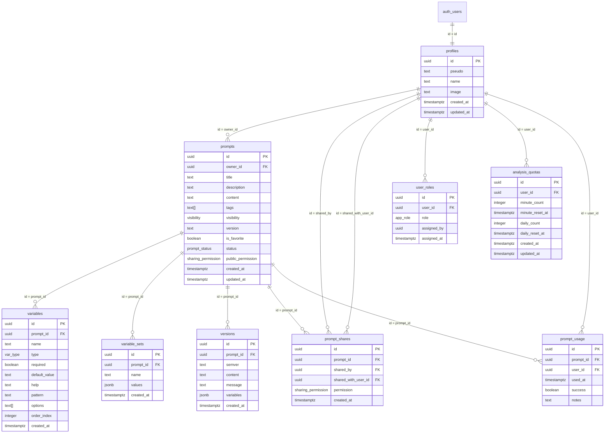

# Référence du Schéma de Base de Données PromptForge

## Vue d'Ensemble

Ce document décrit l'intégralité du schéma de base de données PostgreSQL utilisé par PromptForge, incluant toutes les tables, vues, enums, fonctions, triggers et politiques RLS.

### Statistiques

| Élément | Nombre |
|---------|--------|
| Tables | 9 |
| Vues | 2 |
| Enums | 5 |
| Fonctions | 6 |
| Triggers | 4 |
| Politiques RLS | ~40 |
| Migrations | 42 |

---

## Diagramme ERD



---

## Enums

### `visibility`

Contrôle la visibilité d'un prompt.

| Valeur | Description |
|--------|-------------|
| `PRIVATE` | Visible uniquement par le propriétaire |
| `SHARED` | Visible par tous les utilisateurs authentifiés (si publié) |

### `var_type`

Types de variables supportés dans les prompts.

| Valeur | Description |
|--------|-------------|
| `STRING` | Texte simple |
| `NUMBER` | Valeur numérique |
| `BOOLEAN` | Vrai/Faux |
| `ENUM` | Liste de choix prédéfinis |
| `DATE` | Date |
| `MULTISTRING` | Texte multi-lignes |

### `prompt_status`

Statut de publication d'un prompt.

| Valeur | Description |
|--------|-------------|
| `DRAFT` | Brouillon, non visible par les autres |
| `PUBLISHED` | Publié, visible selon les règles de visibilité |

### `sharing_permission`

Niveau de permission pour le partage.

| Valeur | Description |
|--------|-------------|
| `READ` | Lecture seule |
| `WRITE` | Lecture et modification |

### `app_role`

Rôles applicatifs pour la gestion des droits.

| Valeur | Description |
|--------|-------------|
| `USER` | Utilisateur standard |
| `ADMIN` | Administrateur avec droits étendus |

---

## Tables

### 1. `profiles`

Table de profils utilisateurs, liée 1:1 avec `auth.users`.

| Colonne | Type | Nullable | Default | Description |
|---------|------|----------|---------|-------------|
| `id` | `uuid` | NO | - | PK, FK vers `auth.users.id` |
| `pseudo` | `text` | YES | - | Pseudo unique de l'utilisateur |
| `name` | `text` | YES | - | Nom d'affichage |
| `image` | `text` | YES | - | URL de l'avatar |
| `created_at` | `timestamptz` | YES | `now()` | Date de création |
| `updated_at` | `timestamptz` | YES | `now()` | Date de modification |

**Contraintes :**
- `profiles_pkey` : PRIMARY KEY sur `id`
- `unique_pseudo` : UNIQUE sur `pseudo` (si non null)

**Index :**
- `idx_profiles_pseudo` sur `pseudo`

**Triggers :**
- `update_profiles_updated_at` : Met à jour `updated_at` avant UPDATE

**RLS Policies (8) :**

| Policy | Command | Type | Expression |
|--------|---------|------|------------|
| Deny anonymous access to profiles | ALL | RESTRICTIVE | `false` |
| Users can view only their own profile | SELECT | RESTRICTIVE | `auth.uid() = id` |
| Users can update their own profile | UPDATE | RESTRICTIVE | `auth.uid() = id` |
| Users can delete their own profile | DELETE | RESTRICTIVE | `auth.uid() = id` |
| Users can insert their own profile | INSERT | RESTRICTIVE | `auth.uid() = id` |
| Owners can view profiles of users they shared with | SELECT | RESTRICTIVE | `EXISTS (SELECT 1 FROM prompt_shares WHERE shared_with_user_id = profiles.id AND shared_by = auth.uid())` |
| Shared users can view profile of who shared with them | SELECT | RESTRICTIVE | `EXISTS (SELECT 1 FROM prompt_shares WHERE shared_by = profiles.id AND shared_with_user_id = auth.uid())` |
| Require auth for profiles select | SELECT | RESTRICTIVE | `auth.uid() IS NOT NULL` |

**Privilèges :**
```sql
REVOKE ALL ON profiles FROM anon, public;
GRANT SELECT, INSERT, UPDATE, DELETE ON profiles TO authenticated;
GRANT ALL ON profiles TO service_role;
```

---

### 2. `prompts`

Table principale des prompts créés par les utilisateurs.

| Colonne | Type | Nullable | Default | Description |
|---------|------|----------|---------|-------------|
| `id` | `uuid` | NO | `uuid_generate_v4()` | PK |
| `owner_id` | `uuid` | NO | - | FK vers `profiles.id` |
| `title` | `text` | NO | - | Titre du prompt |
| `description` | `text` | YES | - | Description optionnelle |
| `content` | `text` | NO | - | Contenu du prompt |
| `tags` | `text[]` | YES | `'{}'` | Tags pour catégorisation |
| `visibility` | `visibility` | YES | `'PRIVATE'` | Visibilité |
| `version` | `text` | YES | `'1.0.0'` | Version SemVer |
| `is_favorite` | `boolean` | YES | `false` | Marqué comme favori |
| `status` | `prompt_status` | YES | `'PUBLISHED'` | Statut de publication |
| `public_permission` | `sharing_permission` | NO | `'READ'` | Permission publique par défaut |
| `created_at` | `timestamptz` | YES | `now()` | Date de création |
| `updated_at` | `timestamptz` | YES | `now()` | Date de modification |

**Contraintes :**
- `prompts_pkey` : PRIMARY KEY sur `id`
- `prompts_owner_id_fkey` : FK vers `profiles(id)`

**Index :**
- `idx_prompts_owner_id` sur `owner_id`
- `idx_prompts_visibility` sur `visibility`
- `idx_prompts_status` sur `status`
- `idx_prompts_created_at` sur `created_at DESC`

**Triggers :**
- `update_prompts_updated_at` : Met à jour `updated_at` avant UPDATE

**RLS Policies (6) :**

| Policy | Command | Type | Expression |
|--------|---------|------|------------|
| Deny anonymous access to prompts | ALL | RESTRICTIVE | `false` |
| Require auth for prompts select | SELECT | RESTRICTIVE | `auth.uid() IS NOT NULL` |
| Users can view own and shared prompts | SELECT | RESTRICTIVE | `auth.uid() = owner_id OR (visibility = 'SHARED' AND status = 'PUBLISHED') OR EXISTS (SELECT 1 FROM prompt_shares WHERE prompt_id = prompts.id AND shared_with_user_id = auth.uid())` |
| Users can create their own prompts | INSERT | RESTRICTIVE | `auth.uid() = owner_id` |
| Users can update own prompts or shared with write permission | UPDATE | RESTRICTIVE | `auth.uid() = owner_id OR (visibility = 'SHARED' AND status = 'PUBLISHED' AND public_permission = 'WRITE') OR EXISTS (SELECT 1 FROM prompt_shares WHERE prompt_id = prompts.id AND shared_with_user_id = auth.uid() AND permission = 'WRITE')` |
| Users can delete their own prompts | DELETE | RESTRICTIVE | `auth.uid() = owner_id` |

**Privilèges :**
```sql
REVOKE ALL ON prompts FROM anon, public;
GRANT SELECT, INSERT, UPDATE, DELETE ON prompts TO authenticated;
GRANT ALL ON prompts TO service_role;
```

---

### 3. `variables`

Variables détectées ou définies dans les prompts.

| Colonne | Type | Nullable | Default | Description |
|---------|------|----------|---------|-------------|
| `id` | `uuid` | NO | `uuid_generate_v4()` | PK |
| `prompt_id` | `uuid` | NO | - | FK vers `prompts.id` |
| `name` | `text` | NO | - | Nom de la variable |
| `type` | `var_type` | YES | `'STRING'` | Type de la variable |
| `required` | `boolean` | YES | `false` | Variable obligatoire |
| `default_value` | `text` | YES | - | Valeur par défaut |
| `help` | `text` | YES | - | Texte d'aide |
| `pattern` | `text` | YES | - | Pattern de validation (regex) |
| `options` | `text[]` | YES | - | Options pour type ENUM |
| `order_index` | `integer` | YES | `0` | Ordre d'affichage |
| `created_at` | `timestamptz` | YES | `now()` | Date de création |

**Contraintes :**
- `variables_pkey` : PRIMARY KEY sur `id`
- `variables_prompt_id_fkey` : FK vers `prompts(id)` ON DELETE CASCADE
- `unique_variable_name_per_prompt` : UNIQUE sur `(prompt_id, name)`
- CHECK `options` : Max 50 options, max 100 caractères chacune

**Index :**
- `idx_variables_prompt_id` sur `prompt_id`

**Triggers :**
- `validate_variables_count_trigger` : Limite à 50 variables par prompt
- `validate_variable_options_trigger` : Valide les contraintes sur `options`

**RLS Policies (3) :**

| Policy | Command | Type | Expression |
|--------|---------|------|------------|
| Deny anonymous access to variables | ALL | RESTRICTIVE | `false` |
| Variables inherit prompt permissions for select | SELECT | RESTRICTIVE | `EXISTS (SELECT 1 FROM prompts WHERE prompts.id = variables.prompt_id AND (prompts.owner_id = auth.uid() OR (prompts.visibility = 'SHARED' AND prompts.status = 'PUBLISHED') OR EXISTS (SELECT 1 FROM prompt_shares WHERE prompt_shares.prompt_id = prompts.id AND prompt_shares.shared_with_user_id = auth.uid())))` |
| Users can manage variables for owned or write-shared prompts | ALL | RESTRICTIVE | `EXISTS (SELECT 1 FROM prompts WHERE prompts.id = variables.prompt_id AND (prompts.owner_id = auth.uid() OR (prompts.visibility = 'SHARED' AND prompts.status = 'PUBLISHED' AND prompts.public_permission = 'WRITE') OR EXISTS (SELECT 1 FROM prompt_shares WHERE prompt_shares.prompt_id = prompts.id AND prompt_shares.shared_with_user_id = auth.uid() AND prompt_shares.permission = 'WRITE')))` |

> **Note sécurité (Migration 43)** : La policy SELECT exige désormais `status = 'PUBLISHED'` en plus de `visibility = 'SHARED'`, alignant les variables sur le pattern sécurisé de la table `versions`. Cela empêche l'exposition des variables de brouillons partagés.

---

### 4. `variable_sets`

Ensembles de valeurs prédéfinies pour les variables d'un prompt.

| Colonne | Type | Nullable | Default | Description |
|---------|------|----------|---------|-------------|
| `id` | `uuid` | NO | `uuid_generate_v4()` | PK |
| `prompt_id` | `uuid` | NO | - | FK vers `prompts.id` |
| `name` | `text` | NO | - | Nom de l'ensemble |
| `values` | `jsonb` | YES | `'{}'` | Valeurs des variables |
| `created_at` | `timestamptz` | YES | `now()` | Date de création |

**Contraintes :**
- `variable_sets_pkey` : PRIMARY KEY sur `id`
- `variable_sets_prompt_id_fkey` : FK vers `prompts(id)` ON DELETE CASCADE

**Index :**
- `idx_variable_sets_prompt_id` sur `prompt_id`

**RLS Policies (3) :**

| Policy | Command | Type | Expression |
|--------|---------|------|------------|
| Deny anonymous access to variable_sets | ALL | RESTRICTIVE | `false` |
| Variable sets inherit prompt permissions for select | SELECT | RESTRICTIVE | `EXISTS (SELECT 1 FROM prompts WHERE prompts.id = variable_sets.prompt_id AND (prompts.owner_id = auth.uid() OR (prompts.visibility = 'SHARED' AND prompts.status = 'PUBLISHED') OR EXISTS (SELECT 1 FROM prompt_shares WHERE prompt_shares.prompt_id = prompts.id AND prompt_shares.shared_with_user_id = auth.uid())))` |
| Users can manage variable sets for their prompts | ALL | RESTRICTIVE | `EXISTS (SELECT 1 FROM prompts WHERE prompts.id = variable_sets.prompt_id AND prompts.owner_id = auth.uid())` |

> **Note sécurité (Migration 43)** : La policy SELECT exige désormais `status = 'PUBLISHED'` en plus de `visibility = 'SHARED'`, et vérifie les partages explicites via `prompt_shares`. Cela empêche l'exposition des ensembles de variables de brouillons partagés.

---

### 5. `versions`

Historique des versions des prompts (versioning SemVer).

| Colonne | Type | Nullable | Default | Description |
|---------|------|----------|---------|-------------|
| `id` | `uuid` | NO | `uuid_generate_v4()` | PK |
| `prompt_id` | `uuid` | NO | - | FK vers `prompts.id` |
| `semver` | `text` | NO | - | Version SemVer (ex: 1.2.0) |
| `content` | `text` | NO | - | Contenu du prompt à cette version |
| `message` | `text` | YES | - | Message de changement |
| `variables` | `jsonb` | YES | `'[]'` | Snapshot des variables |
| `created_at` | `timestamptz` | YES | `now()` | Date de création |

**Contraintes :**
- `versions_pkey` : PRIMARY KEY sur `id`
- `versions_prompt_id_fkey` : FK vers `prompts(id)` ON DELETE CASCADE
- `unique_version_per_prompt` : UNIQUE sur `(prompt_id, semver)`

**Index :**
- `idx_versions_prompt_id` sur `prompt_id`
- `idx_versions_semver` sur `semver`

**RLS Policies (5) :**

| Policy | Command | Type | Expression |
|--------|---------|------|------------|
| Deny anonymous access to versions | ALL | RESTRICTIVE | `false` |
| Users can view versions of accessible prompts | SELECT | RESTRICTIVE | `EXISTS (SELECT 1 FROM prompts WHERE prompts.id = versions.prompt_id AND (prompts.owner_id = auth.uid() OR (prompts.visibility = 'SHARED' AND prompts.status = 'PUBLISHED') OR EXISTS (SELECT 1 FROM prompt_shares WHERE prompt_shares.prompt_id = prompts.id AND prompt_shares.shared_with_user_id = auth.uid())))` |
| Users can create versions with write permission | INSERT | RESTRICTIVE | (même logique avec permission WRITE) |
| Users can update versions with write permission | UPDATE | RESTRICTIVE | (même logique avec permission WRITE) |
| Only owners can delete versions | DELETE | RESTRICTIVE | `EXISTS (SELECT 1 FROM prompts WHERE prompts.id = versions.prompt_id AND prompts.owner_id = auth.uid())` |

---

### 6. `prompt_shares`

Partages de prompts entre utilisateurs.

| Colonne | Type | Nullable | Default | Description |
|---------|------|----------|---------|-------------|
| `id` | `uuid` | NO | `gen_random_uuid()` | PK |
| `prompt_id` | `uuid` | NO | - | FK vers `prompts.id` |
| `shared_by` | `uuid` | NO | - | FK vers `profiles.id` (partageur) |
| `shared_with_user_id` | `uuid` | NO | - | FK vers `profiles.id` (destinataire) |
| `permission` | `sharing_permission` | NO | `'READ'` | Niveau de permission |
| `created_at` | `timestamptz` | YES | `now()` | Date de création |

**Contraintes :**
- `prompt_shares_pkey` : PRIMARY KEY sur `id`
- `prompt_shares_prompt_id_fkey` : FK vers `prompts(id)` ON DELETE CASCADE
- `prompt_shares_shared_with_user_id_fkey` : FK vers `profiles(id)`
- `unique_share` : UNIQUE sur `(prompt_id, shared_with_user_id)`

**Index :**
- `idx_prompt_shares_prompt_id` sur `prompt_id`
- `idx_prompt_shares_shared_by` sur `shared_by`
- `idx_prompt_shares_shared_with` sur `shared_with_user_id`
- `idx_prompt_shares_by_with` sur `(shared_by, shared_with_user_id)`
- `idx_prompt_shares_with_by` sur `(shared_with_user_id, shared_by)`

**RLS Policies (6) :**

| Policy | Command | Type | Expression |
|--------|---------|------|------------|
| Deny anonymous access to prompt_shares | ALL | RESTRICTIVE | `false` |
| Require auth for prompt_shares select | SELECT | RESTRICTIVE | `auth.uid() IS NOT NULL` |
| Users can view their shares | SELECT | RESTRICTIVE | `auth.uid() = shared_with_user_id OR auth.uid() = shared_by` |
| Owners can create shares | INSERT | RESTRICTIVE | `EXISTS (SELECT 1 FROM prompts WHERE prompts.id = prompt_shares.prompt_id AND prompts.owner_id = auth.uid())` |
| Owner or share creator can update shares | UPDATE | RESTRICTIVE | `auth.uid() = shared_by OR EXISTS (SELECT 1 FROM prompts WHERE prompts.id = prompt_shares.prompt_id AND prompts.owner_id = auth.uid())` |
| Owner or share creator can delete shares | DELETE | RESTRICTIVE | (même logique que UPDATE) |

---

### 7. `prompt_usage`

Historique d'utilisation des prompts.

| Colonne | Type | Nullable | Default | Description |
|---------|------|----------|---------|-------------|
| `id` | `uuid` | NO | `gen_random_uuid()` | PK |
| `prompt_id` | `uuid` | NO | - | FK vers `prompts.id` |
| `user_id` | `uuid` | NO | - | FK vers `profiles.id` |
| `used_at` | `timestamptz` | NO | `now()` | Date d'utilisation |
| `success` | `boolean` | YES | - | Utilisation réussie |
| `notes` | `text` | YES | - | Notes optionnelles |

**Contraintes :**
- `prompt_usage_pkey` : PRIMARY KEY sur `id`
- `prompt_usage_prompt_id_fkey` : FK vers `prompts(id)` ON DELETE CASCADE
- `prompt_usage_user_id_fkey` : FK vers `profiles(id)`

**Index :**
- `idx_prompt_usage_user_id` sur `user_id`
- `idx_prompt_usage_prompt_id` sur `prompt_id`
- `idx_prompt_usage_used_at` sur `used_at DESC`

**RLS Policies (5) :**

| Policy | Command | Type | Expression |
|--------|---------|------|------------|
| Deny anonymous access to prompt_usage | ALL | RESTRICTIVE | `false` |
| Users can view their own usage | SELECT | RESTRICTIVE | `auth.uid() = user_id` |
| Users can insert their own usage | INSERT | RESTRICTIVE | `auth.uid() = user_id` |
| Users can update their own usage | UPDATE | RESTRICTIVE | `auth.uid() = user_id` |
| Users can delete their own usage | DELETE | RESTRICTIVE | `auth.uid() = user_id` |

---

### 8. `user_roles`

Rôles applicatifs des utilisateurs (séparé des profils pour sécurité).

| Colonne | Type | Nullable | Default | Description |
|---------|------|----------|---------|-------------|
| `id` | `uuid` | NO | `gen_random_uuid()` | PK |
| `user_id` | `uuid` | NO | - | FK vers `profiles.id` |
| `role` | `app_role` | NO | - | Rôle attribué |
| `assigned_by` | `uuid` | YES | - | FK vers `profiles.id` (attributeur) |
| `assigned_at` | `timestamptz` | YES | `now()` | Date d'attribution |

**Contraintes :**
- `user_roles_pkey` : PRIMARY KEY sur `id`
- `unique_user_role` : UNIQUE sur `(user_id, role)`

**Index :**
- `idx_user_roles_user_id` sur `user_id`

**RLS Policies (3) :**

| Policy | Command | Type | Expression |
|--------|---------|------|------------|
| Deny anonymous access to user_roles | ALL | RESTRICTIVE | `false` |
| Users can view their own roles | SELECT | RESTRICTIVE | `auth.uid() = user_id` |
| Only admins can manage roles | ALL | RESTRICTIVE | `has_role(auth.uid(), 'ADMIN')` |

---

### 9. `analysis_quotas`

Quotas d'utilisation de l'analyse IA par utilisateur.

| Colonne | Type | Nullable | Default | Description |
|---------|------|----------|---------|-------------|
| `id` | `uuid` | NO | `gen_random_uuid()` | PK |
| `user_id` | `uuid` | NO | - | FK vers `profiles.id` |
| `minute_count` | `integer` | NO | `0` | Compteur par minute |
| `minute_reset_at` | `timestamptz` | NO | `now() + interval '1 minute'` | Reset du compteur minute |
| `daily_count` | `integer` | NO | `0` | Compteur journalier |
| `daily_reset_at` | `timestamptz` | NO | `date_trunc('day', now() AT TIME ZONE 'UTC') + interval '1 day'` | Reset du compteur journalier |
| `created_at` | `timestamptz` | YES | `now()` | Date de création |
| `updated_at` | `timestamptz` | YES | `now()` | Date de modification |

**Contraintes :**
- `analysis_quotas_pkey` : PRIMARY KEY sur `id`
- `analysis_quotas_user_id_key` : UNIQUE sur `user_id`

**Index :**
- `idx_analysis_quotas_user_id` sur `user_id`
- `idx_analysis_quotas_minute_reset` sur `minute_reset_at`
- `idx_analysis_quotas_daily_reset` sur `daily_reset_at`

**RLS Policies (2) :**

| Policy | Command | Type | Expression |
|--------|---------|------|------------|
| Deny anonymous access to analysis_quotas | ALL | RESTRICTIVE | `false` |
| Users can manage their own quotas | ALL | RESTRICTIVE | `auth.uid() = user_id` |

---

## Vues

### `prompts_with_share_count`

Vue enrichie des prompts avec le nombre de partages.

```sql
CREATE VIEW prompts_with_share_count
WITH (security_invoker = true, security_barrier = true)
AS
SELECT 
    p.*,
    COALESCE(COUNT(ps.id), 0)::integer AS share_count
FROM prompts p
LEFT JOIN prompt_shares ps ON ps.prompt_id = p.id
GROUP BY p.id;
```

**Colonnes héritées de `prompts` + :**
- `share_count` : Nombre de partages actifs

**Sécurité :**
- `security_invoker = true` : Hérite des RLS de l'appelant
- `security_barrier = true` : Empêche les attaques par timing

**Privilèges :**
```sql
GRANT SELECT ON prompts_with_share_count TO authenticated, service_role;
```

---

### `public_profiles`

Vue publique des profils (sans données sensibles).

```sql
CREATE VIEW public_profiles
WITH (security_invoker = true, security_barrier = true)
AS
SELECT 
    id,
    pseudo,
    name,
    image,
    created_at
FROM profiles;
```

**Colonnes exposées :**
- `id`, `pseudo`, `name`, `image`, `created_at`

**Colonnes EXCLUES :**
- `updated_at` (non pertinent)
- Aucun email (supprimé de profiles pour sécurité)

**Sécurité :**
- Hérite des RLS de `profiles` via `security_invoker`

**Privilèges :**
```sql
GRANT SELECT ON public_profiles TO authenticated;
```

---

## Fonctions

### `handle_new_user()`

Crée automatiquement un profil lors de l'inscription.

```sql
CREATE OR REPLACE FUNCTION public.handle_new_user()
RETURNS trigger
LANGUAGE plpgsql
SECURITY DEFINER
SET search_path TO ''
AS $$
BEGIN
  INSERT INTO public.profiles (id, pseudo)
  VALUES (
    NEW.id,
    COALESCE(
      NULLIF(TRIM(NEW.raw_user_meta_data->>'pseudo'), ''),
      'user_' || LEFT(NEW.id::text, 8)
    )
  );
  RETURN NEW;
END;
$$;
```

**Trigger associé :**
```sql
CREATE TRIGGER on_auth_user_created
  AFTER INSERT ON auth.users
  FOR EACH ROW EXECUTE FUNCTION public.handle_new_user();
```

---

### `update_updated_at_column()`

Met à jour automatiquement `updated_at` lors des modifications.

```sql
CREATE OR REPLACE FUNCTION public.update_updated_at_column()
RETURNS trigger
LANGUAGE plpgsql
SET search_path TO ''
AS $$
BEGIN
  NEW.updated_at = NOW();
  RETURN NEW;
END;
$$;
```

**Triggers associés :**
- Sur `profiles` : `update_profiles_updated_at`
- Sur `prompts` : `update_prompts_updated_at`
- Sur `analysis_quotas` : `update_analysis_quotas_updated_at`

---

### `has_role(_user_id, _role)`

Vérifie si un utilisateur possède un rôle donné.

```sql
CREATE OR REPLACE FUNCTION public.has_role(_user_id uuid, _role app_role)
RETURNS boolean
LANGUAGE sql
STABLE
SECURITY DEFINER
SET search_path TO 'public'
AS $$
  SELECT EXISTS (
    SELECT 1
    FROM public.user_roles
    WHERE user_id = _user_id AND role = _role
  )
$$;
```

**Usage :**
```sql
-- Dans une policy RLS
USING (has_role(auth.uid(), 'ADMIN'))
```

---

### `get_user_id_by_email(user_email)`

Recherche l'ID utilisateur par email (depuis `auth.users`).

```sql
CREATE OR REPLACE FUNCTION public.get_user_id_by_email(user_email text)
RETURNS uuid
LANGUAGE plpgsql
SECURITY DEFINER
SET search_path TO 'public'
AS $$
DECLARE
  found_user_id UUID;
BEGIN
  SELECT id INTO found_user_id
  FROM auth.users
  WHERE LOWER(TRIM(email)) = LOWER(TRIM(user_email))
  LIMIT 1;
  
  RETURN found_user_id;
END;
$$;
```

**Note sécurité :**
- `SECURITY DEFINER` permet d'accéder à `auth.users`
- L'email n'est PAS stocké dans `profiles` (privacy)

---

### `validate_variable_options()`

Valide les contraintes sur les options ENUM des variables.

```sql
CREATE OR REPLACE FUNCTION public.validate_variable_options()
RETURNS trigger
LANGUAGE plpgsql
SECURITY DEFINER
SET search_path TO 'public'
AS $$
BEGIN
  -- Max 50 options
  IF NEW.options IS NOT NULL AND array_length(NEW.options, 1) > 50 THEN
    RAISE EXCEPTION 'Le nombre d''options ne peut pas dépasser 50'
    USING ERRCODE = '23514';
  END IF;

  -- Max 100 caractères par option
  IF NEW.options IS NOT NULL THEN
    PERFORM 1
    FROM unnest(NEW.options) AS opt
    WHERE char_length(opt) > 100
    LIMIT 1;

    IF FOUND THEN
      RAISE EXCEPTION 'Chaque option ne peut pas dépasser 100 caractères'
      USING ERRCODE = '23514';
    END IF;
  END IF;

  RETURN NEW;
END;
$$;
```

---

### `validate_variables_count()`

Limite le nombre de variables par prompt à 50.

```sql
CREATE OR REPLACE FUNCTION public.validate_variables_count()
RETURNS trigger
LANGUAGE plpgsql
SECURITY DEFINER
SET search_path TO 'public'
AS $$
DECLARE
  current_count INTEGER;
BEGIN
  SELECT COUNT(*) INTO current_count
  FROM public.variables
  WHERE prompt_id = NEW.prompt_id;

  IF TG_OP = 'INSERT' AND current_count >= 50 THEN
    RAISE EXCEPTION 'Un prompt ne peut pas avoir plus de 50 variables'
    USING ERRCODE = '23514';
  END IF;

  RETURN NEW;
END;
$$;
```

---

## Chronologie des Migrations

Les 42 migrations sont listées dans l'ordre d'exécution requis :

| # | Timestamp | Nom | Description |
|---|-----------|-----|-------------|
| 1 | 20251019014004 | initial_schema | Création profiles, prompts, variables, versions |
| 2 | 20251019020424 | deny_anonymous_roles | Deny anon, table user_roles, fonction has_role() |
| 3 | 20251019201210 | prompt_usage | Table prompt_usage |
| 4 | 20251020163000 | variable_sets | Table variable_sets |
| 5 | 20251021090000 | prompt_shares | Table prompt_shares |
| 6 | 20251022110000 | rls_prompts | Policies RLS sur prompts |
| 7 | 20251023140000 | rls_variables | Policies RLS sur variables |
| 8 | 20251024080000 | rls_versions | Policies RLS sur versions |
| 9 | 20251025100000 | indexes_performance | Index de performance |
| 10 | 20251026120000 | trigger_updated_at | Triggers updated_at |
| 11 | 20251027090000 | variable_constraints | Contraintes sur variables |
| 12 | 20251028110000 | unique_pseudo | Contrainte unique sur pseudo |
| 13 | 20251029130000 | prompt_visibility | Enum visibility |
| 14 | 20251030150000 | prompt_status | Enum prompt_status |
| 15 | 20251031100000 | sharing_permission | Enum sharing_permission |
| 16 | 20251101120000 | public_permission | Colonne public_permission |
| 17 | 20251102140000 | handle_new_user | Fonction et trigger handle_new_user |
| 18 | 20251103090000 | get_user_by_email | Fonction get_user_id_by_email |
| 19 | 20251104110000 | rls_prompt_shares | Policies RLS sur prompt_shares |
| 20 | 20251105130000 | rls_variable_sets | Policies RLS sur variable_sets |
| 21 | 20251106150000 | rls_prompt_usage | Policies RLS sur prompt_usage |
| 22 | 20251107100000 | prompts_view | Vue prompts_with_share_count |
| 23 | 20251108120000 | public_profiles | Vue public_profiles |
| 24 | 20251109140000 | security_invoker | security_invoker sur vues |
| 25 | 20251110090000 | revoke_anon | REVOKE ALL FROM anon |
| 26 | 20251111110000 | variable_validation | Fonctions de validation |
| 27 | 20251112130000 | app_role_enum | Enum app_role |
| 28 | 20251113150000 | user_roles_rls | Policies RLS sur user_roles |
| 29 | 20251114100000 | indexes_shares | Index sur prompt_shares |
| 30 | 20251115120000 | force_rls | FORCE ROW LEVEL SECURITY |
| 31 | 20251116140000 | profiles_sharing_rls | Policies partage sur profiles |
| 32 | 20251117090000 | require_auth | Policies RESTRICTIVE require auth |
| 33 | 20251118110000 | var_type_enum | Enum var_type |
| 34 | 20251119130000 | variable_options | Colonne options sur variables |
| 35 | 20251120150000 | variable_help | Colonne help sur variables |
| 36 | 20251121100000 | variable_pattern | Colonne pattern sur variables |
| 37 | 20251122120000 | variable_order | Colonne order_index sur variables |
| 38 | 20251123140000 | version_message | Colonne message sur versions |
| 39 | 20251124090000 | version_variables | Colonne variables (jsonb) sur versions |
| 40 | 20251125110000 | cleanup_policies | Nettoyage policies orphelines |
| 41 | 20251126130000 | final_security | Audit final sécurité |
| 42 | 20260124020601 | analysis_quotas | Table analysis_quotas |

---

## Commandes de Vérification

### Lister toutes les tables

```sql
SELECT tablename 
FROM pg_tables 
WHERE schemaname = 'public'
ORDER BY tablename;
```

### Lister toutes les policies RLS

```sql
SELECT 
    schemaname,
    tablename,
    policyname,
    permissive,
    roles,
    cmd,
    qual,
    with_check
FROM pg_policies 
WHERE schemaname = 'public'
ORDER BY tablename, policyname;
```

### Vérifier les privilèges

```sql
SELECT 
    grantee,
    table_name,
    privilege_type
FROM information_schema.table_privileges
WHERE table_schema = 'public'
ORDER BY table_name, grantee;
```

### Vérifier RLS activée

```sql
SELECT 
    relname,
    relrowsecurity,
    relforcerowsecurity
FROM pg_class
WHERE relnamespace = 'public'::regnamespace
AND relkind = 'r';
```

---

## Patterns de Sécurité

### 1. Deny Anonymous par Défaut

Toutes les tables ont une policy :
```sql
CREATE POLICY "Deny anonymous access"
ON table_name
FOR ALL
TO anon
USING (false);
```

### 2. Require Auth (RESTRICTIVE)

Toutes les tables avec SELECT ont :
```sql
CREATE POLICY "Require auth for select"
ON table_name
FOR SELECT
TO authenticated
USING (auth.uid() IS NOT NULL);
```

### 3. Héritage via Prompt

Les tables liées (variables, versions, etc.) héritent des permissions via :
```sql
EXISTS (
  SELECT 1 FROM prompts
  WHERE prompts.id = child_table.prompt_id
  AND (prompts.owner_id = auth.uid() OR ...)
)
```

### 4. SECURITY DEFINER pour Fonctions Sensibles

Les fonctions accédant à `auth.users` ou contournant RLS utilisent :
```sql
CREATE FUNCTION ...
SECURITY DEFINER
SET search_path TO 'public'
```

---

## Dépendances de Suppression (CASCADE)

```
auth.users
    └── profiles (ON DELETE: aucun, géré par trigger)

profiles
    └── prompts.owner_id (pas de CASCADE, orphelins possibles)
    └── prompt_shares.shared_by (pas de CASCADE)
    └── prompt_shares.shared_with_user_id (pas de CASCADE)
    └── user_roles.user_id (pas de CASCADE)
    └── analysis_quotas.user_id (pas de CASCADE)

prompts
    └── variables (CASCADE)
    └── variable_sets (CASCADE)
    └── versions (CASCADE)
    └── prompt_shares (CASCADE)
    └── prompt_usage (CASCADE via prompt_id)
```

**⚠️ Attention :** La suppression d'un `profile` ne cascade PAS automatiquement. Il faut supprimer manuellement les données liées ou implémenter un trigger `BEFORE DELETE`.
