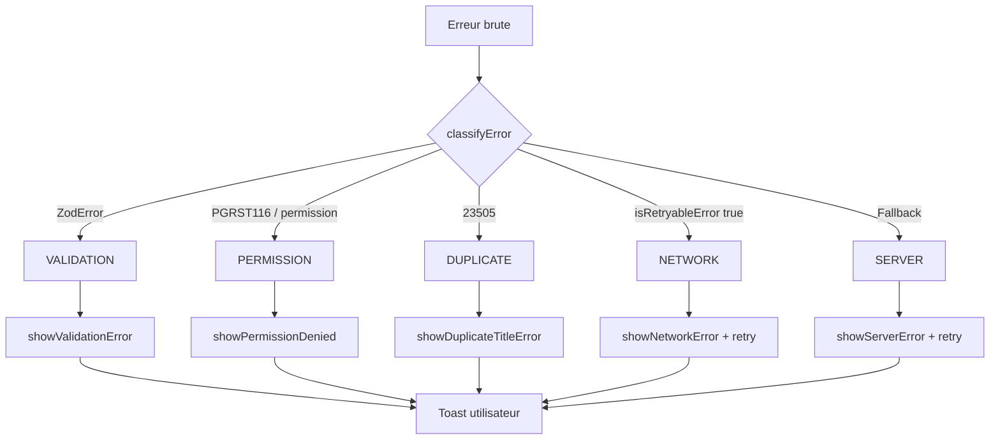
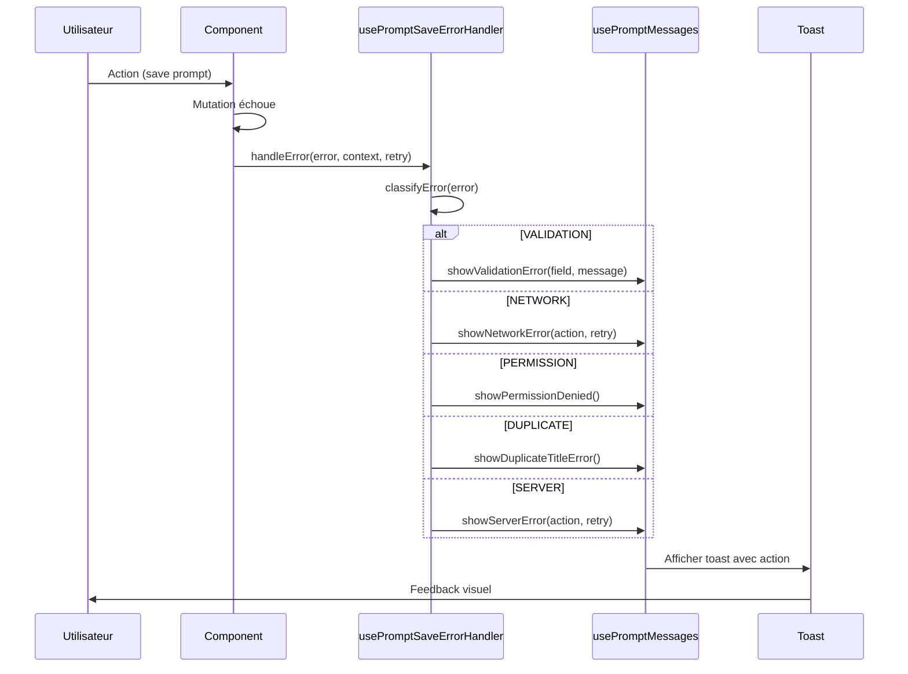

# Architecture de Gestion des Erreurs

## Vue d'ensemble

L'architecture de gestion des erreurs de PromptForge utilise une approche **typée et exhaustive** pour classifier et traiter toutes les erreurs de manière cohérente. Cette architecture garantit qu'aucun type d'erreur ne peut être oublié grâce aux vérifications TypeScript au moment de la compilation.



## 1. Classification des erreurs (`classifyError`)

### Localisation
`src/hooks/prompt-save/usePromptSaveErrorHandler.ts`

### Description
Fonction **pure** qui classifie une erreur brute en un type strict `SaveErrorType`. Exportée séparément pour permettre des tests unitaires isolés.

### Priorité de classification

| Priorité | Type | Condition de détection |
|----------|------|------------------------|
| 1 | `VALIDATION` | `error instanceof ZodError` ou `extractZodError(error)` retourne un résultat |
| 2 | `PERMISSION` | Code `PGRST116` ou message contenant "permission" |
| 3 | `DUPLICATE` | Code PostgreSQL `23505` (contrainte unique violée) |
| 4 | `NETWORK` | `isRetryableError(error)` retourne `true` |
| 5 | `SERVER` | Fallback pour toutes les autres erreurs |

### Exemple d'utilisation

```typescript
import { classifyError } from "@/hooks/prompt-save/usePromptSaveErrorHandler";

const errorType = classifyError(error);
// errorType: "VALIDATION" | "PERMISSION" | "DUPLICATE" | "NETWORK" | "SERVER"
```

## 2. Types d'erreurs (`SaveErrorType`)

### Définition

```typescript
export type SaveErrorType =
  | "VALIDATION"   // Erreurs de validation Zod (données invalides)
  | "PERMISSION"   // Accès refusé (RLS, droits insuffisants)
  | "NETWORK"      // Erreurs transitoires (réseau, timeout, 5xx)
  | "DUPLICATE"    // Contrainte unique violée (titre en doublon)
  | "SERVER";      // Erreur serveur générique (fallback)
```

### Détail par type

| Type | Source | Rejouable | Action utilisateur |
|------|--------|-----------|-------------------|
| `VALIDATION` | Zod, schémas | ❌ Non | Corriger les données |
| `PERMISSION` | RLS PostgreSQL | ❌ Non | Vérifier les droits |
| `DUPLICATE` | Contrainte unique | ❌ Non | Changer le titre |
| `NETWORK` | Réseau, timeout | ✅ Oui | Bouton "Réessayer" |
| `SERVER` | Erreurs 5xx | ✅ Oui | Bouton "Réessayer" |

## 3. Détection des erreurs rejouables (`isRetryableError`)

### Localisation
`src/lib/network.ts`

### Description
Détermine si une erreur est **transitoire** et peut être réessayée automatiquement par TanStack Query.

### Codes PostgreSQL non-rejouables

```typescript
const POSTGRES_UNRETRYABLE_CODES = new Set([
  "23505", // unique_violation
  "23503", // foreign_key_violation
  "23502", // not_null_violation
  "23514", // check_violation
  "42501", // insufficient_privilege
  "42P01", // undefined_table
  "PGRST116", // Row not found
  "PGRST301", // Too many rows
]);
```

### Patterns de messages non-rejouables

```typescript
const UNRETRYABLE_MESSAGE_PATTERNS = [
  "permission denied",
  "row-level security",
  "violates row-level security",
  "violates foreign key",
  "violates unique constraint",
  "duplicate key",
  "already exists",
  "not found",
  "invalid input",
  "validation",
];
```

### Erreurs considérées comme rejouables

- `fetch failed`, `network error`, `failed to fetch`
- `ECONNREFUSED`, `ENOTFOUND`, `ETIMEDOUT`
- Codes HTTP `408` (Request Timeout), `429` (Too Many Requests)
- Codes HTTP `5xx` (Server Error)

## 4. Switch exhaustif avec `assertNever`

### Pattern

```typescript
function assertNever(x: never): never {
  throw new Error(`Unhandled error type: ${x}`);
}

switch (errorType) {
  case "VALIDATION": { /* ... */ return; }
  case "NETWORK": { /* ... */ return; }
  case "PERMISSION": { /* ... */ return; }
  case "DUPLICATE": { /* ... */ return; }
  case "SERVER": { /* ... */ return; }
  default:
    assertNever(errorType); // Erreur de compilation si un cas manque
}
```

### Garantie TypeScript

Si un nouveau type est ajouté à `SaveErrorType` sans mise à jour du switch, TypeScript génère une **erreur de compilation** :

```
Argument of type '"NEW_TYPE"' is not assignable to parameter of type 'never'.
```

### Ajout d'un nouveau type d'erreur

1. Ajouter le type à `SaveErrorType`
2. Ajouter la condition de détection dans `classifyError`
3. Ajouter le case dans le switch de `handleError`
4. Ajouter les tests unitaires correspondants

## 5. Intégration avec TanStack Query

### Configuration de retry

```typescript
// src/lib/network.ts
export const RETRY_CONFIG = {
  MAX_ATTEMPTS: 3,
  INITIAL_DELAY: 1000,
  MAX_DELAY: 10000,
};
```

### Fonctions d'intégration

```typescript
// Délai exponentiel avec plafond
export function getRetryDelay(attemptNumber: number): number {
  const delay = RETRY_CONFIG.INITIAL_DELAY * Math.pow(2, attemptNumber - 1);
  return Math.min(delay, RETRY_CONFIG.MAX_DELAY);
}

// Décision de retry pour TanStack Query
export function shouldRetryMutation(failureCount: number, error: any): boolean {
  return failureCount < RETRY_CONFIG.MAX_ATTEMPTS && isRetryableError(error);
}
```

### Usage dans les mutations

```typescript
const mutation = useMutation({
  mutationFn: savePrompt,
  retry: shouldRetryMutation,
  retryDelay: getRetryDelay,
});
```

## 6. Flux complet de traitement



## 7. Fichiers concernés

| Fichier | Responsabilité |
|---------|---------------|
| `src/hooks/prompt-save/usePromptSaveErrorHandler.ts` | Classification et dispatch des erreurs |
| `src/lib/network.ts` | Détection erreurs rejouables, config retry |
| `src/features/prompts/hooks/usePromptMessages.ts` | Messages toast spécifiques aux prompts |
| `src/hooks/useSystemMessages.ts` | Messages toast système génériques |

## 8. Tests

### Tests unitaires

- `src/hooks/prompt-save/__tests__/usePromptSaveErrorHandler.test.ts`
  - Tests de `classifyError` pour chaque type
  - Tests de priorité de classification
  - Tests de `handleError` pour chaque contexte

- `src/lib/__tests__/network.test.ts`
  - Tests de `isRetryableError` pour chaque pattern
  - Tests de `getRetryDelay` (backoff exponentiel)
  - Tests de `shouldRetryMutation` (limite d'attempts)

### Exécution

```bash
npm run test src/hooks/prompt-save/__tests__/usePromptSaveErrorHandler.test.ts
npm run test src/lib/__tests__/network.test.ts
```
