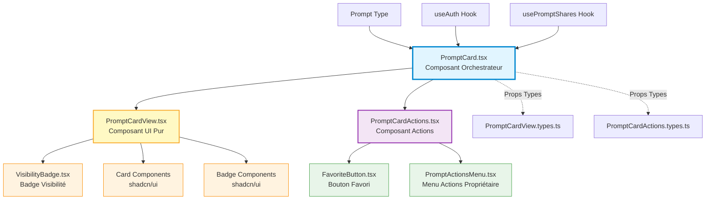

# Architecture PromptCard - Séparation des Responsabilités

## Vue d'ensemble

L'architecture de `PromptCard` a été refactorisée pour suivre le principe de **Separation of Concerns** (SoC), en séparant clairement la logique métier, l'affichage UI et la gestion des actions utilisateur.

## Diagramme d'Architecture



## Structure des Composants

### 1. **PromptCard.tsx** - Composant Orchestrateur (Logic Layer)

**Responsabilité** : Logique métier, gestion d'état, hooks et coordination

**Rôle** :
- Calcule les données dérivées (`isDraft`, `isOwner`, `shareCount`, `sharingState`)
- Gère les états locaux (dialogs, loading)
- Contient les handlers d'événements complexes
- Orchestre les interactions entre View et Actions
- Intègre les hooks (`useAuth`, `usePromptShares`)

**Points clés** :
```typescript
// Calculs de données dérivées
const isDraft = prompt.status === "DRAFT";
const isOwner = user?.id === prompt.owner_id;
const shareCount = shares?.length || 0;
const sharingState = calculateSharingState(prompt, shareCount);

// Gestion d'état
const [showDeleteDialog, setShowDeleteDialog] = useState(false);
const [showShareDialog, setShowShareDialog] = useState(false);

// Event handlers
const handleEdit = () => navigate(`/prompts/${prompt.id}/edit`);
const handleManageSharing = () => setShowShareDialog(true);
```

**Fichiers** :
- `src/features/prompts/components/PromptCard.tsx`

---

### 2. **PromptCardView.tsx** - Composant UI Pur (Presentation Layer)

**Responsabilité** : Rendu visuel sans logique métier

**Rôle** :
- Affichage pur des données reçues en props
- Gestion du layout et des styles
- Animations Framer Motion
- Affichage conditionnel simple (badges, tags)
- **Aucune logique métier, aucun hook**

**Props reçues** :
```typescript
interface PromptCardViewProps {
  prompt: Prompt;
  isDraft: boolean;
  isOwner: boolean;
  shareCount: number;
  sharingState: SharingState;
  onClick: () => void;
  index?: number;
  actions?: React.ReactNode; // Slot pour injecter les actions
}
```

**Points clés** :
- Composant **100% présentationnel**
- Utilise le **pattern Slot** avec `actions` prop
- Testable facilement sans mocks complexes
- Réutilisable dans différents contextes

**Fichiers** :
- `src/features/prompts/components/PromptCardView.tsx`
- `src/features/prompts/components/PromptCardView.types.ts`

---

### 3. **PromptCardActions.tsx** - Composant Actions (Actions Layer)

**Responsabilité** : Centralisation des actions utilisateur

**Rôle** :
- Regroupe toutes les actions disponibles (favori, menu)
- Gère la logique de propagation d'événements (`stopPropagation`)
- Adaptateurs entre les callbacks reçus et les composants enfants
- Affichage conditionnel basé sur `isOwner`

**Props reçues** :
```typescript
interface PromptCardActionsProps {
  prompt: Prompt;
  isOwner: boolean;
  onToggleFavorite: (id: string, currentState: boolean) => void;
  onDelete: (id: string) => void;
  onDuplicate: (id: string) => void;
  onToggleVisibility: (id: string, visibility: Visibility, permission: SharingPermission) => Promise<void>;
  onEdit: (id: string) => void;
  onManageSharing?: () => void;
}
```

**Points clés** :
- Empêche la propagation des clics vers la card
- Conditionne l'affichage du menu selon `isOwner`
- Transforme les props complexes en appels simples

**Fichiers** :
- `src/features/prompts/components/PromptCardActions.tsx`
- `src/features/prompts/components/PromptCardActions.types.ts`

---

## Flux de Données

### 1. **Rendu Initial**

```
PromptCard (reçoit prompt via props)
  ↓
Calcule isDraft, isOwner, shareCount, sharingState
  ↓
Passe les données à PromptCardView
  ↓
Injecte PromptCardActions dans le slot actions
  ↓
Rendu final de la card
```

### 2. **Interaction Utilisateur - Clic sur Favori**

```
User clique sur FavoriteButton
  ↓
PromptCardActions.handleToggleFavorite (stopPropagation)
  ↓
Appelle props.onToggleFavorite(prompt.id, is_favorite)
  ↓
PromptCard.handleToggleFavorite
  ↓
Mutation vers le backend
```

### 3. **Interaction Utilisateur - Édition**

```
User clique sur "Éditer" dans le menu
  ↓
PromptCardActions.handleEdit
  ↓
Appelle props.onEdit(prompt.id)
  ↓
PromptCard.handleEdit
  ↓
Navigation vers /prompts/:id/edit
```

---

## Avantages de cette Architecture

### ✅ **Séparation des Responsabilités**
- **Logic** : PromptCard (calculs, état, hooks)
- **Presentation** : PromptCardView (rendu pur)
- **Actions** : PromptCardActions (interactions)

### ✅ **Testabilité**
- PromptCardView : tests unitaires simples sans mocks
- PromptCardActions : tests d'interactions isolés
- PromptCard : tests d'intégration avec mocks de hooks

### ✅ **Réutilisabilité**
- PromptCardView peut être utilisé dans d'autres contextes
- PromptCardActions peut être réutilisé pour d'autres types de cards
- Composants découplés et modulaires

### ✅ **Maintenabilité**
- Modifications UI dans PromptCardView uniquement
- Modifications de logique dans PromptCard uniquement
- Ajout d'actions dans PromptCardActions uniquement

### ✅ **Performance**
- Mémoïsation facilitée (composants purs)
- Re-rendus optimisés
- Props stables et prévisibles

---

## Comparaison Avant/Après

### **Avant** (Monolithique)

```typescript
// PromptCard.tsx - 200+ lignes
const PromptCard = ({ prompt }) => {
  // Logique métier
  const isDraft = prompt.status === "DRAFT";
  
  // Rendu UI
  return (
    <Card>
      <CardHeader>
        {/* UI directe */}
        <CardTitle>{prompt.title}</CardTitle>
        {isDraft && <Badge>Brouillon</Badge>}
      </CardHeader>
      <CardContent>
        {/* Actions inline */}
        <FavoriteButton onClick={...} />
        {isOwner && <PromptActionsMenu {...} />}
      </CardContent>
    </Card>
  );
};
```

**Problèmes** :
- ❌ Logique et UI mélangées
- ❌ Difficile à tester
- ❌ Non réutilisable
- ❌ Code dupliqué

---

### **Après** (Modulaire)

```typescript
// PromptCard.tsx - Logique pure
const PromptCard = ({ prompt }) => {
  const isDraft = prompt.status === "DRAFT";
  // ... calculs
  
  return (
    <PromptCardView
      prompt={prompt}
      isDraft={isDraft}
      actions={
        <PromptCardActions
          prompt={prompt}
          onEdit={handleEdit}
          // ... callbacks
        />
      }
    />
  );
};

// PromptCardView.tsx - UI pure
export const PromptCardView = ({ prompt, isDraft, actions }) => (
  <Card>
    <CardHeader>
      <CardTitle>{prompt.title}</CardTitle>
      {isDraft && <Badge>Brouillon</Badge>}
      {actions} {/* Slot pattern */}
    </CardHeader>
  </Card>
);

// PromptCardActions.tsx - Actions centralisées
export const PromptCardActions = ({ prompt, onEdit }) => (
  <div onClick={stopPropagation}>
    <FavoriteButton />
    {isOwner && <PromptActionsMenu />}
  </div>
);
```

**Avantages** :
- ✅ Responsabilités séparées
- ✅ Facilement testable
- ✅ Composants réutilisables
- ✅ Code propre et maintenable

---

## Pattern Utilisés

### 1. **Container/Presenter Pattern**
- `PromptCard` = Container (logique)
- `PromptCardView` = Presenter (UI)

### 2. **Composition via Slots**
- `actions` prop permet d'injecter n'importe quel contenu
- Flexibilité maximale sans coupling

### 3. **Props Drilling Minimal**
- Données dérivées calculées au niveau supérieur
- Props simples et typées transmises aux enfants

### 4. **Single Responsibility Principle**
- Chaque composant a UNE responsabilité claire
- Modifications isolées sans effet de bord

---

## Tests

### **PromptCardView** 
Fichier : `src/features/prompts/components/__tests__/PromptCardView.test.tsx`

Tests couverts :
- ✅ Rendu des props (titre, description, version)
- ✅ Badges conditionnels (brouillon, tags, partage)
- ✅ Intégration VisibilityBadge
- ✅ Gestion du clic
- ✅ Slot actions
- ✅ Edge cases (null, vides)

### **PromptCardActions**
Fichier : `src/features/prompts/components/__tests__/PromptCardActions.test.tsx`

Tests couverts :
- ✅ Affichage conditionnel (isOwner)
- ✅ Callbacks (edit, duplicate, delete, favorite)
- ✅ Propagation d'événements
- ✅ Intégration FavoriteButton et Menu
- ✅ Edge cases (permissions, états)

---

## Migration Guide

Pour appliquer ce pattern à d'autres composants :

1. **Identifier les responsabilités** :
   - Logique métier → Container
   - Rendu UI → View
   - Actions → Actions component

2. **Créer les types** :
   - `ComponentView.types.ts`
   - `ComponentActions.types.ts`

3. **Séparer le code** :
   - Extraire le JSX pur vers View
   - Garder les hooks et calculs dans Container
   - Centraliser les actions dans Actions

4. **Utiliser le pattern Slot** :
   - Injecter Actions dans View via props

5. **Écrire les tests** :
   - Tests unitaires pour View (sans mocks)
   - Tests d'interaction pour Actions
   - Tests d'intégration pour Container

---

## Références

- [React Component Patterns](https://www.patterns.dev/posts/presentational-container-pattern)
- [Composition vs Inheritance](https://reactjs.org/docs/composition-vs-inheritance.html)
- [Testing Library Best Practices](https://kentcdodds.com/blog/common-mistakes-with-react-testing-library)

---

## Auteurs

Architecture conçue dans le cadre du refactoring PromptForge - Phase 2-11
Date : 2024
