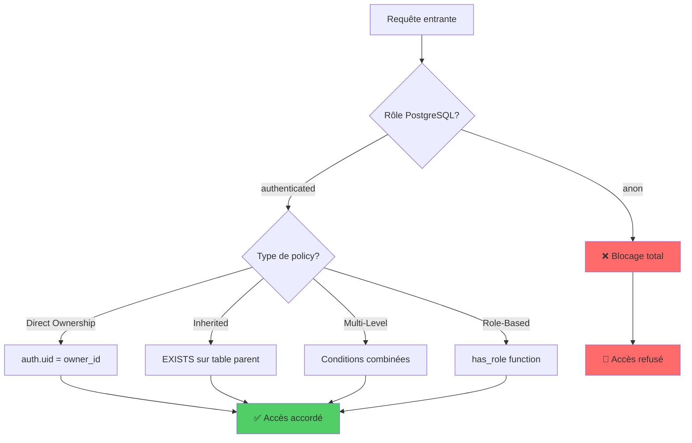
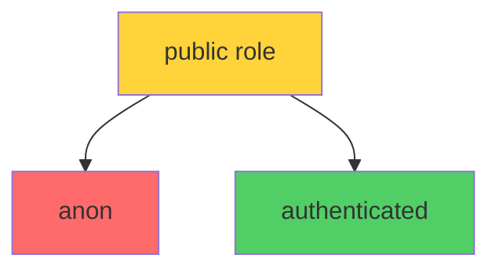
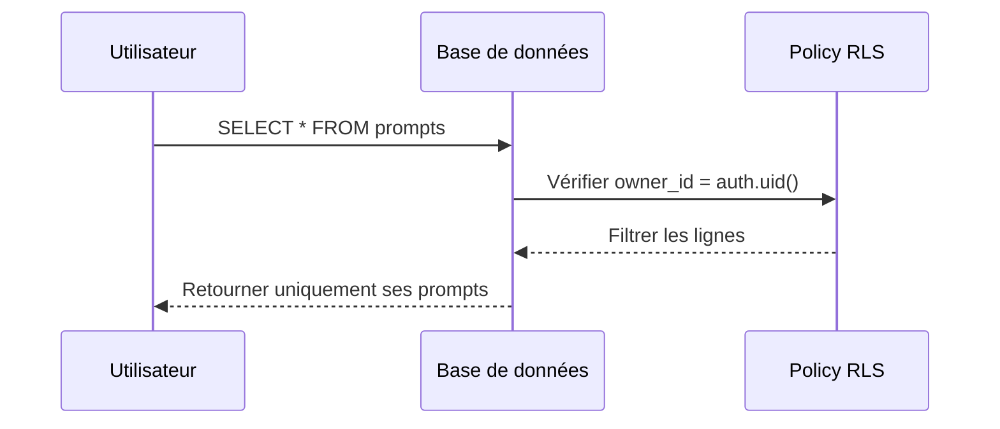
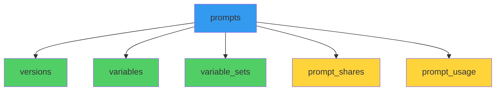
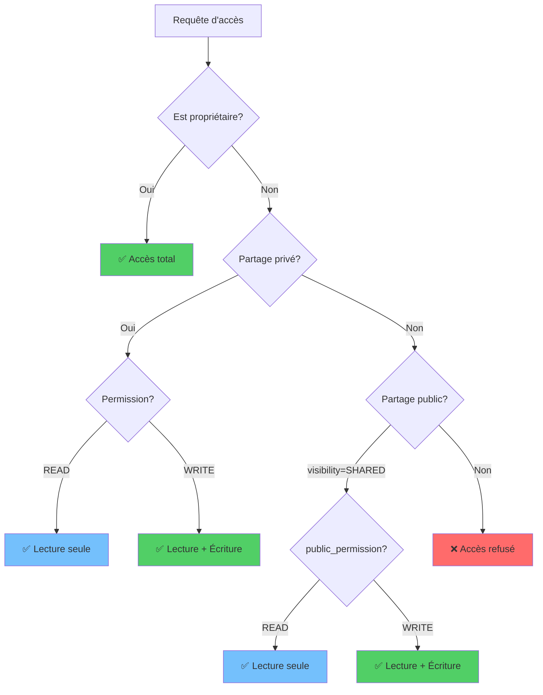
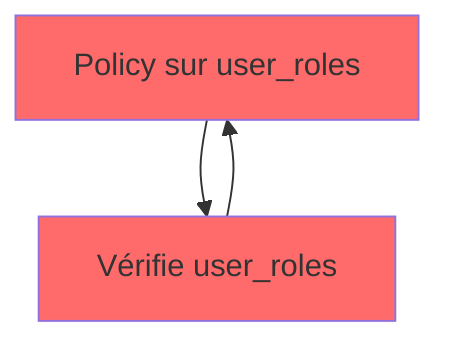
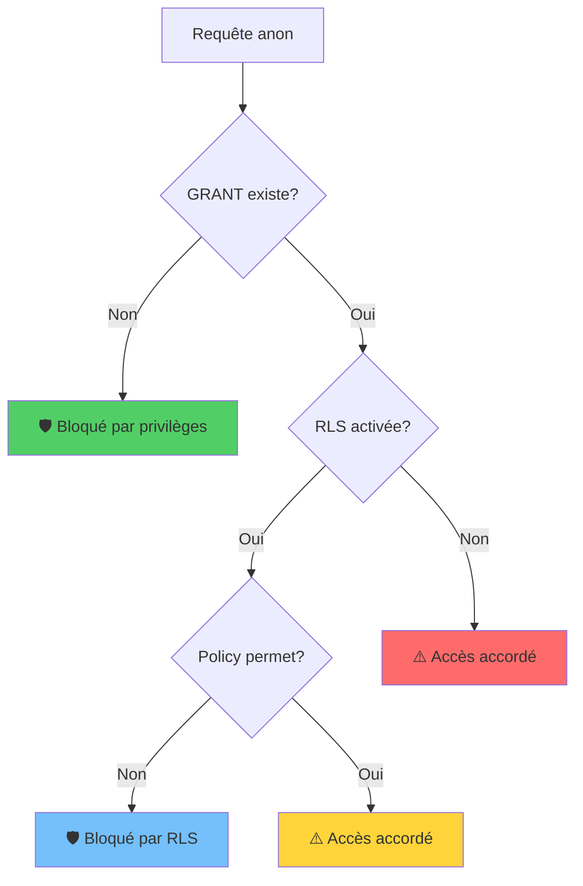

# Patterns RLS du Projet

## Vue d'ensemble

Ce document décrit les patterns de Row-Level Security (RLS) utilisés dans le projet pour sécuriser l'accès aux données.

### Statistiques actuelles

| Métrique | Valeur |
|----------|--------|
| Tables protégées | 8 |
| Policies totales | 35 |
| Policies `anon` | 8 (blocage) |
| Policies `authenticated` | 27 (contrôle d'accès) |
| Policies `public` | 0 (sécurité renforcée) |
| Tables avec Force RLS | 7 (toutes sauf `prompt_usage`) |
| Privilèges `anon` révoqués | 8 tables + séquences |

### Tables protégées

- `profiles` - Profils utilisateurs
- `prompts` - Prompts créés par les utilisateurs
- `prompt_shares` - Partages de prompts
- `prompt_usage` - Statistiques d'utilisation
- `user_roles` - Rôles des utilisateurs
- `variable_sets` - Ensembles de variables
- `variables` - Variables des prompts
- `versions` - Versions des prompts

---

## Architecture de sécurité



---

## Pattern 1 : Deny Anonymous Access

### Description

Bloque **tout accès** pour les utilisateurs non authentifiés. Ce pattern est la première ligne de défense et doit être appliqué sur **toutes les tables** contenant des données utilisateur.

### Caractéristiques

- Rôle cible : `anon`
- Opération : `ALL` (SELECT, INSERT, UPDATE, DELETE)
- Condition : `USING (false)` - toujours faux

### Exemple SQL

```sql
CREATE POLICY "Deny anonymous access to [table_name]"
ON public.[table_name]
FOR ALL
TO anon
USING (false);
```

### Tables concernées

Toutes les 8 tables du projet ont cette policy :

| Table | Policy |
|-------|--------|
| `profiles` | Deny anonymous access to profiles |
| `prompts` | Deny anonymous access to prompts |
| `prompt_shares` | Deny anonymous access to prompt_shares |
| `prompt_usage` | Deny anonymous access to prompt_usage |
| `user_roles` | Deny anonymous access to user_roles |
| `variable_sets` | Deny anonymous access to variable_sets |
| `variables` | Deny anonymous access to variables |
| `versions` | Deny anonymous access to versions |

### Pourquoi `TO anon` et pas `TO public` ?

Le rôle `public` en PostgreSQL est un rôle spécial dont **tous les autres rôles héritent**. Une policy `TO public` s'appliquerait donc aussi aux utilisateurs `authenticated`, ce qui n'est pas le comportement souhaité.



---

## Pattern 2 : Direct Ownership

### Description

Contrôle d'accès basé sur la **propriété directe** de la ressource. L'utilisateur peut accéder uniquement aux lignes qu'il possède.

### Colonnes utilisées

| Colonne | Tables |
|---------|--------|
| `id` | `profiles` (id = auth.uid()) |
| `owner_id` | `prompts` |
| `user_id` | `prompt_shares`, `prompt_usage`, `user_roles` |

### Exemple SQL

```sql
-- Lecture de ses propres prompts
CREATE POLICY "Users can view own prompts"
ON public.prompts
FOR SELECT
TO authenticated
USING (owner_id = auth.uid());

-- Modification de son propre profil
CREATE POLICY "Users can update own profile"
ON public.profiles
FOR UPDATE
TO authenticated
USING (id = auth.uid())
WITH CHECK (id = auth.uid());
```

### Diagramme



---

## Pattern 3 : Permission Inheritance

### Description

Les tables enfants **héritent des permissions** de leur table parent via une jointure `EXISTS`. Ce pattern évite la duplication de logique de permissions.

### Hiérarchie des tables



### Exemple SQL

```sql
-- Les versions héritent des permissions du prompt parent
CREATE POLICY "Users can view versions of accessible prompts"
ON public.versions
FOR SELECT
TO authenticated
USING (
  EXISTS (
    SELECT 1 FROM public.prompts p
    WHERE p.id = versions.prompt_id
    AND (
      p.owner_id = auth.uid()
      OR (p.visibility = 'SHARED' AND p.status = 'PUBLISHED')
      OR EXISTS (
        SELECT 1 FROM public.prompt_shares ps
        WHERE ps.prompt_id = p.id
        AND ps.shared_with_user_id = auth.uid()
      )
    )
  )
);
```

### Tables utilisant ce pattern

| Table enfant | Table parent | Colonne de liaison |
|--------------|--------------|-------------------|
| `versions` | `prompts` | `prompt_id` |
| `variables` | `prompts` | `prompt_id` |
| `variable_sets` | `prompts` | `prompt_id` |
| `prompt_shares` | `prompts` | `prompt_id` |
| `prompt_usage` | `prompts` | `prompt_id` |

---

## Pattern 4 : Multi-Level Access

### Description

Combine plusieurs conditions pour déterminer le niveau d'accès. Utilisé principalement pour la table `prompts` qui supporte différents modes de partage.

### Niveaux d'accès



### Exemple SQL

```sql
CREATE POLICY "Users can view accessible prompts"
ON public.prompts
FOR SELECT
TO authenticated
USING (
  -- Niveau 1: Propriétaire
  owner_id = auth.uid()
  OR
  -- Niveau 2: Partage public (SHARED + PUBLISHED)
  (visibility = 'SHARED' AND status = 'PUBLISHED')
  OR
  -- Niveau 3: Partage privé
  EXISTS (
    SELECT 1 FROM public.prompt_shares ps
    WHERE ps.prompt_id = prompts.id
    AND ps.shared_with_user_id = auth.uid()
  )
);
```

### Matrice des permissions pour `prompts`

| Condition | SELECT | INSERT | UPDATE | DELETE |
|-----------|--------|--------|--------|--------|
| `owner_id = auth.uid()` | ✅ | ✅ | ✅ | ✅ |
| Partage privé READ | ✅ | ❌ | ❌ | ❌ |
| Partage privé WRITE | ✅ | ❌ | ✅ | ❌ |
| Partage public READ | ✅ | ❌ | ❌ | ❌ |
| Partage public WRITE | ✅ | ❌ | ✅ | ❌ |
| Aucun accès | ❌ | ❌ | ❌ | ❌ |

---

## Pattern 5 : Role-Based Access (SECURITY DEFINER)

### Description

Utilise une fonction `SECURITY DEFINER` pour vérifier les rôles utilisateur sans provoquer de **récursion infinie** dans les policies RLS.

### Problème de récursion



Une policy RLS sur `user_roles` qui interroge `user_roles` créerait une boucle infinie.

### Solution : SECURITY DEFINER

```sql
-- Fonction qui bypass RLS grâce à SECURITY DEFINER
CREATE OR REPLACE FUNCTION public.has_role(_user_id uuid, _role app_role)
RETURNS boolean
LANGUAGE sql
STABLE
SECURITY DEFINER
SET search_path = public
AS $$
  SELECT EXISTS (
    SELECT 1
    FROM public.user_roles
    WHERE user_id = _user_id
      AND role = _role
  )
$$;

-- Policy utilisant la fonction (pas de récursion)
CREATE POLICY "Admins can view all user roles"
ON public.user_roles
FOR SELECT
TO authenticated
USING (
  user_id = auth.uid()
  OR public.has_role(auth.uid(), 'admin')
);
```

### Caractéristiques de SECURITY DEFINER

| Attribut | Valeur | Raison |
|----------|--------|--------|
| `SECURITY DEFINER` | Obligatoire | Exécute avec les droits du créateur |
| `STABLE` | Recommandé | Résultat constant pour mêmes arguments dans une transaction |
| `SET search_path = public` | Sécurité | Évite les attaques par injection de schéma |

---

## Matrice complète des permissions

### Par table et opération

| Table | SELECT | INSERT | UPDATE | DELETE |
|-------|--------|--------|--------|--------|
| **profiles** | Own | Own | Own | ❌ |
| **prompts** | Own + Shared + Public | Own | Own + Write | Own |
| **prompt_shares** | Own prompt | Own prompt | Own prompt | Own prompt |
| **prompt_usage** | Own prompt | Own | Own | Own |
| **user_roles** | Own + Admin | ❌ | ❌ | ❌ |
| **variable_sets** | Inherited | Write | Write | Own |
| **variables** | Inherited | Write | Write | Own |
| **versions** | Inherited | Write | Write | Own |

### Légende

- **Own** : Propriétaire uniquement (`owner_id = auth.uid()` ou `user_id = auth.uid()`)
- **Shared** : Partagé via `prompt_shares`
- **Public** : Visible publiquement (`visibility = 'SHARED'`)
- **Write** : Permission WRITE requise
- **Inherited** : Hérite des permissions du prompt parent
- **Admin** : Requiert le rôle admin

---

## Checklist pour nouvelles tables

### Étapes obligatoires

- [ ] **1. Activer RLS**
  ```sql
  ALTER TABLE public.new_table ENABLE ROW LEVEL SECURITY;
  ```

- [ ] **2. Ajouter policy "Deny anonymous access"**
  ```sql
  CREATE POLICY "Deny anonymous access to new_table"
  ON public.new_table
  FOR ALL
  TO anon
  USING (false);
  ```

- [ ] **3. Toutes les policies → `TO authenticated`**
  - ⚠️ Jamais `TO public` (héritage non souhaité)
  - ⚠️ Toujours `TO authenticated` pour les policies de contrôle d'accès

- [ ] **4. Utiliser `EXISTS` pour l'héritage**
  ```sql
  -- ✅ Correct
  USING (
    EXISTS (
      SELECT 1 FROM public.prompts p
      WHERE p.id = new_table.prompt_id
      AND p.owner_id = auth.uid()
    )
  )
  
  -- ❌ Incorrect (JOIN dans la clause principale)
  USING (
    SELECT p.owner_id = auth.uid()
    FROM public.prompts p
    JOIN public.new_table nt ON p.id = nt.prompt_id
  )
  ```

- [ ] **5. Éviter les JOINs récursifs**
  - Si une table doit vérifier ses propres données → utiliser `SECURITY DEFINER`
  - Exemple : `has_role()` pour `user_roles`

- [ ] **6. Distinguer USING vs WITH CHECK**
  - `USING` : Filtre les lignes visibles (SELECT, UPDATE, DELETE)
  - `WITH CHECK` : Valide les nouvelles données (INSERT, UPDATE)
  ```sql
  CREATE POLICY "policy_name"
  ON public.table
  FOR UPDATE
  TO authenticated
  USING (owner_id = auth.uid())        -- Peut modifier ses propres lignes
  WITH CHECK (owner_id = auth.uid());  -- Doit rester propriétaire après modification
  ```

- [ ] **7. Révoquer les privilèges `anon` et `public`**
  ```sql
  REVOKE ALL PRIVILEGES ON TABLE public.new_table FROM anon;
  REVOKE ALL PRIVILEGES ON TABLE public.new_table FROM public;
  ```

- [ ] **8. Révoquer les privilèges sur les séquences associées**
  ```sql
  REVOKE ALL PRIVILEGES ON SEQUENCE public.new_table_id_seq FROM anon;
  REVOKE ALL PRIVILEGES ON SEQUENCE public.new_table_id_seq FROM public;
  ```

- [ ] **9. Activer FORCE RLS pour les tables critiques (rôles, permissions)**
  ```sql
  -- Uniquement pour les tables ultra-sensibles comme user_roles
  ALTER TABLE public.new_table FORCE ROW LEVEL SECURITY;
  ```

### Tests obligatoires

- [ ] **Test 1 : Accès anonyme bloqué**
  ```typescript
  // Sans session utilisateur
  const { data, error } = await supabase
    .from('new_table')
    .select('*');
  expect(data).toEqual([]);
  ```

- [ ] **Test 2 : Accès cross-user bloqué**
  ```typescript
  // Utilisateur A ne voit pas les données de B
  const { data } = await supabaseAsUserA
    .from('new_table')
    .select('*')
    .eq('owner_id', userB.id);
  expect(data).toEqual([]);
  ```

- [ ] **Test 3 : Modification cross-user bloquée**
  ```typescript
  const { error } = await supabaseAsUserA
    .from('new_table')
    .update({ ... })
    .eq('id', recordOwnedByUserB);
  expect(error).toBeDefined();
  ```

---

## Pattern 6 : Views with security_invoker

### Description

Les vues PostgreSQL peuvent contourner la RLS si elles s'exécutent avec les droits du propriétaire. L'option `security_invoker = true` force la vue à respecter la RLS du **caller** (appelant).

### Configuration recommandée

```sql
-- Création d'une vue sécurisée
CREATE VIEW public.prompts_with_share_count
WITH (security_invoker = true, security_barrier = true)
AS
SELECT 
  p.*,
  count(ps.id) as share_count
FROM public.prompts p
LEFT JOIN public.prompt_shares ps ON p.id = ps.prompt_id
GROUP BY p.id;
```

### Options de sécurité

| Option | Effet |
|--------|-------|
| `security_invoker = true` | La vue s'exécute avec les droits de l'appelant (RLS respectée) |
| `security_barrier = true` | Empêche les optimisations de requête de contourner les conditions de sécurité |

### Comportement du `share_count`

**Important** : Le `share_count` dans `prompts_with_share_count` est **filtré par RLS** :

- **Pour l'owner** : Voit le count de tous ses partages (car `shared_by = owner`)
- **Pour un destinataire** : Voit uniquement 1 (son propre partage), même si le prompt a été partagé à 10 personnes

Ce comportement est **intentionnel** : il évite de révéler la diffusion totale du prompt aux non-propriétaires.

### Principe du moindre privilège pour les vues

En plus de `security_invoker`, il est recommandé de :

1. **Révoquer les GRANT inutiles** sur les tables source
2. **Ne pas exposer `content`** dans les vues "liste" (préférer une route dédiée pour le détail)

```sql
-- Retirer les GRANT inutiles (même si RLS bloque)
REVOKE SELECT ON TABLE public.prompt_shares FROM anon;
REVOKE ALL ON TABLE public.prompt_shares FROM public;
```

---

## Pattern 7 : Privilege Hardening (Défense en profondeur)

### Description

La RLS est la **première ligne de défense**, mais les privilèges PostgreSQL (GRANT/REVOKE) constituent une **deuxième couche de protection**. Ce pattern applique le principe du **moindre privilège** : même si RLS bloque, on retire les GRANT inutiles.

### Pourquoi c'est important

- **Réduction de la surface d'attaque** : Un GRANT existe = une porte potentielle
- **Protection contre les régressions** : Une policy mal modifiée + GRANT = fuite
- **Audit simplifié** : Moins de "faux positifs" des scanners de sécurité
- **Defense in depth** : RLS (ceinture) + REVOKE (bretelles)

### Configuration recommandée

#### Étape 1 : Révoquer tous les privilèges `anon` et `public`

```sql
-- Pour chaque table sensible
REVOKE ALL PRIVILEGES ON TABLE public.table_name FROM anon;
REVOKE ALL PRIVILEGES ON TABLE public.table_name FROM public;
```

#### Étape 2 : Révoquer les privilèges sur les séquences

```sql
-- Les séquences peuvent révéler des informations (nombres de lignes, patterns)
DO $$
DECLARE s record;
BEGIN
  FOR s IN
    SELECT sequence_schema, sequence_name
    FROM information_schema.sequences
    WHERE sequence_schema = 'public'
  LOOP
    EXECUTE format('REVOKE ALL PRIVILEGES ON SEQUENCE %I.%I FROM anon', 
                   s.sequence_schema, s.sequence_name);
    EXECUTE format('REVOKE ALL PRIVILEGES ON SEQUENCE %I.%I FROM public', 
                   s.sequence_schema, s.sequence_name);
  END LOOP;
END$$;
```

#### Étape 3 : Activer FORCE RLS sur les tables critiques

```sql
-- FORCE RLS empêche le table owner de bypass les policies
-- ⚠️ IMPORTANT: Ne protège PAS contre les rôles BYPASSRLS (postgres, service_role)
ALTER TABLE public.profiles FORCE ROW LEVEL SECURITY;
ALTER TABLE public.prompts FORCE ROW LEVEL SECURITY;
ALTER TABLE public.prompt_shares FORCE ROW LEVEL SECURITY;
ALTER TABLE public.variables FORCE ROW LEVEL SECURITY;
ALTER TABLE public.versions FORCE ROW LEVEL SECURITY;
ALTER TABLE public.variable_sets FORCE ROW LEVEL SECURITY;
ALTER TABLE public.user_roles FORCE ROW LEVEL SECURITY;
```

### ⚠️ Limitation importante : BYPASSRLS

**FORCE RLS ne protège PAS contre** :
- Les **superusers** PostgreSQL
- Les rôles avec l'attribut **BYPASSRLS** (`postgres`, `service_role`, `supabase_admin`)

```sql
-- Rôles qui bypass toujours RLS (même avec FORCE)
SELECT rolname, rolbypassrls FROM pg_roles WHERE rolbypassrls = true;
-- Résultat: postgres, service_role, supabase_admin, supabase_read_only_user
```

**Implication** : Si la clé `service_role` fuit, FORCE RLS ne protège pas les données.

### Tables avec privilèges durcis

| Table | anon SELECT | anon DML | public | Force RLS |
|-------|-------------|----------|--------|-----------|
| `profiles` | ❌ | ❌ | ❌ | ✅ |
| `prompts` | ❌ | ❌ | ❌ | ✅ |
| `prompt_shares` | ❌ | ❌ | ❌ | ✅ |
| `prompt_usage` | ❌ | ❌ | ❌ | ❌ |
| `user_roles` | ❌ | ❌ | ❌ | ✅ |
| `variable_sets` | ❌ | ❌ | ❌ | ✅ |
| `variables` | ❌ | ❌ | ❌ | ✅ |
| `versions` | ❌ | ❌ | ❌ | ✅ |

### Rollback FORCE RLS

En cas de problème (signup cassé, création de profil bloquée) :

```sql
-- Désactiver FORCE RLS sur une table
ALTER TABLE public.profiles NO FORCE ROW LEVEL SECURITY;
ALTER TABLE public.prompts NO FORCE ROW LEVEL SECURITY;
ALTER TABLE public.prompt_shares NO FORCE ROW LEVEL SECURITY;
ALTER TABLE public.variables NO FORCE ROW LEVEL SECURITY;
ALTER TABLE public.versions NO FORCE ROW LEVEL SECURITY;
ALTER TABLE public.variable_sets NO FORCE ROW LEVEL SECURITY;
```

### Diagramme de défense en profondeur



### Vérification post-durcissement

```sql
-- Vérifier qu'anon n'a plus aucun privilège
SELECT 
  'table_name' as tbl,
  has_table_privilege('anon', 'public.table_name', 'select') as anon_select,
  has_table_privilege('anon', 'public.table_name', 'insert') as anon_insert,
  has_table_privilege('anon', 'public.table_name', 'update') as anon_update,
  has_table_privilege('anon', 'public.table_name', 'delete') as anon_delete;
-- Tous doivent retourner FALSE
```

---

## Audit de sécurité

### Requêtes d'audit des privilèges

#### Vérifier les privilèges anon sur toutes les tables

```sql
SELECT 
  c.relname as table_name,
  has_table_privilege('anon', c.oid, 'select') as anon_select,
  has_table_privilege('anon', c.oid, 'insert') as anon_insert,
  has_table_privilege('anon', c.oid, 'update') as anon_update,
  has_table_privilege('anon', c.oid, 'delete') as anon_delete
FROM pg_class c
JOIN pg_namespace n ON n.oid = c.relnamespace
WHERE n.nspname = 'public' 
  AND c.relkind = 'r'
ORDER BY c.relname;
```

#### Vérifier le statut RLS de toutes les tables

```sql
SELECT 
  c.relname as table_name,
  c.relrowsecurity as rls_enabled,
  c.relforcerowsecurity as rls_forced
FROM pg_class c
JOIN pg_namespace n ON n.oid = c.relnamespace
WHERE n.nspname = 'public' 
  AND c.relkind = 'r'
ORDER BY c.relname;
```

#### Vérifier les privilèges sur les vues

```sql
SELECT 
  c.relname as view_name,
  has_table_privilege('anon', c.oid, 'select') as anon_select,
  has_table_privilege('authenticated', c.oid, 'select') as auth_select
FROM pg_class c
JOIN pg_namespace n ON n.oid = c.relnamespace
WHERE n.nspname = 'public' 
  AND c.relkind = 'v'
ORDER BY c.relname;
```

#### Audit complet des policies par table

```sql
SELECT 
  schemaname,
  tablename,
  policyname,
  permissive,
  roles,
  cmd,
  qual as using_expression,
  with_check
FROM pg_policies
WHERE schemaname = 'public'
ORDER BY tablename, policyname;
```

---

## Références

- [SHARING_GUIDE.md](./SHARING_GUIDE.md) - Guide complet du système de partage
- [VARIABLE_UPSERT_SECURITY.md](./VARIABLE_UPSERT_SECURITY.md) - Contraintes de sécurité DB
- [REPOSITORY_PATTERNS.md](./REPOSITORY_PATTERNS.md) - Patterns d'accès aux données
- [Supabase RLS Documentation](https://supabase.com/docs/guides/auth/row-level-security)

---

## Tests de régression obligatoires

Avant de considérer FORCE RLS comme validé, tester :

- [ ] **Signup** → Profil créé correctement via `handle_new_user`
- [ ] **Login** → Accès aux données personnelles
- [ ] **Création de prompt** → INSERT OK
- [ ] **Partage de prompt** → `prompt_shares` INSERT OK
- [ ] **Variables** → CRUD OK sur `variables`, `variable_sets`
- [ ] **Versions** → Création et lecture OK

### Fonctions SECURITY DEFINER à surveiller

```sql
-- Lister les fonctions SECURITY DEFINER qui peuvent être impactées
SELECT n.nspname, p.proname, r.rolname as owner
FROM pg_proc p
JOIN pg_namespace n ON n.oid = p.pronamespace
JOIN pg_roles r ON r.oid = p.proowner
WHERE n.nspname IN ('public', 'auth')
  AND p.prosecdef = true
ORDER BY n.nspname, p.proname;
```

**Note** : `handle_new_user` est owned par `postgres` (BYPASSRLS) donc non impacté.

---

## Historique des modifications

| Date | Modification |
|------|--------------|
| 2025-01-23 | Création du document |
| 2025-01-23 | Correction policies `public` → `anon` |
| 2025-12-23 | Ajout Pattern 6 : Views avec security_invoker + documentation share_count |
| 2025-12-23 | Ajout Pattern 7 : Privilege Hardening + REVOKE anon/public + FORCE RLS user_roles |
| 2025-12-23 | Ajout section Audit de sécurité avec requêtes SQL |
| 2025-12-23 | Mise à jour checklist avec étapes 7-9 (REVOKE + FORCE RLS) |
| 2025-12-23 | FORCE RLS activé sur 7 tables (profiles, prompts, prompt_shares, variables, versions, variable_sets, user_roles) |
| 2025-12-23 | Ajout avertissement BYPASSRLS + scripts rollback + checklist régression |
