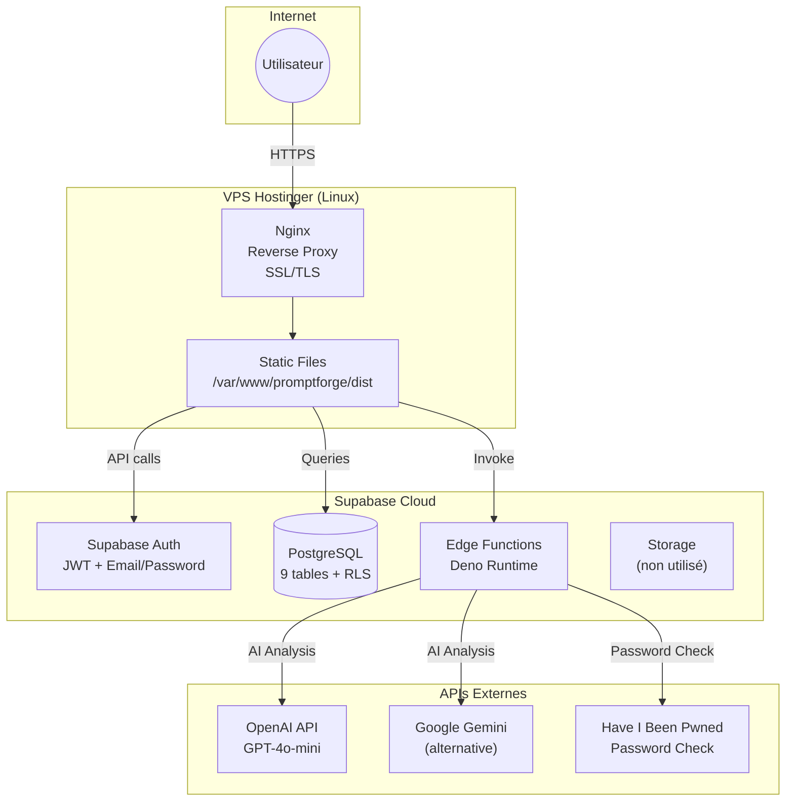
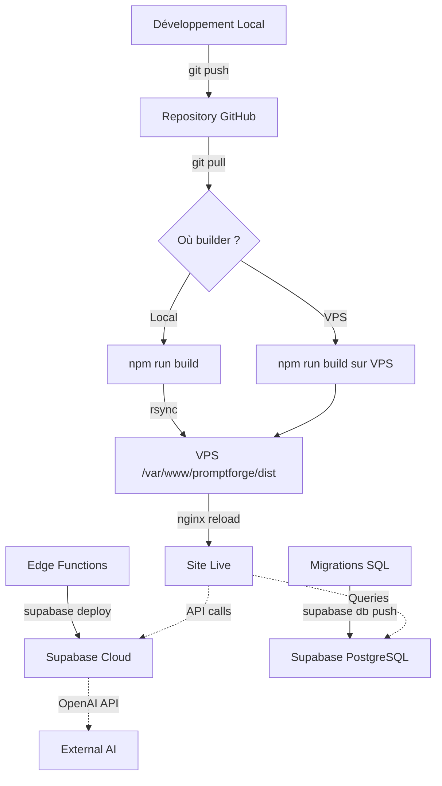

# Guide d'Auto-Hébergement PromptForge

## Vue d'Ensemble

Ce guide détaille les 8 phases nécessaires pour migrer PromptForge de la plateforme Lovable vers un hébergement autonome sur VPS avec Supabase Cloud.

### Architecture Cible



### Composants

| Composant | Technologie Actuelle | Technologie Cible |
|-----------|---------------------|-------------------|
| Frontend | React + Vite + Tailwind | Identique (build statique) |
| Hébergement Frontend | Lovable Preview | VPS + Nginx |
| Base de données | Lovable Cloud (Supabase) | Supabase Cloud |
| Auth | Supabase Auth | Supabase Auth |
| Edge Functions | Lovable Cloud | Supabase Edge Functions |
| AI Gateway | **Lovable AI Gateway** | **OpenAI / Gemini direct** |
| SSL | Lovable automatique | Let's Encrypt |

---

## Phase 1 : Préparation Environnement Local

### 1.1 Prérequis Système

| Outil | Version Minimale | Vérification |
|-------|------------------|--------------|
| Node.js | 20.x | `node --version` |
| npm | 10.x | `npm --version` |
| Git | 2.x | `git --version` |
| Deno | 1.40+ | `deno --version` |
| Supabase CLI | 1.150+ | `supabase --version` |

### 1.2 Installation des Outils

```bash
# Node.js (via nvm recommandé)
curl -o- https://raw.githubusercontent.com/nvm-sh/nvm/v0.39.0/install.sh | bash
nvm install 20
nvm use 20

# Supabase CLI
npm install -g supabase

# Deno (pour edge functions)
curl -fsSL https://deno.land/x/install/install.sh | sh
```

### 1.3 Cloner le Projet

```bash
git clone https://github.com/VOTRE_USER/promptforge.git
cd promptforge
npm install
```

### 1.4 Structure des Fichiers Clés

```
promptforge/
├── .env                          # Variables d'environnement (à créer)
├── .env.example                  # Template des variables
├── src/                          # Code source React
├── supabase/
│   ├── config.toml              # Configuration edge functions
│   ├── functions/               # Edge functions Deno
│   │   ├── analyze-prompt/
│   │   ├── check-password-breach/
│   │   ├── create-initial-version/
│   │   ├── restore-version/
│   │   └── validate-password-strength/
│   └── migrations/              # 42 fichiers SQL
├── docs/
│   └── DATABASE_SCHEMA_REFERENCE.md  # Référence schéma DB
└── dist/                        # Build production (généré)
```

### 1.5 Créer le Fichier `.env`

```bash
cat > .env << 'EOF'
# Supabase Configuration
VITE_SUPABASE_URL=https://VOTRE_PROJECT_ID.supabase.co
VITE_SUPABASE_PUBLISHABLE_KEY=eyJhbGciOiJIUzI1NiIsInR5cCI6IkpXVCJ9...
VITE_SUPABASE_PROJECT_ID=VOTRE_PROJECT_ID

# Pour développement local uniquement
# Ne PAS commiter ce fichier !
EOF
```

---

## Phase 2 : Configuration Supabase

### 2.1 Créer un Projet Supabase

1. Aller sur [supabase.com](https://supabase.com)
2. Cliquer "New Project"
3. Remplir :
   - **Organization** : Créer ou sélectionner
   - **Name** : `promptforge-prod`
   - **Database Password** : Générer un mot de passe fort (noter !)
   - **Region** : Choisir proche des utilisateurs (ex: `eu-west-1`)

4. Noter les informations (Settings → API) :

| Information | Où la trouver | Usage |
|-------------|---------------|-------|
| Project URL | `https://xxx.supabase.co` | VITE_SUPABASE_URL |
| Anon Key | `eyJ...` (public) | VITE_SUPABASE_PUBLISHABLE_KEY |
| Service Role Key | `eyJ...` (secret) | Edge functions uniquement |
| Project ID | Dans l'URL | VITE_SUPABASE_PROJECT_ID |

### 2.2 Configurer l'Authentification

Dashboard Supabase → Authentication → Settings :

#### Email Auth
- ✅ Enable Email Signup : `ON`
- ✅ Confirm email : `OFF` (dev) ou `ON` + SMTP (prod)
- ✅ Secure email change : `ON`
- ✅ Double confirm changes : `ON`

#### URL Configuration
| Paramètre | Valeur |
|-----------|--------|
| Site URL | `https://votre-domaine.com` |
| Redirect URLs | `https://votre-domaine.com/*` |

#### Rate Limits (recommandé)
| Limite | Valeur |
|--------|--------|
| Rate limit for email | 10 per hour |
| Rate limit for SMS | 10 per hour |

### 2.3 Exécuter les Migrations SQL

#### Option A : Via Supabase CLI (recommandé)

```bash
# Login
supabase login

# Lier au projet
supabase link --project-ref VOTRE_PROJECT_ID

# Pousser toutes les migrations
supabase db push

# Vérifier le statut
supabase db status
```

#### Option B : Manuellement via SQL Editor

1. Dashboard → SQL Editor
2. Exécuter chaque fichier dans `supabase/migrations/` **dans l'ordre chronologique**
3. Ordre critique (voir `docs/DATABASE_SCHEMA_REFERENCE.md`) :
   - `20251019014004_*.sql` → Schéma initial
   - ...suivre les timestamps...
   - `20260124020601_*.sql` → Table analysis_quotas

### 2.4 Vérification Post-Migration

```sql
-- Vérifier les tables créées
SELECT tablename FROM pg_tables WHERE schemaname = 'public' ORDER BY tablename;

-- Résultat attendu :
-- analysis_quotas
-- profiles
-- prompt_shares
-- prompt_usage
-- prompts
-- user_roles
-- variable_sets
-- variables
-- versions

-- Vérifier RLS activée
SELECT relname, relrowsecurity, relforcerowsecurity
FROM pg_class
WHERE relnamespace = 'public'::regnamespace AND relkind = 'r';

-- Toutes les tables doivent avoir relrowsecurity = true
```

---

## Phase 3 : Configuration des Secrets Edge Functions

### 3.1 Secrets Requis

Dashboard Supabase → Settings → Edge Functions → Secrets :

| Nom du Secret | Valeur | Description |
|---------------|--------|-------------|
| `SUPABASE_URL` | `https://xxx.supabase.co` | URL du projet |
| `SUPABASE_ANON_KEY` | `eyJ...` | Clé anon publique |
| `SUPABASE_SERVICE_ROLE_KEY` | `eyJ...` | Clé admin (secrète) |
| `OPENAI_API_KEY` | `sk-...` | Clé API OpenAI |

**⚠️ Supprimer `LOVABLE_API_KEY`** - Ce secret est propriétaire Lovable et ne fonctionne pas hors plateforme.

### 3.2 Modification Critique : Remplacer Lovable AI Gateway

Le fichier `supabase/functions/analyze-prompt/index.ts` utilise actuellement :

```typescript
// ❌ NE FONCTIONNE PAS hors Lovable
response = await fetch('https://ai.gateway.lovable.dev/v1/chat/completions', {
  headers: {
    'Authorization': `Bearer ${LOVABLE_API_KEY}`,
    'Content-Type': 'application/json',
  },
  body: JSON.stringify({
    model: 'google/gemini-2.5-flash',
    // ...
  }),
});
```

**Remplacer par OpenAI direct :**

```typescript
// ✅ Fonctionne avec n'importe quel hébergement
const OPENAI_API_KEY = Deno.env.get('OPENAI_API_KEY');
if (!OPENAI_API_KEY) {
  return new Response(
    JSON.stringify({ error: 'Configuration AI manquante' }),
    { status: 500, headers: corsHeaders }
  );
}

response = await fetch('https://api.openai.com/v1/chat/completions', {
  method: 'POST',
  headers: {
    'Authorization': `Bearer ${OPENAI_API_KEY}`,
    'Content-Type': 'application/json',
  },
  body: JSON.stringify({
    model: 'gpt-4o-mini',  // Équivalent à gemini-2.5-flash
    messages: [
      { role: 'system', content: SYSTEM_PROMPT },
      { role: 'user', content: buildUserPrompt(validated) }
    ],
    tools: [STRUCTURE_TOOL],
    tool_choice: { type: 'function', function: { name: 'structure_prompt' } },
    temperature: 0.3,
    max_tokens: 2000,
  }),
  signal: abortController.signal,
});
```

**Alternative Google Gemini :**

```typescript
const GEMINI_API_KEY = Deno.env.get('GEMINI_API_KEY');

response = await fetch(
  `https://generativelanguage.googleapis.com/v1beta/models/gemini-1.5-flash:generateContent?key=${GEMINI_API_KEY}`,
  {
    method: 'POST',
    headers: { 'Content-Type': 'application/json' },
    body: JSON.stringify({
      contents: [{ parts: [{ text: userPrompt }] }],
      generationConfig: {
        temperature: 0.3,
        maxOutputTokens: 2000,
      },
    }),
  }
);

// Note : Le format de réponse Gemini diffère d'OpenAI
// Adapter le parsing de la réponse
```

### 3.3 Gestion des Erreurs API

```typescript
// Ajouter après l'appel fetch
if (response.status === 429) {
  return new Response(
    JSON.stringify({ error: 'Quota API dépassé. Réessayez plus tard.' }),
    { status: 429, headers: corsHeaders }
  );
}

if (response.status === 402) {
  return new Response(
    JSON.stringify({ error: 'Crédit API insuffisant.' }),
    { status: 402, headers: corsHeaders }
  );
}

if (!response.ok) {
  const errorBody = await response.text();
  console.error('AI API error:', response.status, errorBody);
  return new Response(
    JSON.stringify({ error: 'Erreur du service d\'analyse.' }),
    { status: 502, headers: corsHeaders }
  );
}
```

---

## Phase 4 : Déployer les Edge Functions

### 4.1 Configuration `supabase/config.toml`

```toml
# ID du projet Supabase
project_id = "VOTRE_PROJECT_ID"

[api]
enabled = true
port = 54321

[db]
port = 54322

[studio]
enabled = true
port = 54323

# Edge Functions
[functions.analyze-prompt]
verify_jwt = true
import_map = "./functions/import_map.json"

[functions.check-password-breach]
verify_jwt = false

[functions.validate-password-strength]
verify_jwt = false

[functions.create-initial-version]
verify_jwt = true

[functions.restore-version]
verify_jwt = true
```

### 4.2 Déploiement

```bash
# S'assurer d'être lié au projet
supabase link --project-ref VOTRE_PROJECT_ID

# Déployer toutes les fonctions
supabase functions deploy analyze-prompt
supabase functions deploy check-password-breach
supabase functions deploy validate-password-strength
supabase functions deploy create-initial-version
supabase functions deploy restore-version

# Ou tout en une commande
supabase functions deploy --all
```

### 4.3 Vérification

```bash
# Tester check-password-breach (public)
curl -X POST https://VOTRE_PROJECT_ID.supabase.co/functions/v1/check-password-breach \
  -H "Content-Type: application/json" \
  -d '{"password": "password123"}'

# Réponse attendue :
# {"isBreached": true, "breachCount": 10434646}

# Tester validate-password-strength (public)
curl -X POST https://VOTRE_PROJECT_ID.supabase.co/functions/v1/validate-password-strength \
  -H "Content-Type: application/json" \
  -d '{"password": "MyStr0ng!Pass"}'

# Réponse attendue :
# {"isValid": true, "score": 4, "feedback": [...]}
```

---

## Phase 5 : Build et Test Local

### 5.1 Lancer en Développement

```bash
# S'assurer que .env est configuré
cat .env

# Lancer le serveur de développement
npm run dev

# Ouvre http://localhost:8080
```

### 5.2 Checklist de Test Local

| Test | Action | Résultat Attendu |
|------|--------|------------------|
| Page d'accueil | Ouvrir `/` | Landing page affichée |
| Inscription | Créer un compte | Profil créé automatiquement |
| Connexion | Se connecter | Redirection vers `/dashboard` |
| Créer prompt | Nouveau prompt | Sauvegarde OK |
| Analyser prompt | Cliquer "Analyser" | Variables détectées |
| Versioning | Créer version | Historique visible |
| Partage | Partager un prompt | Email envoyé (si SMTP) |
| Quotas | Analyser 11x en 1 min | Erreur rate limit |

### 5.3 Build Production

```bash
# Nettoyer et builder
rm -rf dist
npm run build

# Vérifier le build
ls -la dist/
# Doit contenir : index.html, assets/

# Tester le build localement
npm run preview
# Ouvre http://localhost:4173
```

### 5.4 Tests Automatisés

```bash
# Tests unitaires frontend
npm run test

# Tests edge functions (Deno)
deno test --allow-net --allow-env --allow-read supabase/functions/
```

---

## Phase 6 : Déploiement VPS (Hostinger KVM)

### 6.1 Préparation du Serveur

```bash
# Se connecter au VPS
ssh root@VOTRE_IP

# Mettre à jour le système
apt update && apt upgrade -y

# Installer les dépendances
apt install -y nginx certbot python3-certbot-nginx ufw

# Configurer le firewall
ufw allow OpenSSH
ufw allow 'Nginx Full'
ufw enable

# Créer l'utilisateur application
useradd -m -s /bin/bash promptforge
mkdir -p /var/www/promptforge
chown promptforge:promptforge /var/www/promptforge
```

### 6.2 Configurer Nginx

```bash
# Créer la configuration
cat > /etc/nginx/sites-available/promptforge << 'EOF'
server {
    listen 80;
    listen [::]:80;
    server_name votre-domaine.com www.votre-domaine.com;
    
    root /var/www/promptforge/dist;
    index index.html;
    
    # Gzip compression
    gzip on;
    gzip_vary on;
    gzip_min_length 1024;
    gzip_types text/plain text/css text/xml text/javascript 
               application/javascript application/json 
               application/xml image/svg+xml;
    
    # SPA fallback (toutes les routes vers index.html)
    location / {
        try_files $uri $uri/ /index.html;
    }
    
    # Cache long pour assets statiques
    location ~* \.(js|css|png|jpg|jpeg|gif|ico|svg|woff|woff2|ttf|eot)$ {
        expires 1y;
        add_header Cache-Control "public, immutable";
    }
    
    # Pas de cache pour index.html
    location = /index.html {
        expires -1;
        add_header Cache-Control "no-store, no-cache, must-revalidate";
    }
    
    # Security headers
    add_header X-Frame-Options "SAMEORIGIN" always;
    add_header X-Content-Type-Options "nosniff" always;
    add_header X-XSS-Protection "1; mode=block" always;
    add_header Referrer-Policy "strict-origin-when-cross-origin" always;
    add_header Permissions-Policy "camera=(), microphone=(), geolocation=()" always;
    
    # Bloquer l'accès aux fichiers sensibles
    location ~ /\. {
        deny all;
    }
}
EOF

# Activer le site
ln -sf /etc/nginx/sites-available/promptforge /etc/nginx/sites-enabled/
rm -f /etc/nginx/sites-enabled/default

# Vérifier la configuration
nginx -t

# Recharger Nginx
systemctl reload nginx
```

### 6.3 Configurer SSL avec Let's Encrypt

```bash
# Obtenir le certificat SSL
certbot --nginx -d votre-domaine.com -d www.votre-domaine.com

# Suivre les instructions :
# - Entrer email
# - Accepter les termes
# - Choisir de rediriger HTTP vers HTTPS (recommandé)

# Vérifier le renouvellement automatique
certbot renew --dry-run
```

### 6.4 Déployer les Fichiers

#### Option A : Depuis la machine locale

```bash
# Build local
npm run build

# Déployer via rsync
rsync -avz --delete \
  --exclude='.git' \
  --exclude='node_modules' \
  dist/ \
  root@VOTRE_IP:/var/www/promptforge/dist/

# Vérifier les permissions
ssh root@VOTRE_IP "chown -R promptforge:promptforge /var/www/promptforge"
```

#### Option B : Build sur le serveur

```bash
# Sur le VPS
su - promptforge
cd /var/www/promptforge

# Cloner (première fois)
git clone https://github.com/VOTRE_USER/promptforge.git .

# Ou mettre à jour (fois suivantes)
git pull origin main

# Installer et builder
npm install --production=false
npm run build

# Nettoyer node_modules (optionnel, économise de l'espace)
rm -rf node_modules
```

### 6.5 Script de Déploiement Automatique

Créer `deploy.sh` sur la machine locale :

```bash
#!/bin/bash
set -euo pipefail

# Configuration
VPS_HOST="root@VOTRE_IP"
REMOTE_PATH="/var/www/promptforge"
BACKUP_PATH="/var/www/promptforge-backup"

echo "🔨 Building..."
npm run build

echo "📦 Creating backup on server..."
ssh $VPS_HOST "cp -r $REMOTE_PATH/dist $BACKUP_PATH || true"

echo "📤 Deploying..."
rsync -avz --delete dist/ $VPS_HOST:$REMOTE_PATH/dist/

echo "🔒 Setting permissions..."
ssh $VPS_HOST "chown -R promptforge:promptforge $REMOTE_PATH"

echo "🔄 Reloading nginx..."
ssh $VPS_HOST "systemctl reload nginx"

echo "✅ Deployment complete!"
echo "🌐 https://votre-domaine.com"
```

```bash
# Rendre exécutable
chmod +x deploy.sh

# Déployer
./deploy.sh
```

---

## Phase 7 : Configuration DNS

### 7.1 Enregistrements DNS

Configurer dans le panel de votre registrar (Hostinger, OVH, etc.) :

| Type | Nom | Valeur | TTL | Description |
|------|-----|--------|-----|-------------|
| A | @ | IP_DU_VPS | 3600 | Domaine principal |
| A | www | IP_DU_VPS | 3600 | Sous-domaine www |
| AAAA | @ | IPv6_DU_VPS | 3600 | IPv6 (optionnel) |
| AAAA | www | IPv6_DU_VPS | 3600 | IPv6 www (optionnel) |

### 7.2 Vérification

```bash
# Vérifier la propagation DNS
dig votre-domaine.com +short
# Doit retourner l'IP du VPS

dig www.votre-domaine.com +short
# Doit retourner l'IP du VPS

# Vérifier le certificat SSL
curl -I https://votre-domaine.com
# Doit retourner HTTP/2 200 avec des headers SSL
```

---

## Phase 8 : Checklist Finale

### 8.1 Tests de Validation

| # | Test | Commande/Action | Résultat Attendu |
|---|------|-----------------|------------------|
| 1 | HTTPS accessible | `curl -I https://votre-domaine.com` | HTTP/2 200 |
| 2 | Redirection HTTP | `curl -I http://votre-domaine.com` | 301 → HTTPS |
| 3 | SPA routing | Ouvrir `/prompts` et refresh | Page affichée |
| 4 | Inscription | Créer un compte | Succès |
| 5 | Connexion | Se connecter | Dashboard affiché |
| 6 | Créer prompt | Nouveau prompt | Sauvegarde OK |
| 7 | Analyser prompt | Cliquer "Analyser" | Variables détectées |
| 8 | Versioning | Créer une version | Historique visible |
| 9 | Rate limiting | 11 analyses en 1 min | Erreur quota |
| 10 | Password check | Mot de passe faible | Alerte HIBP |

### 8.2 Récapitulatif des Secrets Configurés

#### Frontend (`.env`)

| Variable | Exemple | Configurée ? |
|----------|---------|--------------|
| VITE_SUPABASE_URL | `https://xxx.supabase.co` | ☐ |
| VITE_SUPABASE_PUBLISHABLE_KEY | `eyJ...` | ☐ |
| VITE_SUPABASE_PROJECT_ID | `xxx` | ☐ |

#### Supabase Edge Functions (Dashboard)

| Secret | Exemple | Configurée ? |
|--------|---------|--------------|
| SUPABASE_URL | `https://xxx.supabase.co` | ☐ |
| SUPABASE_ANON_KEY | `eyJ...` | ☐ |
| SUPABASE_SERVICE_ROLE_KEY | `eyJ...` | ☐ |
| OPENAI_API_KEY | `sk-...` | ☐ |

### 8.3 Fichiers de Configuration

| Fichier | Chemin | Description |
|---------|--------|-------------|
| Variables frontend | `.env` | URL et clés Supabase |
| Config edge functions | `supabase/config.toml` | JWT verification |
| Config Nginx | `/etc/nginx/sites-available/promptforge` | Reverse proxy |
| Certificat SSL | `/etc/letsencrypt/live/votre-domaine.com/` | Auto-géré par certbot |

---

## Résumé des Coûts

### Coûts Récurrents

| Service | Tier | Coût Mensuel | Limites |
|---------|------|--------------|---------|
| **Supabase** | Free | 0€ | 500MB DB, 2GB storage, 50K MAU |
| **Supabase** | Pro | ~25$/mois | 8GB DB, 100GB storage, 100K MAU |
| **VPS Hostinger** | KVM 1 | ~5€/mois | 1 vCPU, 4GB RAM, 50GB SSD |
| **VPS Hostinger** | KVM 2 | ~10€/mois | 2 vCPU, 8GB RAM, 100GB SSD |
| **Domaine** | .com | ~12€/an | - |
| **OpenAI API** | Usage | Variable | ~0.002$/1K tokens (GPT-4o-mini) |

### Estimation Mensuelle

| Scénario | Supabase | VPS | Domaine | API | Total |
|----------|----------|-----|---------|-----|-------|
| **Minimal** | 0€ | 5€ | 1€ | ~2€ | **~8€/mois** |
| **Standard** | 25$ (~23€) | 10€ | 1€ | ~10€ | **~44€/mois** |
| **Production** | 25$ | 15€ | 1€ | ~50€ | **~89€/mois** |

### Coûts API AI (Référence)

| Modèle | Coût Input | Coût Output | 1000 analyses |
|--------|------------|-------------|---------------|
| GPT-4o-mini | $0.15/1M | $0.60/1M | ~$0.50 |
| GPT-4o | $2.50/1M | $10/1M | ~$8 |
| Gemini 1.5 Flash | $0.075/1M | $0.30/1M | ~$0.25 |
| Gemini 1.5 Pro | $1.25/1M | $5/1M | ~$4 |

---

## Points d'Attention

### ⚠️ 1. Lovable AI Gateway

**Problème :** Le projet utilise `ai.gateway.lovable.dev` qui est un service propriétaire Lovable.

**Solution :** Remplacer par OpenAI ou Google Gemini direct (voir Phase 3.2).

**Impact :** Modification de `supabase/functions/analyze-prompt/index.ts` obligatoire.

### ⚠️ 2. Edge Functions

**Limitation :** Les Supabase Edge Functions restent sur Supabase Cloud. Il n'existe pas de solution simple pour les self-hosted.

**Alternative :** Si vous voulez tout héberger, il faudrait :
- Convertir les edge functions en API Node.js/Deno
- Héberger sur le VPS ou un service comme Railway/Render
- Modifier le frontend pour appeler ces nouvelles URLs

### ⚠️ 3. HIBP API

**Bonne nouvelle :** L'API Have I Been Pwned fonctionne tel quel (API publique).

**Aucune modification requise** pour `check-password-breach`.

### ⚠️ 4. Supabase Free Tier

**Limites :**
- 500MB de base de données
- 2GB de stockage fichiers
- 50,000 MAU (Monthly Active Users)
- Pause après 7 jours d'inactivité

**Recommandation :** Passer au tier Pro (~25$/mois) pour une utilisation en production.

### ⚠️ 5. Auto-confirm Email

**Développement :** Désactiver la confirmation email pour faciliter les tests.

**Production :** 
- Activer la confirmation email
- Configurer un serveur SMTP (Resend, SendGrid, Mailgun)
- Ajouter les templates d'email personnalisés

### ⚠️ 6. Sauvegardes

**Supabase :** Sauvegardes automatiques incluses (Pro tier).

**VPS :** Configurer des snapshots réguliers via le panel Hostinger.

**Recommandation :** Exporter la base de données régulièrement :
```bash
pg_dump -h db.VOTRE_PROJECT_ID.supabase.co -U postgres -d postgres > backup.sql
```

### ⚠️ 7. Monitoring

**Supabase :** Dashboard intégré avec métriques.

**VPS :** Installer des outils de monitoring :
```bash
# Netdata (monitoring temps réel)
bash <(curl -Ss https://my-netdata.io/kickstart.sh)

# Ou simple check avec htop
apt install htop
```

### ⚠️ 8. Mises à Jour

**Frontend :**
```bash
# Sur le VPS ou en local
git pull
npm install
npm run build
./deploy.sh
```

**Edge Functions :**
```bash
supabase functions deploy --all
```

**Dépendances :**
```bash
npm audit
npm update
```

---

## Diagramme de Flux de Déploiement



---

## Support et Ressources

| Ressource | URL |
|-----------|-----|
| Documentation Supabase | https://supabase.com/docs |
| Supabase CLI | https://supabase.com/docs/reference/cli |
| Nginx Documentation | https://nginx.org/en/docs/ |
| Let's Encrypt | https://letsencrypt.org/docs/ |
| OpenAI API | https://platform.openai.com/docs |
| Google Gemini API | https://ai.google.dev/docs |
| Hostinger KVM VPS | https://www.hostinger.fr/vps |

---

## Changelog

| Version | Date | Changements |
|---------|------|-------------|
| 1.0.0 | 2026-01-24 | Première version du guide |
