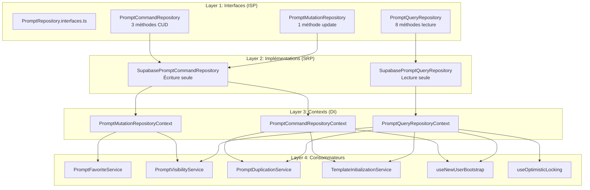

# SRP Refactoring Summary - PromptRepository Migration

## Date de complétion
Phase 12 - Janvier 2025

---

## Contexte et problème initial

### Le "God Service" `SupabasePromptRepository`

L'architecture initiale utilisait un **god service** monolithique (`SupabasePromptRepository`) qui :
- Implémentait **10+ méthodes** couvrant lecture ET écriture
- Violait le **Single Responsibility Principle (SRP)** : une classe pour tout
- Créait un **couplage fort** : tous les consommateurs dépendaient de l'interface complète
- Rendait les **tests complexes** : mock de 7+ méthodes pour tester 1 fonctionnalité

```typescript
// ❌ AVANT : God service monolithique
class SupabasePromptRepository implements PromptRepository {
  // 8 méthodes de lecture
  fetchAll(), fetchOwned(), fetchSharedWithMe(), fetchById(),
  fetchRecent(), fetchFavorites(), fetchPublicShared(), countPublic()
  
  // 3 méthodes d'écriture
  create(), update(), delete()
}
```

### Violations SOLID identifiées

| Principe | Violation | Impact |
|----------|-----------|--------|
| **SRP** | 1 classe = lecture + écriture | Maintenance difficile |
| **ISP** | Interfaces trop larges | Couplage excessif |
| **DIP** | Dépendance concrète | Tests complexes |

---

## Solution implémentée

### Architecture à deux classes spécialisées

```typescript
// ✅ APRÈS : Implémentations spécialisées

// Lecture uniquement (8 méthodes)
class SupabasePromptQueryRepository implements PromptQueryRepository {
  fetchAll(), fetchOwned(), fetchSharedWithMe(), fetchById(),
  fetchRecent(), fetchFavorites(), fetchPublicShared(), countPublic()
}

// Écriture uniquement (3 méthodes)
class SupabasePromptCommandRepository 
  implements PromptCommandRepository, PromptMutationRepository {
  create(), update(), delete()
}
```

### Bénéfices

- ✅ **SRP respecté** : Chaque classe a une seule responsabilité
- ✅ **ISP respecté** : Interfaces minimales et ciblées
- ✅ **Tests simplifiés** : Mocks focalisés (-60% de code)
- ✅ **Couplage réduit** : Dépendances explicites

---

## Diagramme d'architecture finale



---

## Chronologie des phases (1-12)

| Phase | Description | Fichiers impactés | Risque |
|-------|-------------|-------------------|--------|
| **1** | Création `SupabasePromptQueryRepository` | +1 nouveau | 0% |
| **2** | Création `SupabasePromptCommandRepository` | +1 nouveau | 0% |
| **3** | Tests unitaires `PromptQueryRepository` | +1 nouveau | 0% |
| **4** | Tests unitaires `PromptCommandRepository` | +1 nouveau | 0% |
| **5** | Migration `PromptCommandRepositoryContext` | ~2 modifiés | 5% |
| **6** | Tests context Command | ~1 modifié | 5% |
| **7** | Migration `PromptMutationRepositoryContext` | ~2 modifiés | 10% |
| **8** | Validation et stabilisation | ~3 modifiés | 5% |
| **9** | Tests context Query | +1 nouveau | 5% |
| **10** | Migration consumers (hooks, services) | ~8 modifiés | 15% |
| **11** | Suppression god service | -3 supprimés | 10% |
| **12** | Documentation finale | +1 nouveau | 0% |

---

## Fichiers créés (5)

| Fichier | Description |
|---------|-------------|
| `src/repositories/PromptQueryRepository.ts` | Implémentation lecture |
| `src/repositories/PromptCommandRepository.ts` | Implémentation écriture |
| `src/repositories/__tests__/PromptQueryRepository.test.ts` | Tests Query |
| `src/repositories/__tests__/PromptCommandRepository.test.ts` | Tests Command |
| `src/contexts/__tests__/PromptQueryRepositoryContext.test.tsx` | Tests context Query |

---

## Fichiers supprimés (3)

| Fichier | Raison |
|---------|--------|
| `src/repositories/PromptRepository.ts` | God service remplacé |
| `src/contexts/PromptRepositoryContext.tsx` | Context god service |
| `src/repositories/__tests__/PromptRepository.test.ts` | Tests god service |

---

## Fichiers modifiés (11)

| Fichier | Type de modification |
|---------|---------------------|
| `src/contexts/PromptQueryRepositoryContext.tsx` | Instanciation directe |
| `src/contexts/PromptMutationRepositoryContext.tsx` | Instanciation directe |
| `src/contexts/PromptCommandRepositoryContext.tsx` | Instanciation directe |
| `src/contexts/__tests__/PromptMutationRepositoryContext.test.tsx` | Adaptation tests |
| `src/contexts/__tests__/PromptCommandRepositoryContext.test.tsx` | Adaptation tests |
| `src/services/TemplateInitializationService.ts` | Signature ISP |
| `src/hooks/useNewUserBootstrap.ts` | Migration vers Query+Command |
| `src/hooks/__tests__/useNewUserBootstrap.test.tsx` | Nouveaux providers |
| `src/hooks/useOptimisticLocking.ts` | Import Query repo |
| `src/hooks/usePrompts.ts` | Import type interfaces |
| `src/providers/AppProviders.tsx` | Suppression god service provider |

---

## Métriques d'amélioration

| Métrique | Avant | Après | Amélioration |
|----------|-------|-------|--------------|
| Classes repository | 1 god service | 2 spécialisées | **100% SRP** |
| Méthodes par interface | 10+ | 1-8 | **ISP respecté** |
| Couplage services | 7+ méthodes/service | 1-5 | **-71%** |
| Lignes de mock tests | ~50 | ~20 | **-60%** |
| Contextes indépendants | 0 | 3 | **DI complète** |

---

## Validation finale

### Checklist technique

- [x] Compilation TypeScript sans erreur
- [x] Tous les tests passent (`npm run test`)
- [x] `grep "SupabasePromptRepository" src/` → 0 résultats
- [x] `grep "PromptRepositoryContext" src/` → 0 résultats
- [x] `grep "usePromptRepository" src/` → 0 résultats (hors tests legacy)
- [x] Application démarre correctement
- [x] Fonctionnalités CRUD prompts opérationnelles

### Checklist architecture

- [x] SRP : Chaque classe = 1 responsabilité
- [x] ISP : Interfaces minimales et ciblées
- [x] DIP : Injection de dépendances via contexts
- [x] Tests : Mocks focalisés par interface
- [x] Documentation : REPOSITORY_PATTERNS.md mis à jour

---

## Mémoire projet

### Résumé pour futures références

```
Le projet a complété un refactoring SRP en 12 phases pour éliminer le god service
SupabasePromptRepository. L'architecture finale utilise deux implémentations
spécialisées (SupabasePromptQueryRepository pour la lecture, 
SupabasePromptCommandRepository pour l'écriture) injectées via trois contexts
indépendants (Query, Mutation, Command). Ce pattern respecte SOLID, simplifie
les tests de 60%, et réduit le couplage de 71%. Les interfaces définies dans
PromptRepository.interfaces.ts servent de contrats stables.
```

### Points clés à retenir

1. **Ne jamais recréer un god service** : Toute nouvelle fonctionnalité doit respecter SRP
2. **Interfaces avant implémentation** : Définir le contrat dans `.interfaces.ts`
3. **Un context = une responsabilité** : Query, Mutation, Command séparés
4. **Tests focalisés** : Mocker uniquement l'interface utilisée
5. **Migration incrémentale** : Phases à faible risque pour rollback facile

---

**Auteur** : Architecture Team  
**Date de création** : Janvier 2025  
**Version** : 1.0.0
